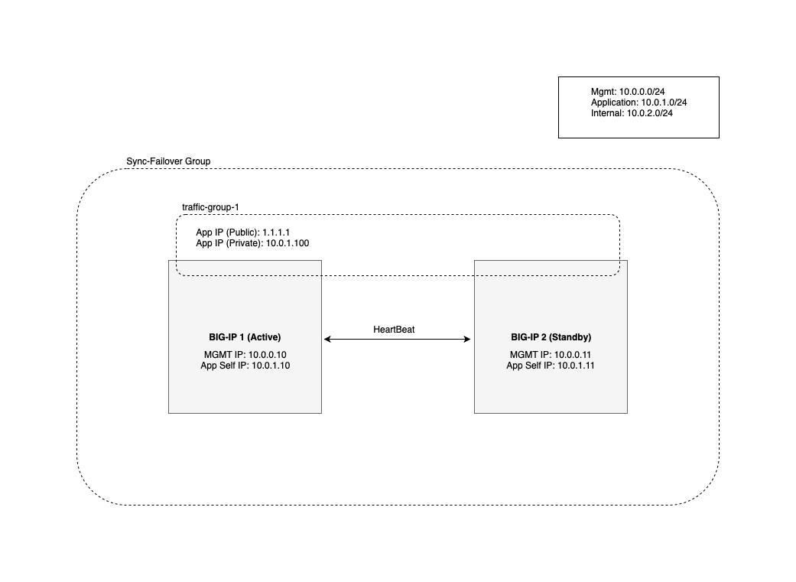
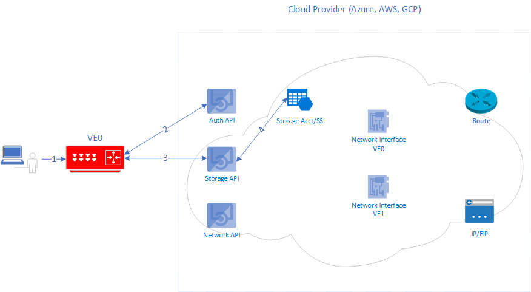
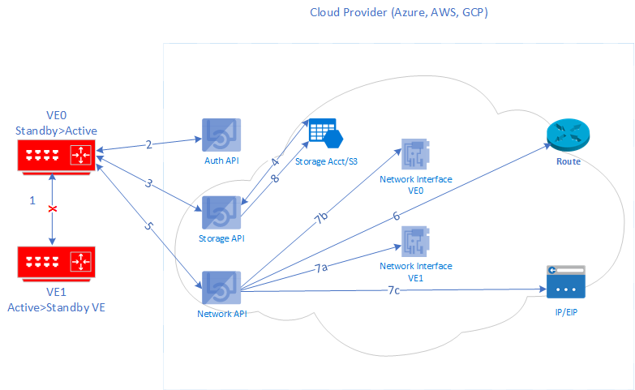
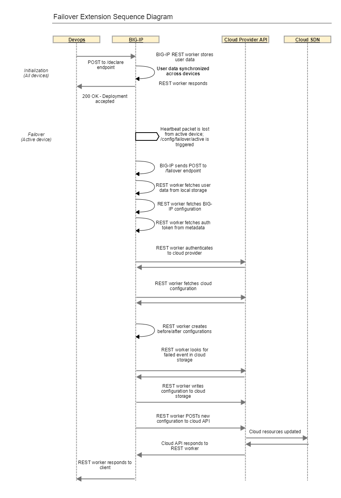
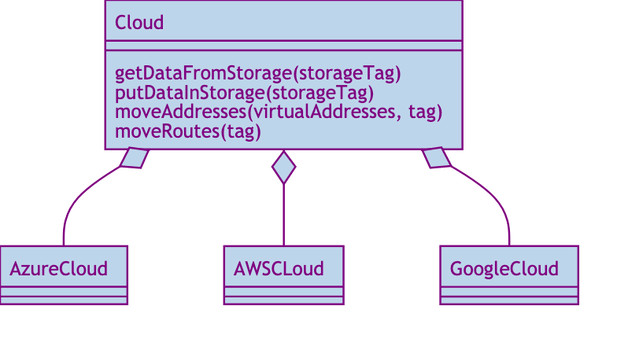

# Introduction

This is the top-level documentation which provides notes and information about contributing to this project.  It is broken down into a couple of key sections, listed below.

- [Overview](#overview)
- [Contributing](#contributing)

---
## Overview

The purpose of the F5 Cloud Failover (CF) iControl LX extension is to provide L3 failover functionality in cloud environments.  Some reasons for this are:

- Standardization: Failover should look basically the same across all clouds
- Portability: I should be able to install/run failover using a variety of methods (Cloud native templates, Terraform, Ansible, FaaS, etc.)
- Lifecyle: I should be able to upgrade my BIG-IP software without having to call F5 support to "fix failover"

The failover extension includes a number of key components, listed below.

*Configuration*: Prepares the environment for failover.  Writes user data to cloud provider storage and configures the /config/failover scripts on BIG-IP.

*Failover*: Triggers a failover event.  Reads configuration from BIG-IP and the cloud provider storage, creates a desired configuration, and updates cloud resources.

---
## Diagram



---
### Configuration



1. Client POST declaration to extension endpoint
2. Cloud SDK creates management client using token from local metadata
3. Cloud SDK uses management client to create storage client 
4. Cloud SDK uses storage client to write user-provided config data to storage location

---
### Anatomy of an Configuration Request

How does the project handle a `POST` request to the configuration endpoint?

`POST /mgmt/shared/cloud-failover/declare`

```json
{
	"class": "Cloud_Failover",
	"environment": "azure",
	"storageResource": "myuniquestorageaccount",
	"storageTags": [
		{
			"key": "value",
			"value": "myvalue"
		}
	],
	"managedRoutes": [
		"192.168.1.0/24"
	],
	"addressTags": [
		{
			"key": "F5_CLOUD_FAILOVER_LABEL",
			"value": "mydeployment"
		}
	]
}
```

*Response*:

```javascript
{
    "message": "success",
    "declaration": {
        "class": "Cloud_Failover",
        "environment": "azure",
        "storageResource": "myuniquestorageaccount",
        "storageTags": [
            {
                "key": "value",
                "value": "myvalue"
            }
        ],
        "managedRoutes": [
            "192.168.1.0/24"
        ],
        "addressTags": [
            {
                "key": "F5_CLOUD_FAILOVER_LABEL",
                "value": "mydeployment"
            }
        ]
    }
}
```

---
#### Anatomy of an Configuration Request (cont.)

What happens in the system internals between request and response?

- LX worker receives request which validates URI, etc.
    - ref: [restWorkers/main.js](../src/nodejs/restWorkers/main.js)
- Request is validated using JSON schema and AJV
    - ref: [validator.js](../src/nodejs/validator.js)
- A provider auth token is acquired from metadata and a storage management client is returned
    - ref: [cloud.js](../src/nodejs/providers/cloud.js)
- User data is written to cloud provider storage
    - ref: [storage.js](../src/nodejs/providers/storage.js)
- Failover declaration/API call is written to /config/failover scripts on BIG-IP
    - ref: [device.js](../src/nodejs/providers/device.js)
- Client response sent with validated config
    - ref: [response.js](../src/nodejs/response.js)


---
### Failover



1. Heartbeat lost from active device; client POST failover declaration to extension endpoint
2. Cloud SDK creates management client using token from local metadata
3. Cloud SDK uses management client to create storage client 
4. Cloud SDK uses storage client to read config data and write task started to storage location
5. Cloud SDK uses management client to create network client
6. Cloud SDK uses network client to update route destination(s) to point to active device's NIC
7. Cloud SDK uses network client to update IP > NIC association(s)
    a. Azure: removes targeted IP(s) from standby NIC
    b. Azure: adds targeted IP(s) to active NIC
    c. AWS: updates EIP association(s)
8. Cloud SDK uses storage client to write task completed to storage location

---
### Anatomy of a Failover Trigger Request

How does the project handle a `POST` request to the failover trigger endpoint?

`POST /mgmt/shared/cloud-failover/trigger`

*Response*:

```javascript
{
    "message": "success"
}
```

---
#### Anatomy of a Failover Trigger Request (cont.)

What happens in the system internals between request and response?

- LX worker receives request which validates URI, etc.
    - ref: [restWorkers/main.js](../src/nodejs/restWorkers/main.js)
- Request is validated using JSON schema and AJV
    - ref: [validator.js](../src/nodejs/validator.js)
- A provider auth token is acquired from metadata and storage/network management clients are returned
    - ref: [cloud.js](../src/nodejs/providers/cloud.js)
- User data is read from cloud provider storage
    - ref: [storage.js](../src/nodejs/providers/storage.js)
- BIG-IP configuration is read from local device
    - ref: [device.js](../src/nodejs/providers/device.js)
- Before/after configuration, timestamp are created and written to provider storage
    - ref: [failover.js](../src/nodejs/providers/failover.js), [storage.js](../src/nodejs/providers/storage.js)
- Provider resources are updated to match "after" configuration
    - ref: [failover.js](../src/nodejs/providers/failover.js)
- Completed task info is written from cloud provider storage
    - ref: [storage.js](../src/nodejs/providers/storage.js)
- Client response sent with failover result
    - ref: [response.js](../src/nodejs/response.js)

---
### Failover Flow Diagram




---
## Contributing

Ok, overview done!  Now let's dive into the major areas to be aware of as a developer.

- [Software Design](#software-design)
- [Core Modules](#core-modules)
- [Testing methodology](#testing-methodology)
- [Release methodology](#release-methodology)
- [Public documentation methodology](#public-documentation-methodology)

---
### Software Design

Design: Object model driven by cloud...

Directory structure: `src/nodejs/providers/<azure|aws|google>/*`

#### Class Diagram



---
### Core modules

All core modules are included inside `../src/nodejs/`

- [restWorkers/main.js](../src/nodejs/restWorkers/main.js)
    - Purpose: Hook for incoming HTTP requests
- [cloud.js](../src/nodejs/providers/cloud.js)
    - Purpose: When passed an environment name, gets an authentication token from local metadata and returns a provider management client object for use in making calls to provider APIs
- [device.js](../src/nodejs/providers/device.js)
    - Purpose: When passed a iControl REST resource URI, returns the desired configuration from the local BIG-IP device (using f5-cloud-libs bigIp class)
- [failover.js](../src/nodejs/providers/failover.js)
    - Purpose: Gets and munges the user data, provider configuration, and local BIG-IP configuration and returns the 'before failover' and 'after failover' configurations
- [storage.js](../src/nodejs/providers/storage.js)
    - Purpose: Creates storage client, reads/writes user data and failover state to provider storage location
- [logger.js](../src/nodejs/logger.js)
    - Purpose: Log events to /var/log/restnoded/restnoded.log
- [validator.js](../src/nodejs/validator.js)
    - Purpose: Validate POST data against schema(s) using ajv
- [state.js](../src/nodejs/state.js)
    - Purpose: Create, update, and return application state; in addition to returning the last successful declaration, we can extend this to include config details, history, etc
- [response.js](../src/nodejs/response.js)
    - Purpose: Send REST response to client
- [constants.js](../src/nodejs/constants.js)
    - Purpose: Define shared variables

---
### Testing methodology

Additional information about the testing methodology can be found in the [test readme](../test/README.md)

---
### Release methodology

Build/publish makes heavy use of GitLab and [.gitlab-ci.yml](../.gitlab-ci.yml).  Check out CI file and GitLab documentation for more details.

- Add *new* RPM to `dist/` directory (from build artifact on mainline developement branch)
- Publish to artifactory (automated on new tags)
- Push to GitLab (mainline release branch)
- Push to GitHub (mainline release branch)

*Local development build process*: Various strategies exist here, see the following for an inexhaustive list.

- Build locally using `build_rpm.sh` or similar, copy RPM to BIG-IP
- VS Code `tasks.json` to copy `src/` files to BIG-IP and run `restart restnoded`
- Matthe Zinke's ICRDK [development kit](https://github.com/f5devcentral/f5-icontrollx-dev-kit/blob/master/README.md)
- Vim on BIG-IP (enough said, you know who you are)

Note: See Release Checklist on Confluence for complete details.

---
### Public documentation methodology

In general, see the documentation team for more details... however there is a process.

The current process involves adding a `doc` label to an issue to note it requires public documentation.  This will cause the issue to show up in a documentation board in GitLab, the developer responsible for the feature is also responsible for generating the artifacts required by the documentation team member.

See the [examples](../examples) directory for curated artifacts such as declaration examples, output examples, AS3 declaration example, etc.

See the [INTERNAL_README.md](../INTERNAL_README.md) for an internal explanation of most features.
