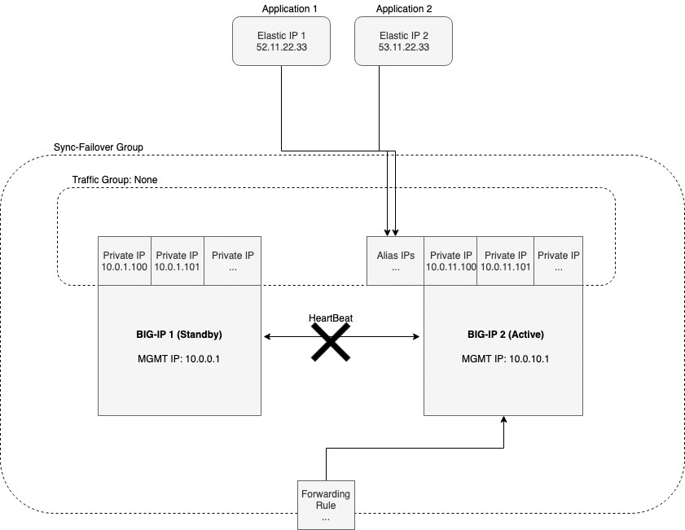
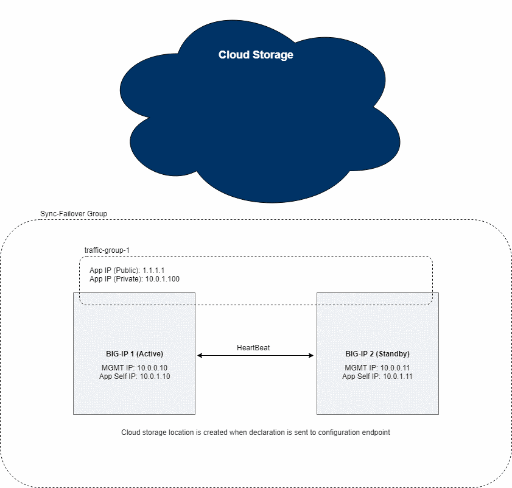
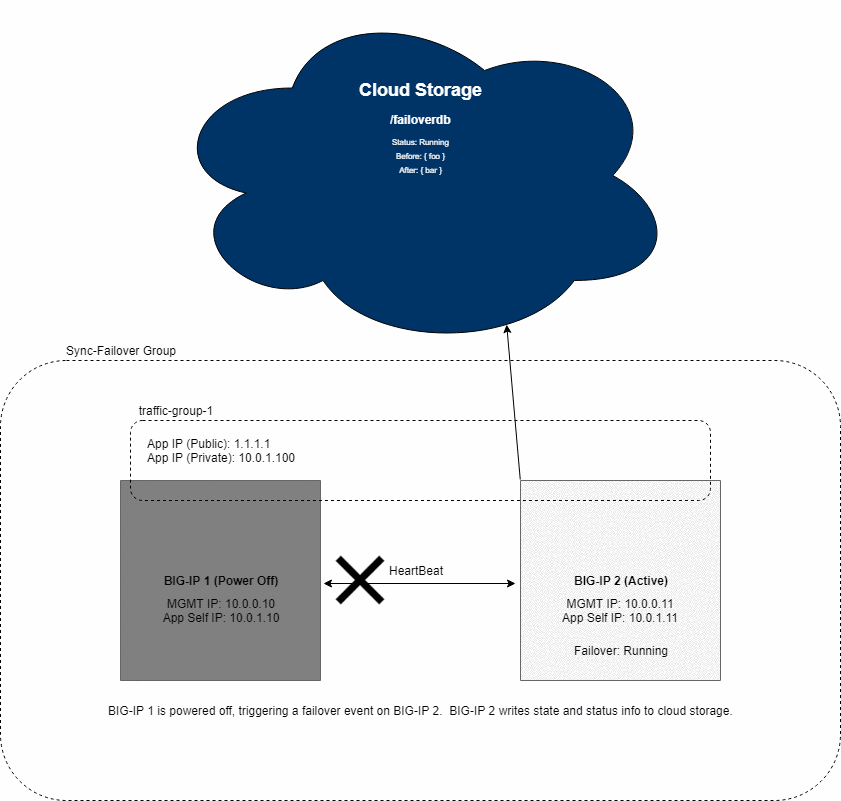

# Introduction

This is the top-level documentation which provides notes and information about contributing to this project.  It is broken down into a couple of key sections, listed below.

- [Overview](#overview)
- [Contributing](#contributing)

---
## Overview

The purpose of the F5 Cloud Failover (CF) iControl LX extension is to provide L3 failover functionality in cloud environments, effectively replacing Gratuitous ARP (GARP).  This requires moving/updating certain cloud resources during a failover event, as described below.

- Failover IP(s) - Move Azure IP configuration(s) between NICs, update AWS EIP/private IP associations, and move GCP alias IP(s) between instances to point to a virtual address on the active BIG-IP device.
- Failover Route(s) - Update Azure user-defined Routes (UDR), AWS route tables, and GCP forwarding rule targets to point to a self IP address of the active BIG-IP device.

Additional reasons for providing a consolidated solution include:

- Standardization: Failover should look basically the same across all clouds
- Portability: I should be able to install/run failover using a variety of methods (Cloud native templates, Terraform, Ansible, FaaS, etc.)
- Lifecyle: I should be able to upgrade my BIG-IP software without having to call F5 support to "fix failover"

---
### Failover Event Diagrams

#### Azure


#### AWS


#### GCP



---
### Components

The failover extension includes a number of key components, listed below.

*Configuration*: Prepares the environment for failover.  Writes configuration info to REST storage and state info to cloud provider storage and configures the /config/failover/tgactive and /config/failover/tgrefresh scripts on BIG-IP.

*Failover*: Triggers a failover event.  Reads configuration info from BIG-IP REST storage and state info from cloud provider storage, creates a desired configuration, and updates cloud resources accordingly.  Recovers from previously failed events, if required.

---
### Configuration


- Client POST declaration to extension `/declare` endpoint
- The extension stores user configuration using local REST storage

---
#### Anatomy of a Failover Configuration Request

How does the project handle a `POST` request to the configuration endpoint?

`POST /mgmt/shared/cloud-failover/declare`

```json
{
    "class": "Cloud_Failover",
    "environment": "azure",
	"externalStorage": {
		"scopingTags": {
			"f5_cloud_failover_label": "mydeployment"
		}
    },
	"failoverAddresses": {
		"scopingTags": {
			"f5_cloud_failover_label": "mydeployment"
		}
    },
    "failoverRoutes": {
		"scopingTags": {
			"f5_cloud_failover_label": "mydeployment"
		},
		"scopingAddressRanges": [
			{
				"range": "192.168.1.0/24"
			}
		],
		"defaultNextHopAddresses": {
			"discoveryType": "static",
			"items": [
				"192.0.2.10",
				"192.0.2.11"
			]
		}
    }
}
```

*Response*:

```json
{
    "message": "success",
    "declaration": ...
}
```

What happens in the system internals between request and response?

- LX worker receives request which validates URI, etc.
    - ref: [restWorkers/main.js](../src/nodejs/restWorkers/main.js)
- Request is validated using JSON schema and AJV
    - ref: [validator.js](../src/nodejs/validator.js)
- User data is written to cloud provider storage
    - ref: [cloud.js](../src/nodejs/providers/azure/cloud.js)
- Failover declaration/API call is written to /config/failover scripts on BIG-IP
    - ref: [device.js](../src/nodejs/providers/config.js)
- Client response sent with validated config
    - ref: [main.js](../src/nodejs/restWorkers/main.js)

---
### Failover


#### Failover Sequence

- Heartbeat lost from active device; client POST failover declaration to extension endpoint
- Cloud SDK creates management client using token from local metadata
- Cloud SDK uses management client to create storage client 
- Cloud SDK uses storage client to read config data and write task started to storage location
- Cloud SDK uses management client to create network client
- Cloud SDK uses network client to update route destination(s) to point to active device's NIC
- Cloud SDK uses network client to update IP > NIC association(s)
  - Azure:
    - removes targeted IP(s) from standby NIC
    - adds targeted IP(s) to active NIC
  - AWS:
    - updates EIP association(s)
  - GCP:
    - re-associate alias ip addresses from Active to Standby host
    - re-associate forwarding rule from Primary to Standby host
- Cloud SDK uses storage client to write task completed to storage location

---
#### Anatomy of a Failover Trigger Request

How does the project handle a `POST` request to the failover trigger endpoint?

`POST /mgmt/shared/cloud-failover/trigger`

*Response*:

```javascript
{
    "message": "success"
}
```

What happens in the system internals between request and response?

- LX worker receives request which validates URI, etc.
    - ref: [restWorkers/main.js](../src/nodejs/restWorkers/main.js)
- Request is validated using JSON schema and AJV
    - ref: [validator.js](../src/nodejs/validator.js)
- A provider auth token is acquired from metadata and storage/network management clients are returned
    - ref: [cloud.js](../src/nodejs/providers/azure/cloud.js)
- User data is read from cloud provider storage
    - ref: [cloud.js](../src/nodejs/providers/azure/cloud.js)
- BIG-IP configuration is read from local device
    - ref: [device.js](../src/nodejs/providers/device.js)
- Before/after configuration, timestamp are created and written to provider storage
    - ref: [failover.js](../src/nodejs/providers/failover.js), [cloud.js](../src/nodejs/providers/azure/cloud.js)
- Provider resources are updated to match "after" configuration
    - ref: [failover.js](../src/nodejs/providers/failover.js)
- Completed task info is written from cloud provider storage
    - ref: [cloud.js](../src/nodejs/providers/azure/cloud.js)
- Client response sent with failover result
    - ref: [main.js](../src/nodejs/restWorkers/main.js)

---
### Failover Event Diagrams

#### Azure

##### Prerequisites

- 2 clustered BIG-IPs
   - Note: Here is an [example ARM Template](https://github.com/F5Networks/f5-azure-arm-templates/blob/master/supported/failover/same-net/via-api/n-nic/existing-stack/payg), although this is not required.  Any configuration tool can be used to provision the resources.
- An Azure system-assigned or user-managed identity with sufficient access
    - Using Standard roles
        - Contributor access - Note: This should be limited to the appropriate resource groups
- Storage account for Cloud Failover extension cluster-wide file(s)
    - Tagged with a key/value cooresponding to the key/value(s) provided in the `externalStorage.scopingTags` section of the Cloud Failover extension configuration
- Network Interfaces should be tagged with a key/value cooresponding to the key/value(s) provided in the `failoverAddresses.scopingTags` section of the Cloud Failover extension configuration
- Virtual addresses created in a traffic group (floating) and matching addresses (secondary) on the IP configurations of the instance NICs serving application traffic
- Route(s) in a route table tagged with the following (optional):
    - Tagged with a key/value cooresponding to the key/value(s) provided in the `failoverRoutes.scopingTags` section of the Cloud Failover extension configuration
    - Note: The failover extension configuration `failoverRoutes.scopingAddressRanges` should contain a list of destination routes to update


##### Result

- IP configuration(s) with a secondary private address that matches a virtual address in a traffic group owned by the active BIG-IP are deleted and recreated on that device's network interface(s)
- User-defined routes with a destination and parent route table with tags matching the Cloud Failover extension configuration are updated with a next hop attribute that corresponds to the self IP address of the active BIG-IP    

---
#### AWS

##### Prerequisites

- 2 clustered BIG-IPs
   - Note: Here is an [example AWS CloudFormation template](https://github.com/F5Networks/f5-aws-cloudformation/tree/master/supported/failover/across-net/via-api/2nic/existing-stack/payg), although this is not required.  Any configuration tool can be used to provision the resources.
- An AWS IAM role with sufficient access
    - Using Standard roles
        - EC2 Full Access
        - S3 Full Access - Note: This should be limited to necessary buckets
- S3 bucket for Cloud Failover extension cluster-wide file(s)
    - Tagged with a key/value cooresponding to the key/value(s) provided in the `externalStorage.scopingTags` section of the Cloud Failover extension configuration
- Elastic IP addresses tagged with the following (optional):
    - Tagged with a key/value cooresponding to the key/value(s) provided in the `failoverAddresses.scopingTags` section of the Cloud Failover extension configuration
    - Tagged with a special key called `f5_cloud_failover_vips` containing a comma seperated list of addresses mapping to a private IP address on each instance in the cluster that the Elastic IP is associated with. Example: `10.0.0.10,10.0.0.11`
- Route(s) in a route table tagged with the following (optional):
    - Tagged with a key/value cooresponding to the key/value(s) provided in the `failoverRoutes.scopingTags` section of the Cloud Failover extension configuration
    - Note: The failover extension configuration `failoverRoutes.scopingAddressRanges` should contain a list of destination routes to update


##### Result

- Elastic IP addresses with matching tags are associated with the secondary private IP matching the virtual address corresponding to the active BIG-IP device
- Route targets with destinations matching the Failover Extension configuration are updated with the network interface of the active BIG-IP device

---
#### Google

##### Prerequisites

- 2 clustered BIG-IPs
   - Note: Here is an [example GDM Template](https://github.com/F5Networks/f5-google-gdm-templates/tree/master/supported/failover/same-net/via-api/3nic/existing-stack/payg), although this is not required.  Any configuration tool can be used to provision the resources.
- A Google service account with sufficent access
    - Using Standard scopes
        - compute-rw
        - storage-rw
        - cloud-platform
- Storage bucket for Cloud Failover extension cluster-wide file(s)
    - Tagged with a key/value cooresponding to the key/value(s) provided in the `externalStorage.scopingTags` section of the Cloud Failover extension configuration
- Instances should be tagged with a key/value cooresponding to the key/value(s) provided in the `failoverAddresses.scopingTags` section of the Cloud Failover extension configuration
- Virtual addresses created in a traffic group (floating) and matching Alias IP addresses on the instance serving application traffic
- Forwarding rules(s) configured with targets that match a virtual address or floating self IP on the instance serving application traffic
- Route(s) in a route table tagged with the following (optional):
    - Tagged with a key/value cooresponding to the key/value(s) provided in the `failoverRoutes.scopingTags` section of the Cloud Failover extension configuration
    - Note: The failover extension configuration `failoverRoutes.scopingAddressRanges` should contain a list of destination routes to update


##### Result

- Alias IPs are updated to point to the network interface of the active BIG-IP device
- Forwarding rule targets matching a self IP address of the active BIG-IP device are associated with the network interface of the active BIG-IP device

---
### Reconciliation/Recovery

Due to unpredictability of the cloud environment where BIG-IP clusters are running, the Cloud Failover extension must be able to recover gracefully from these failure scenarios:

#### Flapping

The failover process is triggered multiple times within the period that it would normally take the initial process to fully complete (30 seconds for AWS or 3 minutes for Azure, for example). This condition is seen during scheduled maintenance or a network outage where both devices are in an active state.

Scenario:

- BIG-IP B (standby) loses connectivity to BIG-IP A (active)
- BIG-IP B (active) becomes active, triggers failover via `/config/failover/tgactive`
- BIG-IP A (active) reestablishes connection to BIG-IP B (active) and reconciles active/active using preferred device order on the traffic group
- BIG-IP A (active) wins reconciliation and triggers failover via `/config/failover/tgrefresh`
- BIG-IP B (standby) is still executing failover resulting in BIG-IP A (active) exiting without neccessary failover objects
- BIG-IP B (standby) owns failover objects, incorrectly

Diagram:


---
#### Loss of configuration 

The failover process is interrupted, which is possible in environments where multiple synchronous calls to cloud APIs are required (Azure and Google). Rebooting both devices in a HA pair in quick succession will result in this condition.

The solution must create an external source of truth from which to recover the last known good configuration state in the case of interruption.

##### Normal operation:



##### Recovering from lost configuration:



---
#### Generic Failover Flow Diagram


---
## Contributing

Ok, overview done!  Now let's dive into the major areas to be aware of as a developer.

- [Software Design](#software-design)
- [Core Modules](#core-modules)
- [Testing methodology](#testing-methodology)
- [Release methodology](#release-methodology)
- [Public documentation methodology](#public-documentation-methodology)

---
### Core modules

All core modules are included inside `../src/nodejs/`

- [restWorkers/main.js](../src/nodejs/restWorkers/main.js)
    - Purpose: Hook for incoming/outgoing HTTP requests and managing application state
- [cloud.js](../src/nodejs/providers/abstract/cloud.js)
    - Purpose: When passed an environment name, creates an instance of a specific cloud provider
- [cloud.js](../src/nodejs/providers/azure/cloud.js)
    - Purpose: Provider for a specific cloud environment
- [device.js](../src/nodejs/providers/device.js)
    - Purpose: When passed a iControl REST resource URI, returns the desired configuration from the local BIG-IP device (using f5-cloud-libs bigIp class)
- [config.js](../src/nodejs/config.js)
    - Purpose: Write configuration changes to the BIG-IP device (currently only creates POST to trigger endpoint in /config/failover)
- [failover.js](../src/nodejs/providers/failover.js)
    - Purpose: Gets and munges the user data, provider configuration, and local BIG-IP configuration and returns the 'before failover' and 'after failover' configurations
- [logger.js](../src/nodejs/logger.js)
    - Purpose: Log events to /var/log/restnoded/restnoded.log
- [validator.js](../src/nodejs/validator.js)
    - Purpose: Validate POST data against schema(s) using ajv
- [constants.js](../src/nodejs/constants.js)
    - Purpose: Define shared variables
- [util.js](../src/nodejs/util.js)
    - Purpose: Perform common tasks
---
### Quick deployment setup

A quick way to see the failover extension in action run ```npm run deployment-setup```. This command builds the cloud failover extension RPM, creates two clustered BIG-IPs in your desired cloud, installs the RPM on the BIG-IPs and runs our functional tests against the created deployments. Once the deployment-setup script has been executed the extension is ready to perform failover on the addresses and routes that were created by the deployment.


---
### Testing methodology

Additional information about the testing methodology can be found in the [test readme](../test/README.md)

---
### Release methodology

Build/publish makes use of GitLab and [.gitlab-ci.yml](../.gitlab-ci.yml) for automation.  Check out CI file and GitLab documentation for more details.

- Publish to artifactory (automated on new tags as well as develop branch for *development* artifact)
- Add as artifact(s) to tagged release on GitHub

*Local development build process*: Various strategies exist here, see the following for an inexhaustive list.

- Build locally using `build_rpm.sh` or similar, copy RPM to BIG-IP
- VS Code `tasks.json` to copy `src/` files to BIG-IP and run `restart restnoded`
- Matthe Zinke's ICRDK [development kit](https://github.com/f5devcentral/f5-icontrollx-dev-kit/blob/master/README.md)
- Vim on BIG-IP (enough said, you know who you are)

Note: See Release Process snippet in internal repo for complete details.

---
### Public documentation methodology

In general, see the documentation team for more details... that being said public documentation is available on clouddocs.  (See the main README for the link)

See the [examples](../examples) directory for curated artifacts such as declaration examples, output examples, AS3 declaration example, etc.

### Telemetry

Usage telemetry is sent to an F5 provided service called TEEM.  Below describes the payload that is sent.

```json
{
    "documentType": "f5-cloud-failover-data",
    "documentVersion": "1",
    "digitalAssetId": "xxxx",
    "digitalAssetName": "f5-cloud-failover",
    "digitalAssetVersion": "1.0.0",
    "observationStartTime": "xxxx",
    "observationEndTime": "xxxx",
    "epochTime": "123581321",
    "telemetryId": "xxxx",
    "telemetryRecords": [
        {
            "environment": "azure",
            "Failover": 1,
            "platform": "BIG-IP",
            "platformVersion": "14.1.0.5",
            "featureFlags": {
                "ipFailover": true,
                "routeFailover": false
            }
        }
    ]
}
```
