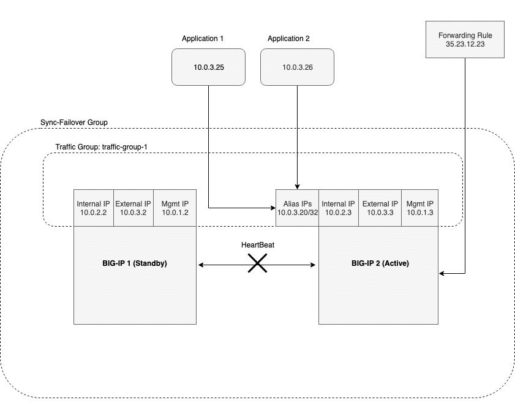

# Introduction

This is the top-level documentation which provides notes and information about contributing to this project.  It is broken down into a couple of key sections, listed below.

- [Overview](#overview)
- [Contributing](#contributing)

---
## Overview

The purpose of the F5 Cloud Failover (CF) iControl LX extension is to provide L3 failover functionality in cloud environments, effectively replacing Gratuitous ARP (GARP).  This requires moving/updating certain cloud resources during a failover event, as described below.

- Failover IP(s) - Move Azure IP configuration(s) between NICs, update AWS EIP/private IP associations, and move GCP alias IP(s) between instances to point to a virtual address on the active BIG-IP device.
- Failover Route(s) - Update Azure user-defined Routes (UDR), AWS route tables, and GCP forwarding rule targets to point to a self IP address of the active BIG-IP device.

Additional reasons for providing a consolidated solution include:

- Standardization: Failover should look basically the same across all clouds
- Portability: I should be able to install/run failover using a variety of methods (Cloud native templates, Terraform, Ansible, FaaS, etc.)
- Lifecyle: I should be able to upgrade my BIG-IP software without having to call F5 support to "fix failover"

---
### Components

The failover extension includes a number of key components, listed below.

*Configuration*: Prepares the environment for failover.  Writes configuration info to REST storage and state info to cloud provider storage and configures the /config/failover/tgactive and /config/failover/tgrefresh scripts on BIG-IP.

*Failover*: Triggers a failover event.  Reads configuration info from BIG-IP REST storage and state info from cloud provider storage, creates a desired configuration, and updates cloud resources accordingly.  Recovers from previously failed events, if required.

---
### Configuration


1. Client POST declaration to extension endpoint
2. Cloud SDK creates management client using token from local metadata
3. Cloud SDK uses management client to create storage client 
4. Cloud SDK uses storage client to write user-provided config data to storage location

---
#### Anatomy of a Failover Configuration Request

How does the project handle a `POST` request to the configuration endpoint?

`POST /mgmt/shared/cloud-failover/declare`

```json
{
	"class": "Cloud_Failover",
	"environment": "azure",
	"storageResource": "myuniquestorageaccount",
	"storageTags": [
		{
			"key": "value",
			"value": "myvalue"
		}
	],
	"managedRoutes": [
		"192.168.1.0/24"
	],
	"addressTags": [
		{
			"key": "F5_CLOUD_FAILOVER_LABEL",
			"value": "mydeployment"
		}
	]
}
```

*Response*:

```javascript
{
    "message": "success",
    "declaration": {
        "class": "Cloud_Failover",
        "environment": "azure",
        "storageResource": "myuniquestorageaccount",
        "storageTags": [
            {
                "key": "value",
                "value": "myvalue"
            }
        ],
        "managedRoutes": [
            "192.168.1.0/24"
        ],
        "addressTags": [
            {
                "key": "F5_CLOUD_FAILOVER_LABEL",
                "value": "mydeployment"
            }
        ]
    }
}
```

What happens in the system internals between request and response?

- LX worker receives request which validates URI, etc.
    - ref: [restWorkers/main.js](../src/nodejs/restWorkers/main.js)
- Request is validated using JSON schema and AJV
    - ref: [validator.js](../src/nodejs/validator.js)
- A provider auth token is acquired from metadata and a storage management client is returned
    - ref: [cloud.js](../src/nodejs/providers/azure/cloud.js)
- User data is written to cloud provider storage
    - ref: [cloud.js](../src/nodejs/providers/azure/cloud.js)
- Failover declaration/API call is written to /config/failover scripts on BIG-IP
    - ref: [device.js](../src/nodejs/providers/config.js)
- Client response sent with validated config
    - ref: [main.js](../src/nodejs/restWorkers/main.js)

---
### Failover


#### Failover Sequence

1. Heartbeat lost from active device; client POST failover declaration to extension endpoint
2. Cloud SDK creates management client using token from local metadata
3. Cloud SDK uses management client to create storage client 
4. Cloud SDK uses storage client to read config data and write task started to storage location
5. Cloud SDK uses management client to create network client
6. Cloud SDK uses network client to update route destination(s) to point to active device's NIC
7. Cloud SDK uses network client to update IP > NIC association(s)
8. Cloud SDK uses storage client to write task completed to storage location

---
#### Anatomy of a Failover Trigger Request

How does the project handle a `POST` request to the failover trigger endpoint?

`POST /mgmt/shared/cloud-failover/trigger`

*Response*:

```javascript
{
    "message": "success"
}
```

What happens in the system internals between request and response?

- LX worker receives request which validates URI, etc.
    - ref: [restWorkers/main.js](../src/nodejs/restWorkers/main.js)
- Request is validated using JSON schema and AJV
    - ref: [validator.js](../src/nodejs/validator.js)
- A provider auth token is acquired from metadata and storage/network management clients are returned
    - ref: [cloud.js](../src/nodejs/providers/azure/cloud.js)
- User data is read from cloud provider storage
    - ref: [cloud.js](../src/nodejs/providers/azure/cloud.js)
- BIG-IP configuration is read from local device
    - ref: [device.js](../src/nodejs/providers/device.js)
- Before/after configuration, timestamp are created and written to provider storage
    - ref: [failover.js](../src/nodejs/providers/failover.js), [cloud.js](../src/nodejs/providers/azure/cloud.js)
- Provider resources are updated to match "after" configuration
    - ref: [failover.js](../src/nodejs/providers/failover.js)
- Completed task info is written from cloud provider storage
    - ref: [cloud.js](../src/nodejs/providers/azure/cloud.js)
- Client response sent with failover result
    - ref: [main.js](../src/nodejs/restWorkers/main.js)

---
### Failover Event Diagrams

#### Azure
#### Prerequisites
- 2 clustered BIG-IPs in Azure ([example ARM Template](https://github.com/F5Networks/f5-azure-arm-templates/blob/master/supported/failover/same-net/via-api/n-nic/existing-stack/payg))
- An Azure system-assigned or user-managed identity with Contributor role to the virtual machines and resource group where network interfaces and route tables are configured
- Network access to the Azure metadata service
- Virtual addresses created in a named traffic group and matching _Secondary Private IP_ addresses on the IP configurations of the BIG-IP NICs serving application traffic
- The aforementioned Azure network interfaces tagged with:
    1. The key(s) and value(s) from the *addressTags* section in the Failover Extension configuration request:
    
- Route(s) in the route table with destination networks corresponding to the values from the *managedRoutes* section in the Failover Extension Configuration request
- Route table(s) tagged with:
    1. Key(s) named "f5_ha" with value(s) matching the self IP address name(s) from the BIG-IP devices:  
    


#### Result
- IP configuration(s) with a secondary private address that matches a virtual address in a traffic group owned by the active BIG-IP are deleted and recreated on that device's network interface(s)
- User-defined routes with a destination and parent route table with tags matching the Failover Extension configuration are updated with a next hop attribute that corresponds to the self IP address of the active BIG-IP    

---
#### AWS
#### Prerequisites
- 2 clustered BIG-IPs in AWS ([example Cloudformation Template](https://github.com/F5Networks/f5-aws-cloudformation/tree/master/supported/failover/across-net/via-api/2nic/existing-stack/payg))
- An AWS IAM role with sufficient access to update the indicated elastic IP addresses and route tables
- Network access to the AWS metadata service
- Virtual addresses created in traffic group None and matching _Secondary Private IP_ addresses on the BIG-IP NICs serving application traffic
- Elastic IP addresses tagged with:
    1. The key(s) and value(s) from the *addressTags* section in the Failover Extension configuration request
    2. The Private IP addresses that each Elastic IP is associated with, separated by a comma:
     
- Route(s) in a route table with destination networks corresponding to the values from the *managedRoutes* section in the Failover Extension configuration request


#### Result
- Elastic IP addresses with matching tags are associated with the secondary private IP matching the virtual address corresponding to the active BIG-IP device
- Route targets with destinations matching the Failover Extension configuration are updated with the network interface of the active BIG-IP device

---
#### Google
#### Prerequisites
- 2 clustered BIG-IPs in GCE ([example GDM Template](https://github.com/F5Networks/f5-google-gdm-templates/tree/master/supported/failover/same-net/via-api/3nic/existing-stack/payg))
- Network access to the Google metadata service
- A Google service account with sufficent access to update the indicated virtual machines and forwarding rules
- Virtual addresses created in a named traffic group and matching _Alias IP_ addresses on the BIG-IP NICs serving application traffic
- Virtual machine instances tagged with:
    1. The key(s) and value(s) from the *addressTags* section in the Failover Extension Configuration request
- Forwarding rules(s) configured with targets that match the self IP address of the active BIG-IP



#### Result
- Alias IPs are updated to point to the network interface of the active BIG-IP device
- Forwarding rule targets matching a self IP address of the active BIG-IP device are associated with the network interface of the active BIG-IP device


---
### Reconciliation/Recovery

Due to unpredictability of the cloud environment where BIG-IP clusters are running, the Cloud Failover extension must be able to recover gracefully from these failure scenarios:

- Flapping: The failover process is triggered multiple times within the period that it would normally take the initial process to fully complete (30 seconds for AWS or 3 minutes for Azure, for example). This condition is seen during scheduled maintenance or a network outage where both devices are in an active state.
    - The failover trigger must run when /config/tgrefresh is triggered by the sod daemon on BIG-IP, reconciling the cloud configuration to the currently active device.  


- Loss of configuration: The failover process is interrupted, which is possible in environments where multiple synchronous calls to cloud APIs are required (Azure and Google). Rebooting both devices in a HA pair in quick succession will result in this condition.  
    - The solution must create an external source of truth from which to recover the last known good configuration state in the case of interruption.

---

#### Generic Failover Flow Diagram


---
## Contributing

Ok, overview done!  Now let's dive into the major areas to be aware of as a developer.

- [Software Design](#software-design)
- [Core Modules](#core-modules)
- [Testing methodology](#testing-methodology)
- [Release methodology](#release-methodology)
- [Public documentation methodology](#public-documentation-methodology)

---
### Core modules

All core modules are included inside `../src/nodejs/`

- [restWorkers/main.js](../src/nodejs/restWorkers/main.js)
    - Purpose: Hook for incoming/outgoing HTTP requests and managing application state
- [cloud.js](../src/nodejs/providers/abstract/cloud.js)
    - Purpose: When passed an environment name, creates an instance of a specific cloud provider
- [cloud.js](../src/nodejs/providers/azure/cloud.js)
    - Purpose: Provider for a specific cloud environment
- [device.js](../src/nodejs/providers/device.js)
    - Purpose: When passed a iControl REST resource URI, returns the desired configuration from the local BIG-IP device (using f5-cloud-libs bigIp class)
- [config.js](../src/nodejs/config.js)
    - Purpose: Write configuration changes to the BIG-IP device (currently only creates POST to trigger endpoint in /config/failover)
- [failover.js](../src/nodejs/providers/failover.js)
    - Purpose: Gets and munges the user data, provider configuration, and local BIG-IP configuration and returns the 'before failover' and 'after failover' configurations
- [logger.js](../src/nodejs/logger.js)
    - Purpose: Log events to /var/log/restnoded/restnoded.log
- [validator.js](../src/nodejs/validator.js)
    - Purpose: Validate POST data against schema(s) using ajv
- [constants.js](../src/nodejs/constants.js)
    - Purpose: Define shared variables
- [util.js](../src/nodejs/util.js)
    - Purpose: Perform common tasks

---
### Testing methodology

Additional information about the testing methodology can be found in the [test readme](../test/README.md)

---
### Release methodology

Build/publish makes heavy use of GitLab and [.gitlab-ci.yml](../.gitlab-ci.yml).  Check out CI file and GitLab documentation for more details.

- Add *new* RPM to `dist/` directory (from build artifact on mainline developement branch)
- Publish to artifactory (automated on new tags)
- Push to GitLab (mainline release branch)
- Push to GitHub (mainline release branch)

*Local development build process*: Various strategies exist here, see the following for an inexhaustive list.

- Build locally using `build_rpm.sh` or similar, copy RPM to BIG-IP
- VS Code `tasks.json` to copy `src/` files to BIG-IP and run `restart restnoded`
- Matthe Zinke's ICRDK [development kit](https://github.com/f5devcentral/f5-icontrollx-dev-kit/blob/master/README.md)
- Vim on BIG-IP (enough said, you know who you are)

Note: See Release Checklist on Confluence for complete details.

---
### Public documentation methodology

In general, see the documentation team for more details... however there is a process.

The current process involves adding a `doc` label to an issue to note it requires public documentation.  This will cause the issue to show up in a documentation board in GitLab, the developer responsible for the feature is also responsible for generating the artifacts required by the documentation team member.

See the [examples](../examples) directory for curated artifacts such as declaration examples, output examples, AS3 declaration example, etc.

See the [INTERNAL_README.md](../INTERNAL_README.md) for an internal explanation of most features.
