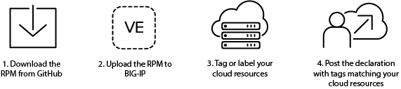
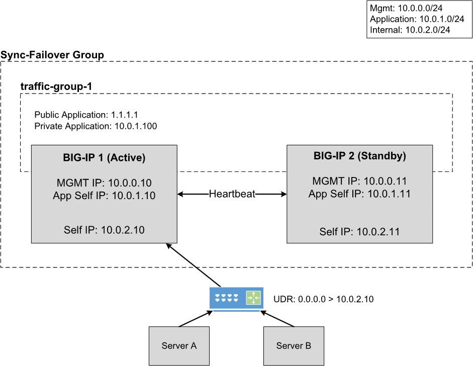

F5 Cloud Failover
=================

Welcome to the F5 Cloud Failover Extension User Guide.

Introduction
------------

The F5 Cloud Failover Extension (CFE) is an iControl LX extension that provides L3 failover functionality in cloud environments, effectively replacing Gratuitous ARP (GARP). CFE uses a declarative model, meaning you provide a JSON declaration using a single REST API call rather than a set of imperative commands. The declaration then configures the BIG-IP system with all the required settings for cloud failover. At a high level, to use CFE, you will `download the RPM from GitHub <https://github.com/F5Networks/f5-cloud-failover-extension>`_, upload the RPM to BIG-IP, tag or label your cloud resources, and then Post your declaration.



How does it work?
`````````````````
In the event of a failover between BIG-IP systems, BIG-IP fails a traffic group over, which runs the `/config/failover/tgactive` script. CFE updates that file during any configuration request to ensure it triggers failover by calling the Cloud Failover /trigger API. During a failover event, CFE then moves or updates cloud resources as described below:

- **Failover IP(s)**: The extension updates IP configurations between NICs, updates EIP/private IP associations, and updates forwarding rule target instances.
- **Failover Routes**: The extension updates Azure User-Defined Routes (UDR), AWS route tables, and GCP forwarding rule targets to point to a self IP address of the active BIG-IP device.
- **Failback**: The extension reverts to using the designated primary BIG-IP when it becomes active again.


The diagram below shows a typical failover scenario for an active/standby pair of BIG-IPs in a cloud environment. To see how Cloud Failover Extension works in specific cloud environments, see the sections for :ref:`azure`, :ref:`aws`, and :ref:`gcp`.




|

Why use Cloud Failover Extension?
`````````````````````````````````
Using Cloud Failover Extension has three main benefits:

- Standardization: Failover patterns will look similar across all clouds.
- Portability: You can leverage a variety of methods, including cloud-native templates, Terraform, and Ansible, to install and run CFE.
- Lifecycle and Supportability: You can upgrade BIG-IP without having to call F5 support to fix failover.

|

Use the following links, the navigation on the left, and/or the Next and Previous buttons to explore the documentation.

User Guide Index
----------------

.. toctree::
   :maxdepth: 2
   :includehidden:
   :glob:

   userguide/prereqs
   userguide/faq
   userguide/quickstart
   userguide/installation
   userguide/configuration
   userguide/apidocs
   userguide/example-declarations
   userguide/postman-collection
   userguide/logging
   userguide/update-revert
   userguide/troubleshooting
   revision-history


.. include:: /_static/reuse/feedback.rst


.. |github| raw:: html

   <a href="https://github.com/F5Networks/f5-cloud-failover-extension/issues" target="_blank">GitHub Issue</a>