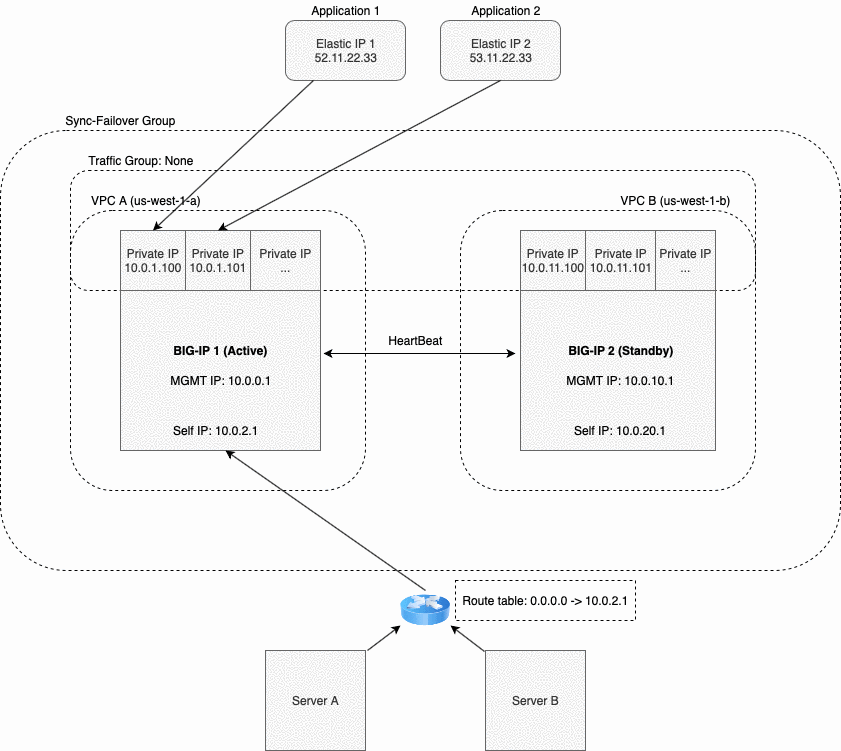

F5 Cloud Failover
=================

Welcome to the F5 Cloud Failover User Guide. To provide feedback on this documentation, you can file a `GitHub Issue <https://github.com/f5networks/f5-cloud-failover/issues>`.

Introduction
------------

F5 Cloud Failover (CF) iControl LX extension provides L3 failover functionality in cloud environments, effectively replacing Gratuitous ARP (GARP). This requires moving or updating certain cloud resources during a failover event, as described below.

- Failover IP(s) - Update IP configurations on a NIC, update EIP associations, update forwarding rule target instance, etc.
- Failover Route(s) - Update User-Defined Routes (UDR), update route table, etc.

User Guide Index
----------------

.. toctree::
   :maxdepth: 2
   :includehidden:
   :glob:

   userguide/prereqs
   userguide/faq
   userguide/quickstart
   userguide/example-declarations
   userguide/troubleshooting
   revision-history