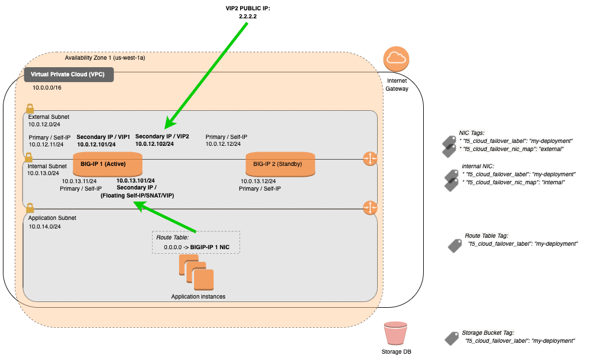

.. _aws-same-az:

AWS (Same Availability Zone)
============================

In this section, you can see the complete steps for implementing Cloud Failover Extension in AWS *(Same Availability Zone)*. For an *Across Availability Zone* deployment, see :ref:`aws`.

AWS CFE Prerequisites
---------------------
These are the basic prerequisites for setting up CFE in AWS:

- **2 BIG-IP systems in Active/Standby configuration**. You can use an `example AWS Cloudformation template <https://github.com/F5Networks/f5-aws-cloudformation/tree/master/supported/failover/same-net/via-api/3nic/existing-stack/payg>`_. Any configuration tool can be used to provision the resources.
- **Disable "Src/Dst checking"** on the NICs if enabling routing or avoiding SNAT. See `AWS documentation <https://docs.aws.amazon.com/AWSEC2/latest/UserGuide/using-eni.html#change_source_dest_check>`_ for more information.

|

Complete these tasks to deploy Cloud Failover Extension in AWS. Before getting started, we recommend you review the `Known Issues <https://github.com/F5Networks/f5-cloud-failover-extension/issues>`_ and :ref:`faq`.

.. include:: /_static/reuse/initial-config.rst

.. table:: Task Summary

   =======  ===================================================================
   Step     Task
   =======  ===================================================================
   1.       :ref:`download-rpm`

            - :ref:`verify-rpm`

   2.       :ref:`upload-install`

            - :ref:`installgui-ref` (or)
            - :ref:`installcurl-ref`

   3.       :ref:`aws-same-az-iam`

            - :ref:`aws-same-az-iam-example`

   4.       :ref:`aws-same-az-define-objects`

            - :ref:`aws-same-az-tag-nics`
            - :ref:`aws-same-az-define-storage`
            - :ref:`aws-same-az-define-addresses`
            - :ref:`aws-same-az-define-routes`

   5.       Modify and POST the :ref:`aws-same-az-example`
   6.       :ref:`update-revert`
   =======  ===================================================================

Additional Information:

- :ref:`aws-as3-same-az-example`
- :ref:`aws-same-az-custom-cert`

|

.. _aws-same-az-diagram:

AWS Failover Event Diagram
--------------------------

This diagram shows an example of a *Same Availability Zone* failover with 3NIC BIG-IPs. You can see Elastic IP (EIP) addresses are associated with the secondary private IPs of the active BIG-IP device. Upon failover, secondary IP addresses will be re-mapped to the peer BIG-IP. Route targets with destinations matching the Cloud Failover Extension configuration are updated with the network interface of the active BIG-IP device.




|

.. Note:: 

   - Management NICs/Subnets are not shown in this diagram.
   - In AWS, only Secondary IP addresses can be reassigned, so they are mapped to BIG-IP addresses that typically float (like VIPs, SNATs, etc.). Hence, AWS Primary IPs and their associated EIPs are used for the BIG-IP system's unique Self IPs (which also do not float) and are not remapped during failover.


.. _aws-same-az-example:

Example AWS Declaration
-----------------------
This example declaration shows the minimum information needed to update the cloud resources in AWS. See the :ref:`quickstart` section for steps on how to post this declaration. See the :ref:`example-declarations` section for more examples.

.. literalinclude:: ../../examples/declarations/aws-same-az-1.13.0.json
   :language: json
   :caption: Example AWS Declaration with Single Routing Table
   :tab-width: 4
   :linenos:

:fonticon:`fa fa-download` :download:`aws-same-az.json <../../examples/declarations/aws-same-az-1.13.0.json>`

|

.. _aws-same-az-iam:

Create and assign an IAM Role
-----------------------------

.. IMPORTANT::  You are responsible for following the provider's IAM best practices.  See your cloud provider resources for IAM Best Practices (for example, `IAM Best Practices <https://docs.aws.amazon.com/IAM/latest/UserGuide/best-practices.html>`_). 


In order to successfully implement CFE in AWS, you need an AWS Identity and Access Management (IAM) role with sufficient access. To create and assign an IAM role you must have a user role of `iam:CreateUser`.

1. In AWS, go to **IAM > Roles** and create a policy with the following permissions:

 ======================================== ============================== ======================= ======================= ===================================================================================================================== 
  IAM Action                               IAM Resource Element           IAM Resource Condition  CFE Component           Description                                       
 ======================================== ============================== ======================= ======================= ===================================================================================================================== 
  ec2:AssignIpv6Addresses                  Network Interface ID           Tag (Optional)          failoverAddresses       To remap IPv6 addresses to the network interface of the active BIG-IP instance.               
  ec2:AssignPrivateIpAddresses             Network Interface ID           Tag (Optional)          failoverAddresses       To remap one or more secondary private IP addresses to the network interface of the active BIG-IP instance.            
  ec2:AssociateAddress                     Elastic IP ID                  Tag (Optional)          failoverAddresses       To associate Elastic IP addresses to the network interface of the active BIG-IP instance.             
  ec2:CreateRoute                          Route Table ID                 Tag (Optional)          failoverRoutes          To update a route's next hop to use the active BIG-IP's NIC.
  ec2:DescribeAddresses                    \*                             Current Account/Region  failoverAddresses       To get information about an Elastic IP addresses in the current account/region.            
  ec2:DescribeInstances                    \*                             Current Account/Region  All                     To get information about BIG-IP instances in the current account/region.             
  ec2:DescribeInstanceStatus               \*                             Current Account/Region  All                     To get status of BIG-IP instances in the current account/region.               
  ec2:DescribeNetworkInterfaceAttribute    \*                             Current Account/Region  All                     To get attributes of BIG-IP network interfaces in the current account/region.    
  ec2:DescribeNetworkInterfaces            \*                             Current Account/Region  All                     To get information about BIG-IP network interfaces in the current account/region.  
  ec2:DescribeRouteTables                  \*                             Current Account/Region  failoverRoutes          To get information about route tables in the current account/region.        
  ec2:DescribeSubnets                      \*                             Current Account/Region  All                     To get information about subnets in the current account/region.
  ec2:DisassociateAddress                  Elastic IP ID                  Tag (Optional)          failoverAddresses       To disassociate Elastic IP address from instance or network interface of standby BIG-IP instance.         
  ec2:UnassignIpv6Addresses                Network Interface ID           Tag (Optional)          failoverAddresses       To unassign IPv6 addresses from the network interface.           
  ec2:UnassignPrivateIpAddresses           Network Interface ID           Tag (Optional)          failoverAddresses       To unassign one or more secondary private IP addresses from the network interface of standby BIG-IP instance.     
  s3:DeleteObject                          S3 Bucket ID/Key               Optional                externalStorage         To delete failover state file.                     
  s3:GetBucketLocation                     S3 Bucket ID                   Optional                externalStorage         To discover (using scopingTags) bucket location used for failover state file.
  s3:GetBucketTagging                      S3 Bucket ID                   Optional                externalStorage         To discover (using scopingTags) bucket used for failover state file.    
  s3:GetObject                             S3 Bucket ID/Key               Optional                externalStorage         To retrieve failover state file.                        
  s3:ListAllMyBuckets                      \*                             Current Account         externalStorage         To discover (using scopingTags) bucket used for failover state file.
  s3:ListBucket                            S3 Bucket ID                   Optional                externalStorage         To return information about a bucket.
  s3:PutObject                             S3 Bucket ID/Key               Optional                externalStorage         To write failover state file.
  kms:DescribeKey                          KMS Encryption Key ID          Optional                externalStorage         To write failover state file when using a **customer managed** KMS key for server-side encryption.
  kms:GenerateDataKey                      KMS Encryption Key ID          Optional                externalStorage         To write failover state file when using a **customer managed** KMS key for server-side encryption.
  kms:Decrypt                              KMS Encryption Key ID          Optional                externalStorage         To write failover state file when using a **customer managed** KMS key for server-side encryption.
 ======================================== ============================== ======================= ======================= ===================================================================================================================== 

 
   |

   For example, to create a role for an EC2 service follow these steps:
   
   a. In the navigation pane of the console, click :guilabel:`Roles` and then select :guilabel:`Create role`.

   b. Select the EC2 service that you will use for this role. Then click :guilabel:`Next: Permissions`.

   c. Click :guilabel:`Create policy` to open a new browser tab and then create a new policy.

   d. Select the EC2 service, expand :guilabel:`Write box` and select the :guilabel:`CreateRoute` boxes that you want the service to have.

   e. Specify the Resource. If the resource IDs are known ahead of time, provide the resource ARN for the Action. For example, add a route table ID with the following syntax: ``arn:aws:ec2:region:account:route-table/route-table-id``.

   f. Optionally, add Request Conditions to limit which resources can be accessed. For resources not known ahead of time, add a Request Condition to limit the resources to those tagged with the f5_cloud_failover_label tag. For actions requiring a wildcard scope, consider adding a Request Condition that filters resources in the current account or region. See `AWS documentation <https://docs.aws.amazon.com/IAM/latest/UserGuide/reference_policies_elements_condition.html>`_ for more information.

   g. Choose :guilabel:`Review policy` then select :guilabel:`Create policy`.

   .. image:: ../images/aws/AWSIAMRoleSummary.png


   |

2. Assign an IAM role to each instance by navigating to **EC2 > Instances > Instance > Actions > Instance Settings > Attach/Replace IAM Role**

   For example:

   .. image:: ../images/aws/AWSIAMRoleAssignedToInstance.png


|

.. _aws-same-az-iam-example:

IAM Role Example Declaration
````````````````````````````
Below is an example F5 policy that includes IAM roles.


.. IMPORTANT:: The example below provides the minimum permissions required and serves as an illustration. *Resource* statements should be limited as much as possible. For *Actions* that **do not** allow resource level permissions and require a wildcard "*", this example uses *Condition* statements to restrict resources to a specific Account and Region. For *Actions* that **do** allow resource level permissions, provide the specific Resource IDs. *NOTE: Some Actions like ec2:AssociateAddress may require access to multiple types of Resources. In the snippet below, the resource IDs for ec2:AssociateAddress action include the EIP for the Virtual Service, the dataplane NICs where addresses are being remapped and both BIG-IP instances.*

.. code-block:: json

   {
    "BigIpHighAvailabilityAccessRole": {
        "Condition": "failover",
        "Type": "AWS::IAM::Role",
        "Properties": {
            "AssumeRolePolicyDocument": {
                "Statement": [
                    {
                        "Action": [
                            "sts:AssumeRole"
                        ],
                        "Effect": "Allow",
                        "Principal": {
                            "Service": [
                                "ec2.amazonaws.com"
                            ]
                        }
                    }
                ],
                "Version": "2012-10-17T00:00:00.000Z"
            },
            "Path": "/",
            "Policies": [
                {
                    "PolicyDocument": {
                        "Statement": [
                            {
                                "Effect": "Allow",
                                "Action": [
                                    "s3:ListAllMyBuckets"
                                ],
                                "Resource": [
                                    \*
                                ],
                                "Condition": {
                                    "StringEquals": {
                                        "aws:PrincipalAccount": "<my_account_id>"
                                    }
                                }
                            },
                            {
                                "Effect": "Allow",
                                "Action": [
                                    "s3:ListBucket",
                                    "s3:GetBucketLocation",
                                    "s3:GetBucketTagging"
                                ],
                                "Resource": "arn:*:s3:::<my_bucket_id>"
                            },
                            {
                                "Effect": "Allow",
                                "Action": [
                                    "s3:PutObject",
                                    "s3:GetObject",
                                    "s3:DeleteObject"
                                ],
                                "Resource": "arn:*:s3:::<my_bucket_id>/*"
                            },
                            {
                                "Action": [
                                    "s3:PutObject"
                                ],
                                "Condition": {
                                    "Null": {
                                        "s3:x-amz-server-side-encryption": true
                                    }
                                },
                                "Effect": "Deny",
                                "Resource": {
                                    "Fn::Join": [
                                        "",
                                        [
                                            "arn:*:s3:::<my_bucket_id>/*"
                                        ]
                                    ]
                                },
                                "Sid": "DenyPublishingUnencryptedResources"
                            },
                            {
                                "Effect": "Allow",
                                "Action": [
                                    "ec2:DescribeAddresses",
                                    "ec2:DescribeInstances",
                                    "ec2:DescribeInstanceStatus",
                                    "ec2:DescribeNetworkInterfaces",
                                    "ec2:DescribeNetworkInterfaceAttribute",
                                    "ec2:DescribeSubnets"
                                ],
                                "Resource": [
                                    \*
                                ],
                                "Condition": {
                                    "StringEquals": {
                                        "aws:RequestedRegion": "<my_region>",
                                        "aws:PrincipalAccount": "<my_account_id>"
                                    }
                                }
                            },
                            {
                                "Effect": "Allow",
                                "Action": [
                                    "ec2:DescribeRouteTables"
                                ],
                                "Resource": [
                                    \*
                                ],
                                "Condition": {
                                    "StringEquals": {
                                        "aws:RequestedRegion": "<my_region>",
                                        "aws:PrincipalAccount": "<my_account_id>"
                                    }
                                }
                            },
                            {
                                "Effect": "Allow",
                                "Action": [
                                    "ec2:AssociateAddress",
                                    "ec2:DisassociateAddress",
                                    "ec2:AssignPrivateIpAddresses",
                                    "ec2:UnassignPrivateIpAddresses",
                                    "ec2:AssignIpv6Addresses",
                                    "ec2:UnassignIpv6Addresses"
                                ],
                                "Resource": [
                                    "arn:aws:ec2:<my_region>:<my_account_id>:elastic-ip/eipalloc-0c95857a871766c89",
                                    "arn:aws:ec2:<my_region>:<my_account_id>:network-interface/eni-0b6048204159911f6",
                                    "arn:aws:ec2:<my_region>:<my_account_id>:network-interface/eni-04d62e9925725bd50",
                                    "arn:aws:ec2:<my_region>:<my_account_id>:network-interface/eni-0ca369c4a3943ed00",
                                    "arn:aws:ec2:<my_region>:<my_account_id>:network-interface/eni-0720fae100b8bf380",
                                    "arn:aws:ec2:<my_region>:<my_account_id>:instance/i-0da99e772e3391dd7",
                                    "arn:aws:ec2:<my_region>:<my_account_id>:instance/i-0954f69207c32e1b5"
                                ]
                            },
                            {
                                "Effect": "Allow",
                                "Action": [
                                    "ec2:DescribeRouteTables"
                                ],
                                "Resource": [
                                    "*"
                                ],
                                "Condition": {
                                    "StringEquals": {
                                        "aws:RequestedRegion": "<my_region>",
                                        "aws:PrincipalAccount": "<my_account_id>"
                                    }
                                }
                            },
                            {
                                "Effect": "Allow",
                                "Action": [
                                    "ec2:CreateRoute",
                                    "ec2:ReplaceRoute"
                                ],
                                "Resource": [
                                    "arn:aws:ec2:<my_region>:<my_account_id>:route-table/rtb-11111111111111111",
                                    "arn:aws:ec2:<my_region>:<my_account_id>:route-table/rtb-22222222222222222"
                                ]
                            }
                        ],
                        "Version": "2012-10-17T00:00:00.000Z"
                    },
                    "PolicyName": "BigipHighAvailabilityAcccessPolicy"
                }
            ]
        }
    }
   }

|

NOTE: If a customer managed KMS Encryption Key is used for server-side encryption on the S3 bucket, the following permissions are required:

.. code-block:: json

  {
      "Effect": "Allow",
      "Action": [
          "kms:DescribeKey",
          "kms:GenerateDataKey",
          "kms:Decrypt"
      ],
      "Resource": "arn:aws:kms:<my_region>:<my_account_id>:key/<my_customer_managed_key_id>"
  },

|

To limit encryption to a specific type or for more information, see `AWS Documentation <https://docs.aws.amazon.com/AmazonS3/latest/userguide/serv-side-encryption.html>`_.


Alternatively, for *Actions* that **do** allow resource level permissions, but the specific resource IDs may not be known ahead of time, you can leverage *Condition* statements that limit access to only those resources with a certain tag. For example, in some orchestration workflows, the IAM instance profile and policy are created first in order to apply to the instance at creation time, but of course the instance IDs for the policy are not known yet. Instead, in the snippet below, *Conditions* are used so only resources with the ``f5_cloud_failover_label`` tag can be updated.

.. code-block:: json

   {
                        "snippet": "...",
                        "Statement":  [
                            {
                                "Effect": "Allow",
                                "Action": [
                                    "ec2:AssociateAddress",
                                    "ec2:DisassociateAddress"
                                ],
                                "Resource": [
                                    \*
                                ],
                                "Condition": {
                                    "StringLike": {
                                        "aws:ResourceTag/f5_cloud_failover_label": "<my_f5_cloud_failover_label_tag_value>"
                                    }
                                }
                            }
                            {
                                "Effect": "Allow",
                                "Action": [
                                    "ec2:CreateRoute",
                                    "ec2:ReplaceRoute"
                                ],
                                "Resource": [
                                    \*
                                ],
                                "Condition": {
                                    "StringLike": {
                                        "aws:ResourceTag/f5_cloud_failover_label": "<my_f5_cloud_failover_label_tag_value>"
                                    }
                                }
                            },
                            "snippet": "..."
                        ]
  }

|


.. _aws-same-az-define-objects:

Define AWS Network Infrastructure Objects
-----------------------------------------

Define or Tag your cloud resources with the keys and values that you configure in your CFE declaration.


.. _aws-same-az-tag-nics:

Tag the Network Interfaces in AWS:
``````````````````````````````````

.. Important:: Tagging the NICs is required for all AWS deployments regardless of which configuration option you choose to define external resources.


1. Create two sets of tags for Network Interfaces: 

   - **Deployment scoping tag**: a key-value pair that will correspond to the key-value pair in the `failoverAddresses.scopingTags` section of the CFE declaration. If you use the declaration example below, the key-value tag would be: ``"f5_cloud_failover_label":"mydeployment"``.


     .. code-block:: json

        "failoverAddresses":{
            "scopingTags": {
                "f5_cloud_failover_label": "mydeployment"
            },


   - **NIC mapping tag**: a key-value pair with the reserved key named ``f5_cloud_failover_nic_map`` and a user-provided value that can be anything. For example ``"f5_cloud_failover_nic_map":"external"``.

     .. IMPORTANT:: The same tag (matching key:value) must be placed on corresponding NIC on the peer BIG-IP. For example, each BIG-IP would have their external NIC tagged with ``"f5_cloud_failover_nic_map":"external"`` and their internal NIC tagged with ``"f5_cloud_failover_nic_map":"internal"``.

  
     .. image:: ../images/aws/AWS-NetworkInterface-Tags.png

|

2. Disable the original built-in scripts (``/usr/libexec/aws/aws-failover-tgactive.sh, /usr/libexec/aws/aws-failover-tgrefresh.sh``) from a BIG-IP shell, either manually or using automation:

   .. code-block:: bash

      mount -o remount,rw /usr
      mv /usr/libexec/aws/aws-failover-tgactive.sh /usr/libexec/aws/aws-failover-tgactive.sh.disabled
      mv /usr/libexec/aws/aws-failover-tgrefresh.sh /usr/libexec/aws/aws-failover-tgrefresh.sh.disabled
      mount -o remount,ro /usr

|


.. _aws-same-az-define-storage:

Define the Storage Account in AWS
`````````````````````````````````

.. sidebar:: :fonticon:`fa fa-info-circle fa-lg` Version Notice:
  
   - The property ``scopingName`` is available in Cloud Failover Extension v1.7.0 and later.
   - Beginning v1.13.0, CFE supports Serverside Encryption on the S3 Bucket using Amazon S3-Managed Keys (SSE-S3) or KMS keys Stored in AWS Key Management Service (SSE-KMS) with either the default AWS managed key or a customer managed key. See `AWS Documentation <https://docs.aws.amazon.com/AmazonS3/latest/userguide/serv-side-encryption.html>`_ for more details on how to enable server-side encryption on the S3 bucket.

1. Create an `S3 bucket in AWS <https://docs.aws.amazon.com/AmazonS3/latest/user-guide/create-bucket.html>`_ for Cloud Failover Extension cluster-wide file(s). 

   .. WARNING:: To avoid a potential data breach, ensure the required S3 buckets are properly secured and do not have public access. See your cloud provider for best practices.
  

2. Update/modify the Cloud Failover ``scopingName`` value with name of your S3 bucket:

   .. code-block:: json
      :emphasize-lines: 2
  
      "externalStorage":{
        "scopingName": "yourS3BucketforCloudFailover",
        "encryption": {
          "serverSide": {
            "enabled": true,
            "algorithm": "AES256"
          }
         }
      },

   You can also optionally update/modify the serverside encyption config. The example above uses S3-Managed Keys (SSE-S3). To use KMS, set the ``algorithm`` attribute to "aws::kms". Click `here <https://clouddocs.f5.com/products/extensions/f5-cloud-failover/latest/userguide/example-declarations.html#aws-kms-server-side-encryption-sse-kms-using-default-aws-managed-key>`_ to see an example using KMS and the default AWS managed key. Click `here <https://clouddocs.f5.com/products/extensions/f5-cloud-failover/latest/userguide/example-declarations.html#aws-kms-server-side-encryption-sse-kms-using-customer-managed-key>`_ to see an example using KMS and a customer managed key.

   Alternatively, if you are using the Discovery via Tag option, tag the S3 bucket with your custom key:values in the `externalStorage.scopingTags` section of the CFE declaration.

   .. code-block:: json
      :emphasize-lines: 3

      "externalStorage":{
         "scopingTags":{
            "f5_cloud_failover_label":"mydeployment"
         },
         "encryption": {
           "serverSide": {
             "enabled": true,
             "algorithm": "AES256"
           }
         }
      },


   a. Sign in to the AWS Management Console and open the Amazon S3 console.

   b. In the :guilabel:`Bucket name` list, choose the name of the bucket.

   c. In the :guilabel:`Name` list, choose the name of the object you want to add tags to.

   d. Select :guilabel:`Properties`.

   e. Select :guilabel:`Tags` and then select :guilabel:`Add Tag`.

   f. Each tag is a key-value pair. Type a :guilabel:`Key` and a :guilabel:`Value` of your choosing. This key-value pair will match the key-value pair you enter in the `externalStorage.scopingTags` section of the CFE declaration. Then select :guilabel:`Save`

   .. NOTE:: If you use our declaration example, the key-value tag would be: ``"f5_cloud_failover_label":"mydeployment"``

   .. image:: ../images/aws/AWS-S3-Tags.png

|

|


.. _aws-same-az-define-addresses:

Define the Failover Addresses in AWS
````````````````````````````````````

.. sidebar:: :fonticon:`fa fa-info-circle fa-lg` Version Notice:

   The property ``addressGroupDefinitions`` is available in Cloud Failover Extension v1.7.0 and later.

Update/modify the ``addressGroupDefinitions`` list to match the addresses in your deployment. In the Same AZ example below, there are two services defined:

- Virtual Service 1 (10.0.12.101): Mapped to an AWS secondary IP (10.0.12.101)
- Virtual Service 2 (10.0.12.102): Mapped to an AWS secondary IP (10.0.12.102) 

.. code-block:: json

   "failoverAddresses":{
      "enabled":true,
      "scopingTags": {
         "f5_cloud_failover_label": "mydeployment"
      },
       "addressGroupDefinitions": [
         {
           "type": "networkInterfaceAddress",
           "scopingAddress": "10.0.12.101"
         },
         {
           "type": "networkInterfaceAddress",
           "scopingAddress": "10.0.12.102"
         }
       ]
   },

|


Alternatively, if you are using the Discovery via Tag option, tag the S3 bucket with your custom key:values in the `failoverAddresses.scopingTags` section of the CFE declaration.

.. code-block:: json

   "failoverAddresses":{
      "enabled":true,
      "scopingTags":{
         "f5_cloud_failover_label":"mydeployment"
      }
   },

|

This will look for BIG-IPs Virtual Addresses (on traffic-group 1) and try to match them to Secondary IPs.

|


.. _aws-same-az-define-routes:

Define the Routes in AWS
````````````````````````
.. sidebar:: :fonticon:`fa fa-info-circle fa-lg` Version Notice:

   The property ``routeGroupDefinitions`` is available in Cloud Failover Extension v1.5.0 and later.

Update/modify the ``routeGroupDefinitions`` list to the desired route tables and prefixes to manage. 
The ``routeGroupDefinitions`` property allows more granular route-table operations. See :ref:`failover-routes` for more information. 

.. code-block:: json

   "failoverRoutes":{
       "enabled":true,
       "routeGroupDefinitions":[
           {
             "scopingName":"rtb-11111111111111111",
             "scopingAddressRanges":[
                 {
                   "range":"0.0.0.0/0"
                 }
             ],
             "defaultNextHopAddresses":{
                 "discoveryType":"static",
                 "items":[
                   "10.0.13.11",
                   "10.0.13.12"
                 ]
             }
           }
       ]
   }

|

See :ref:`advanced-routing-examples-aws` for additional examples of more advanced configurations.


Alternatively, if you are using the Discovery via Tag option, tag the route tables containing the routes you want to manage.

1. Create a key-value pair that will correspond to the key-value pair in the `failoverAddresses.scopingTags` section of the CFE declaration.

.. NOTE:: If you use our declaration example, the key-value tag would be ``"f5_cloud_failover_label":"mydeployment"``

2. In the case where BIG-IP has multiple NICs, CFE needs to know what interfaces (by using the Self-IPs associated with those NICs) it needs to re-map the routes to. You can either define the nextHopAddresses using an additional tag on the route table or provide them statically in the cloud failover configuration.

   - If you use discoveryType ``routeTag``, you will need to add another tag to the route table in your cloud environment with the reserved key ``f5_self_ips``. For example, ``"f5_self_ips":"10.0.13.11,10.0.23.11"``.

   |

   .. code-block:: json

       "failoverRoutes": {
         "enabled": true,
         "scopingTags": {
           "f5_cloud_failover_label": "mydeployment"
         },
         "scopingAddressRanges": [
           {
             "range": "0.0.0.0/0",
             "nextHopAddresses": {
                 "discoveryType":"routeTag"
             }
           }
         ]
       }

   - If you use discoveryType ``static``, you can provide the Self-IPs in the items area of the CFE configuration. See :ref:`failover-routes` for more information.  

| 


.. _aws-as3-same-az-example:

Example Virtual Service Declaration
-----------------------------------

See below for example Virtual Services created with `AS3 <https://clouddocs.f5.com/products/extensions/f5-appsvcs-extension/latest/>`_ in :ref:`aws-same-az-diagram` above:

.. literalinclude:: ../../examples/toolchain/as3/aws-as3-same-az.json
   :language: json
   :caption: Example AS3 Declaration
   :tab-width: 4
   :linenos:

:fonticon:`fa fa-download` :download:`aws-as3-same-az.json <../../examples/toolchain/as3/aws-as3-same-az.json>`


.. _aws-same-az-custom-cert:

Specify a custom trusted certificate bundle for API Calls
---------------------------------------------------------

In AWS C2S environments, you may need the ability to specify a custom trusted certificate bundle for API calls to work. You can specify a custom trusted certificate by using the property ``trustedCertBundle``. Enter a string that specifies the BIG-IP file path to the certificate bundle to use when connecting to AWS API endpoints. For example:


.. code-block:: json

    {
        "trustedCertBundle": "/config/ssl/ssl.crt/ca-bundle.crt",
    }

.. include:: /_static/reuse/feedback.rst