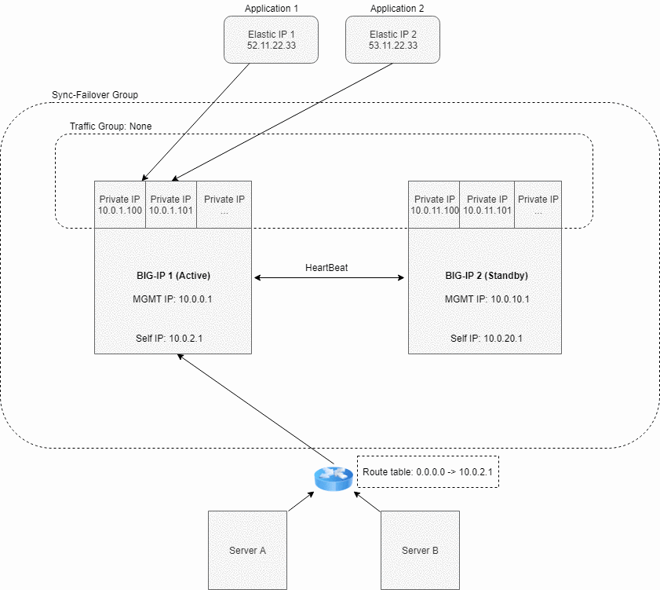

.. _aws:

Amazon Web Services
===================

Failover Event Diagram
----------------------

Prerequisites
-------------

- 2 clustered BIG-IP systems in AWS. See example ARM templates on |github|.
- An AWS IAM role with sufficient access to update the indicated elastic IP addresses and route tables
- Network access to the AWS metadata service
- Virtual addresses created, corresponding to *Secondary Private IP* addresses on the BIG-IP NICs serving application traffic
- Elastic IP addresses, tagged with:
    - the key(s) and values(s) from the *addressTags* section in the Failover Extension Configuration request
    - the private IP addresses that each Elastic IP is associated with, separated by a comma. For example: 
    .. image:: ../images/AWSEIPTags.png
- Route(s) in a route table with destination networks corresponding to the values from the *managedRoutes* section in the Failover Extension configuration request

Example Declaration
-------------------

.. code-block:: json

    {
        "class": "Cloud_Failover",
        "environment": "aws",
          "externalStorage": {
            "scopingTags": {
              "F5_CLOUD_FAILOVER_LABEL": "mydeployment"
            }
        },
          "failoverAddresses": {
            "scopingTags": {
              "F5_CLOUD_FAILOVER_LABEL": "mydeployment"
            }
        },
        "failoverRoutes": {
          "scopingTags": {
            "F5_CLOUD_FAILOVER_LABEL": "mydeployment"
          },
          "scopingAddressRanges": [
            "192.168.1.0/24"
          ]
        }
    }

.. |github| raw:: html

   <a href="https://github.com/F5Networks/f5-aws-cloudformation/tree/master/supported/failover/across-net/via-api/2nic/existing-stack/payg" target="_blank">GitHub</a>