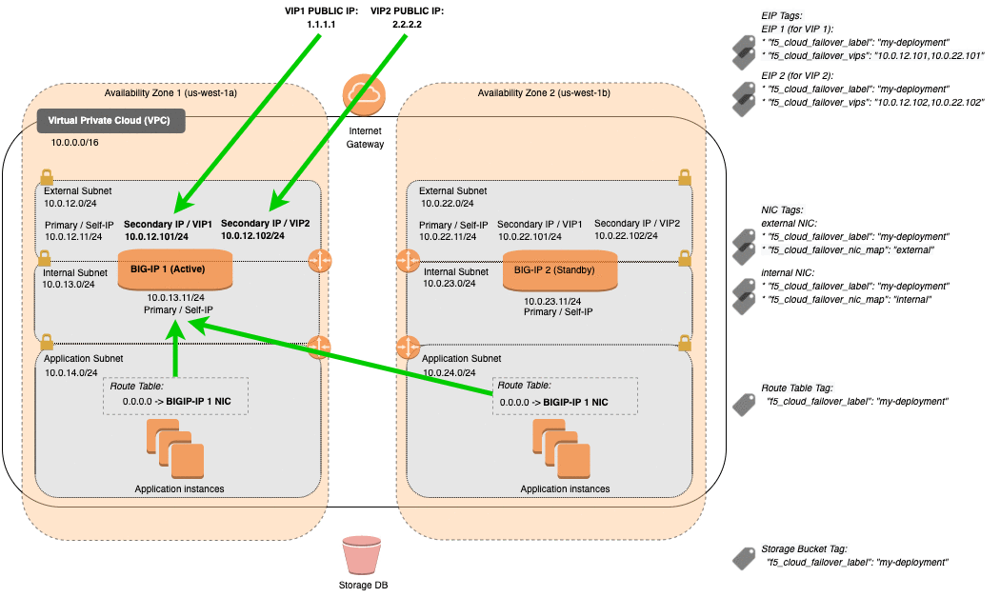
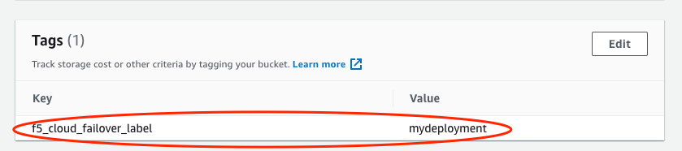
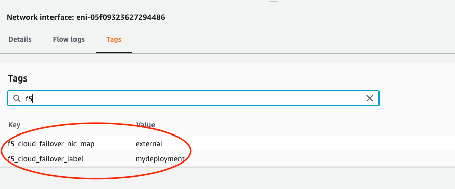
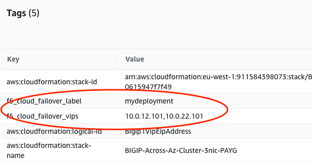

.. _aws:

AWS
===

In this section, you can see the complete steps for implementing Cloud Failover Extension in AWS *(Across Availability Zones)*. For a *Same Availabilty Zone* deployment, see :ref:`aws-same-az`.

AWS CFE Prerequisites
---------------------
These are the basic prerequisites for setting up CFE in AWS:

- **2 BIG-IP systems in Active/Standby configuration**. You can use an `example AWS Cloudformation template <https://github.com/F5Networks/f5-aws-cloudformation/tree/master/supported/failover/across-net/via-api/3nic/existing-stack/payg>`_. Any configuration tool can be used to provision the resources.
- **Disable "Src/Dst checking"** on the NICs if enabling routing or avoiding SNAT. See `AWS documentation <https://docs.aws.amazon.com/AWSEC2/latest/UserGuide/using-eni.html#change_source_dest_check>`_ for more information.

|

Complete these tasks to deploy Cloud Failover Extension in AWS. Before getting started, we recommend you review the `Known Issues <https://github.com/F5Networks/f5-cloud-failover-extension/issues>`_ and :ref:`faq`.

.. include:: /_static/reuse/initial-config.rst

.. table:: Task Summary

   =======  ===================================================================
   Step     Task
   =======  ===================================================================
   1.       :ref:`download-rpm`

            - :ref:`verify-rpm`

   2.       :ref:`upload-install`

            - :ref:`installgui-ref` (or)
            - :ref:`installcurl-ref`

   3.       :ref:`aws-iam`

            - :ref:`aws-iam-example`

   4.       :ref:`aws-tag-objects`

            - :ref:`aws-tag-storage`
            - :ref:`aws-tag-addresses`
            - :ref:`aws-tag-addresses-acrossnet`
            - :ref:`aws-tag-routes`

   5.       Modify and POST the :ref:`aws-example`
   6.       :ref:`update-revert`
   =======  ===================================================================


.. _aws-diagram:

AWS Failover Event Diagram
--------------------------

This diagram shows an example of an *Across Availability Zones* failover with 3NIC BIG-IPs. You can see Elastic IP (EIP) addresses with matching tags are associated with the secondary private IP matching the virtual address corresponding to the active BIG-IP device. Route targets with destinations matching the Cloud Failover Extension configuration are updated with the network interface of the active BIG-IP device.



|

.. Note:: Management NICs/Subnets are not shown in this diagram.

.. _aws-example:

Example AWS Declaration
-----------------------
This example declaration shows the minimum information needed to update the cloud resources in AWS. See the :ref:`quickstart` section for steps on how to post this declaration. See the :ref:`example-declarations` section for more examples.

.. literalinclude:: ../../examples/declarations/aws.json
   :language: json
   :caption: Example AWS Declaration with Single Routing Table
   :tab-width: 4
   :linenos:

:fonticon:`fa fa-download` :download:`aws.json <../../examples/declarations/aws.json>`

|

.. _aws-iam:

Create and assign an IAM Role
-----------------------------
In order to successfully implement CFE in AWS, you need an AWS Identity and Access Management (IAM) role with sufficient access. To create and assign an IAM role you must have a user role of `iam:CreateUser`.

#. In AWS, go to **IAM > Roles** and create a policy with the following permissions:

   - ec2:DescribeInstances
   - ec2:DescribeInstanceStatus
   - ec2:DescribeAddresses
   - ec2:AssociateAddress
   - ec2:DisassociateAddress
   - ec2:DescribeNetworkInterfaces
   - ec2:DescribeNetworkInterfaceAttribute
   - ec2:DescribeRouteTables
   - ec2:AssignPrivateIpAddresses
   - s3:ListAllMyBuckets
   - ec2:UnassignPrivateIpAddresses
   - s3:ListBucket
   - s3:GetBucketTagging
   - s3:PutObject
   - s3:GetObject
   - s3:DeleteObject
   - ec2:CreateRoute
   - ec2:ReplaceRoute
   - sts:AssumeRole

   |

   For example, to create a role for an EC2 service follow these steps:
       1. In the navigation pane of the console, click :guilabel:`Roles` and then select :guilabel:`Create role`.

       2. Select the EC2 service that you will use for this role. Then click :guilabel:`Next: Permissions`.

       3. Click :guilabel:`Create policy` to open a new browser tab and then create a new policy.

       4. Select the EC2 service, expand :guilabel:`Write box` and select the :guilabel:`CreateRoute/ReplaceRoutes` boxes that you want the service to have.

       5. Specify the route-table resource ARN for the ReplaceRoute and CreateRoute action.

       6. Add a route table ARN with the following syntax: ``arn:aws:ec2:region:account:route-table/route-table-id``

       7. Optionally, add a Request Condition.

       8. Choose :guilabel:`Review policy` then select :guilabel:`Create policy`.

   .. image:: ../images/aws/AWSIAMRoleSummary.png

   |

#. Assign an IAM role to each instance by navigating to **EC2 > Instances > Instance > Actions > Instance Settings > Attach/Replace IAM Role**

   For example:

   .. image:: ../images/aws/AWSIAMRoleAssignedToInstance.png

|

.. _aws-iam-example:

IAM Role Example Declaration
````````````````````````````
Below is an example F5 policy that includes IAM roles.

.. IMPORTANT:: This example provides the minimum permissions required and serves as an illustration. You are responsible for following the provider's IAM best practices.

.. code-block:: json

    {
      "Version": "2012-10-17",
      "Statement": [
        {
          "Action": [
            "ec2:DescribeInstances",
            "ec2:DescribeInstanceStatus",
            "ec2:DescribeAddresses",
            "ec2:DescribeNetworkInterfaces",
            "ec2:DescribeNetworkInterfaceAttribute",
            "ec2:DescribeRouteTables",
            "s3:ListAllMyBuckets",
            "s3:GetBucketLocation",
            "ec2:AssociateAddress",
            "ec2:DisassociateAddress",
            "ec2:AssignPrivateIpAddresses",
            "ec2:UnassignPrivateIpAddresses"
          ],
          "Resource": "*",
          "Effect": "Allow"
        },
        {
          "Action": [
            "sts:AssumeRole"
          ],
          "Resource": "arn:aws:iam:::role/<my_role>",
          "Effect": "Allow"
        },
        {
          "Action": [
            "ec2:CreateRoute",
            "ec2:ReplaceRoute"
          ],
          "Resource": "arn:aws:ec2:<my_region>:<account_id>:route-table/<my_id>",
          "Condition": {
            "StringEquals": {
              "ec2:ResourceTag/Name": "<my_resource_name>"
            }
          },
          "Effect": "Allow"
        },
        {
          "Action": [
            "s3:ListBucket",
            "s3:GetBucketLocation",
            "s3:GetBucketTagging"
          ],
          "Resource": "arn:aws:s3:::<my_id>",
          "Effect": "Allow"
        },
        {
          "Action": [
            "s3:PutObject",
            "s3:GetObject",
            "s3:DeleteObject"
          ],
          "Resource": "arn:aws:s3:::<my_id>/*",
          "Effect": "Allow"
        }
      ]
    }

|

.. _aws-tag-objects:

Tag your AWS Network Infrastructure Objects
-------------------------------------------

Tag your infrastructure with the the keys and values that you will send in your CFE declaration.


.. _aws-tag-storage:

Tag the Storage Account in AWS
``````````````````````````````
Create an `S3 bucket <https://docs.aws.amazon.com/AmazonS3/latest/user-guide/create-bucket.html>`_ for Cloud Failover Extension cluster-wide file(s). Then add tags for a key-value pair that will correspond to the key-value tag in the `externalStorage.scopingTags` section of the CFE declaration.

.. WARNING:: To avoid a potential data breach, ensure the required S3 buckets are properly secured and do not have public access.

#. Sign in to the AWS Management Console and open the Amazon S3 console.

#. In the :guilabel:`Bucket name` list, choose the name of the bucket.

#. In the :guilabel:`Name` list, choose the name of the object you want to add tags to.

#. Select :guilabel:`Properties`.

#. Select :guilabel:`Tags` and then select :guilabel:`Add Tag`.

#. Each tag is a key-value pair. Type a :guilabel:`Key` and a :guilabel:`Value` of your choosing. This key-value pair will match the key-value pair you enter in the `externalStorage.scopingTags` section of the CFE declaration. Then select :guilabel:`Save`

.. NOTE:: If you use our declaration example, the key-value tag would be: ``"f5_cloud_failover_label":"mydeployment"``



|

.. _aws-tag-addresses:

Tag the Network Interfaces in AWS:
``````````````````````````````````

#. Create two sets of tags for Network Interfaces:

   - **Deployment scoping tag**: a key-value pair that will correspond to the key-value pair in the `failoverAddresses.scopingTags` section of the CFE declaration.

     .. NOTE:: If you use our declaration example, the key-value tag would be: ``"f5_cloud_failover_label":"mydeployment"``

   - **NIC mapping tag**: a key-value pair with the reserved key named ``f5_cloud_failover_nic_map`` and a user-provided value that can be anything. For example ``"f5_cloud_failover_nic_map":"external"``.

     .. IMPORTANT:: The same tag (matching key:value) must be placed on corresponding NIC on the peer BIG-IP. For example, each BIG-IP would have their external NIC tagged with ``"f5_cloud_failover_nic_map":"external"`` and their internal NIC tagged with ``"f5_cloud_failover_nic_map":"internal"``.



|

.. _aws-tag-addresses-acrossnet:

Tag the Elastic IP Addresses in AWS:
````````````````````````````````````

#. Create two sets of tags for Elastic IP addresses:

   - **Deployment scoping tag**: a key-value pair that will correspond to the key-value pair in the `failoverAddresses.scopingTags` section of the CFE declaration.

     .. NOTE:: If you use our declaration example, the key-value tag would be: ``"f5_cloud_failover_label":"mydeployment"``

   - **VIP mapping tag**: a key-value pair with the reserved key named ``f5_cloud_failover_vips`` and value that contains a comma-separated list of addresses mapping to a private IP address on each instance in the cluster that the Elastic IP is associated with. For example: ``"f5_cloud_failover_vips":"10.0.12.101,10.0.22.101"``



|

.. _aws-tag-routes:

Tag the Route Tables in AWS
```````````````````````````

.. sidebar:: :fonticon:`fa fa-info-circle fa-lg` Version Notice:

   Use these steps for CFE version 1.5.0 and newer.

The parameter ``routeGroupDefinitions`` was added in CFE v1.5.0. It allows more granular route-table operations and you are not required to tag the routes. See :ref:`failover-routes` for more information. 

.. code-block:: json

   "failoverRoutes":{
       "enabled":true,
       "routeGroupDefinitions":[
           {
             "scopingName":"rtb-11111111111111111",
             "scopingAddressRanges":[
                 {
                   "range":"0.0.0.0/0"
                 }
             ],
             "defaultNextHopAddresses":{
                 "discoveryType":"static",
                 "items":[
                   "10.0.13.11",
                   "10.0.23.11"
                 ]
             }
           }
       ]
   }

|

See :ref:`advanced-routing-examples-aws` for additional examples of more advanced configurations.

|

.. sidebar:: :fonticon:`fa fa-info-circle fa-lg` Version Notice:

   Use these steps for CFE versions earlier than 1.5.0.

To enable route failover in CFE versions earlier than v1.5.0, tag the route tables containing the routes you want to manage.

1. Create a key-value pair that will correspond to the key-value pair in the `failoverAddresses.scopingTags` section of the CFE declaration.

.. NOTE:: If you use our declaration example, the key-value tag would be ``"f5_cloud_failover_label":"mydeployment"``

2. In the case where BIG-IP has multiple NICs, CFE needs to know what interfaces (by using the Self-IPs associated with those NICs) it needs to re-map the routes to. You can either define the nextHopAddresses using an additional tag on the route table or provide them statically in the cloud failover configuration.

   - If you use discoveryType ``routeTag``, you will need to add another tag to the route table in your cloud environment with the reserved key ``f5_self_ips``. For example, ``"f5_self_ips":"10.0.13.11,10.0.23.11"``.


   .. code-block:: json

       "failoverRoutes": {
         "enabled": true,
         "scopingTags": {
           "f5_cloud_failover_label": "mydeployment"
         },
         "scopingAddressRanges": [
           {
             "range": "0.0.0.0/0",
             "nextHopAddresses": {
                 "discoveryType":"routeTag"
             }
           }
         ]
       }

   - If you use discoveryType ``static``, you can provide the Self-IPs in the items area of the CFE configuration. See :ref:`failover-routes` for more information.  

| 


.. _aws-as3-across-az-example:

Example Virtual Service Declaration
-----------------------------------

See below for example Virtual Services created with `AS3 <https://clouddocs.f5.com/products/extensions/f5-appsvcs-extension/latest/>`_ in :ref:`aws-diagram` above:

.. literalinclude:: ../../examples/toolchain/as3/aws-as3-across-az.json
   :language: json
   :caption: Example AS3 Declaration
   :tab-width: 4
   :linenos:

:fonticon:`fa fa-download` :download:`aws-as3-across-az.json <../../examples/toolchain/as3/aws-as3-across-az.json>`


.. include:: /_static/reuse/feedback.rst