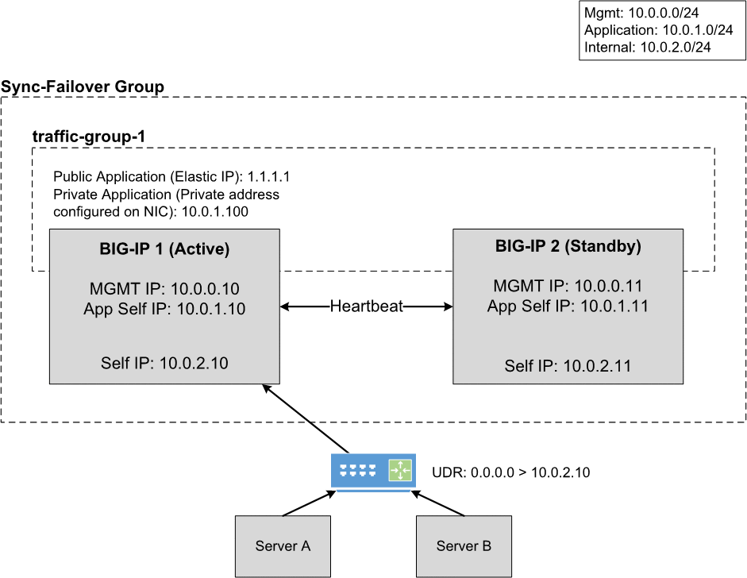

.. _aws:

AWS
===

In this section, you can see the complete steps for implementing Cloud Failover Extension in AWS. You can also go straight to the :ref:`aws-example`.

AWS CFE Prerequisites
---------------------
These are the basic prerequisites for setting up CFE in AWS:

- **2 BIG-IP systems in Active/Standby configuration**. You can find an example AWS Cloudformation template |cloudformation|. Any configuration tool can be used to provision the resources.


|

Complete these tasks to deploy Cloud Failover Extension in AWS. Before getting started, we recommend you review the `Known Issues <https://github.com/F5Devcentral/f5-cloud-failover-extension/issues>`_ and :ref:`faq`. 

.. include:: /_static/reuse/initial-config.rst

.. table:: Task Summary

   =======  ===================================================================
   Step     Task
   =======  ===================================================================
   1.       :ref:`download-rpm`

            - :ref:`verify-rpm`

   2.       :ref:`upload-install`

            - :ref:`installgui-ref` (or)
            - :ref:`installcurl-ref`

   3.       :ref:`aws-iam`

            - :ref:`aws-iam-example`

   4.       :ref:`aws-tag-objects`

            - :ref:`aws-tag-storage`
            - :ref:`aws-tag-addresses`

              - :ref:`aws-tag-addresses-samenet` (or)
              - :ref:`aws-tag-addresses-acrossnet`

            - :ref:`aws-tag-routes`

   5.       Modify and POST the :ref:`aws-example`
   6.       :ref:`update-revert`
   =======  ===================================================================


Failover Event Diagram
----------------------

This diagram shows a failover event with CFE implemented in AWS. You can see Elastic IP addresses with matching tags are associated with the secondary private IP matching the virtual address corresponding to the active BIG-IP device. Route targets with destinations matching the Failover Extension configuration are updated with the network interface of the active BIG-IP device.



|

.. _aws-example:

Example AWS Declaration
-----------------------
This example declaration shows the minimum information needed to update the cloud resources in AWS. See the :ref:`quickstart` section for steps on how to post this declaration.

.. literalinclude:: ../../examples/declarations/aws.json
   :language: json
   :tab-width: 4

:fonticon:`fa fa-download` :download:`aws.json <../../examples/declarations/aws.json>`

|


.. _aws-iam:

Create and assign an IAM Role
-----------------------------
In order to successfully implement CFE in AWS, you need an AWS Identity and Access Management (IAM) role with sufficient access. To create and assign an IAM role you must have a user role of `iam:CreateUser`.

#. In AWS, go to **IAM > Roles** and create a policy with the following permissions:

   - EC2 Read/Write
   - S3 Read/Write
   - STS Assume Role
   
   |
    
   For example, to create a role for an EC2 service follow these steps:
       1. In the navigation pane of the console, click :guilabel:`Roles` and then select :guilabel:`Create role`.
   
       2. Select the EC2 service that you will use for this role. Then click :guilabel:`Next: Permissions`.

       3. Click :guilabel:`Create policy` to open a new browser tab and then create a new policy.

       4. Select the EC2 service, expand :guilabel:`Write box` and select the :guilabel:`CreateRoute/ReplaceRoutes` boxes that you want the service to have.

       5. Specify the route-table resource ARN for the ReplaceRoute and CreateRoute action.

       6. Add a route table ARN with the following syntax: ``arn:aws:ec2:region:account:route-table/route-table-id``

       7. Optionally, add a Request Condition.
   
       8. Choose :guilabel:`Review policy` then select :guilabel:`Create policy`.

   .. image:: ../images/aws/AWSIAMRoleSummary.png
     :width: 800
    
   |

#. Assign an IAM role to each instance by navigating to **EC2 > Instances > Instance > Actions > Instance Settings > Attach/Replace IAM Role**

   For example:

   .. image:: ../images/aws/AWSIAMRoleAssignedToInstance.png
     :width: 800

|

.. _aws-iam-example:

IAM Role Example Declaration
````````````````````````````
Below is an example F5 policy that includes IAM roles.

.. IMPORTANT:: This example provides the minimum permissions required and serves as an illustration. You are responsible for following the provider's IAM best practices.

.. code-block:: json

    {
      "Version": "2012-10-17",
      "Statement": [
        {
          "Action": [
            "ec2:DescribeInstances",
            "ec2:DescribeInstanceStatus",
            "ec2:DescribeAddresses",
            "ec2:DescribeNetworkInterfaces",
            "ec2:DescribeNetworkInterfaceAttribute",
            "ec2:DescribeRouteTables",
            "s3:ListAllMyBuckets",
            "ec2:AssociateAddress",
            "ec2:DisassociateAddress",
            "ec2:AssignPrivateIpAddresses",
            "ec2:UnassignPrivateIpAddresses"
          ],
          "Resource": "*",
          "Effect": "Allow"
        },
        {
          "Action": [
            "sts:AssumeRole"
          ],
          "Resource": "arn:aws:iam:::role/<my_role>",
          "Effect": "Allow"
        },
        {
          "Action": [
            "ec2:CreateRoute",
            "ec2:ReplaceRoute"
          ],
          "Resource": "arn:aws:ec2:<my_region>:<account_id>:route-table/<my_id>",
          "Condition": {
            "StringEquals": {
              "ec2:ResourceTag/Name": "<my_resource_name>"
            }
          },
          "Effect": "Allow"
        },
        {
          "Action": [
            "s3:ListBucket",
            "s3:GetBucketTagging"
          ],
          "Resource": "arn:aws:s3:::<my_id>",
          "Effect": "Allow"
        },
        {
          "Action": [
            "s3:PutObject",
            "s3:GetObject",
            "s3:DeleteObject"
          ],
          "Resource": "arn:aws:s3:::<my_id>/*",
          "Effect": "Allow"
        }
      ]
    }

|

.. _aws-tag-objects:

Tag your AWS Network Infrastructure Objects
-------------------------------------------

Tag your infrastructure with the the keys and values that you will send in your CFE declaration.

.. IMPORTANT:: You must tag the following resources. Even if you only have routes to update during failover (for example, there are no Elastic IPs to re-map) you still have to tag the NICs on the Virtual Machines associated with the IPs in your CFE declaration.


.. _aws-tag-storage:

Tag the storage account in AWS
``````````````````````````````
Create an `S3 bucket <https://docs.aws.amazon.com/AmazonS3/latest/user-guide/create-bucket.html>`_ for Cloud Failover Extension cluster-wide file(s). Then add tags for a key-value pair that will correspond to the key-value tag in the `externalStorage.scopingTags` section of the CFE declaration.

.. WARNING:: To avoid a potential data breach, ensure the required S3 buckets are properly secured and do not have public access.

#. Sign in to the AWS Management Console and open the Amazon S3 console.

#. In the :guilabel:`Bucket name` list, choose the name of the bucket.

#. In the :guilabel:`Name` list, choose the name of the object you want to add tags to.

#. Select :guilabel:`Properties`. 

#. Select :guilabel:`Tags` and then select :guilabel:`Add Tag`. 

#. Each tag is a key-value pair. Type a :guilabel:`Key` and a :guilabel:`Value` of your choosing. This key-value pair will match the key-value pair you enter in the `externalStorage.scopingTags` section of the CFE declaration. Then select :guilabel:`Save`


.. _aws-tag-addresses:

Tag the Network Interfaces in AWS:
``````````````````````````````````
Choose the set of instructions to follow based on whether you are provisioning for same network or across network.

.. _aws-tag-addresses-samenet:

For Same Network Topology
`````````````````````````
If provisioning Same Network Topology, you will need to: 

#. Create two sets of tags for Network Interfaces:

   - **Deployment scoping tag**: a key-value pair that will correspond to the key-value pair in the `failoverAddresses.scopingTags` section of the CFE declaration.
   - **NIC mapping tag**: a key-value pair where the key is static but the value is user-provided (for example, ``f5_cloud_failover_nic_map:<your value>``). This tag must match the corresponding NIC on the secondary BIG-IP.

#. Disable the built-in scripts (``/usr/libexec/aws/aws-failover-tgactive.sh, /usr/libexec/aws/aws-failover-tgrefresh.sh``) from a BIG-IP shell, either manually or using automation:

   .. code-block:: bash

      mount -o remount,rw /usr
      mv /usr/libexec/aws/aws-failover-tgactive.sh /usr/libexec/aws/aws-failover-tgactive.sh.disabled
      mv /usr/libexec/aws/aws-failover-tgrefresh.sh /usr/libexec/aws/aws-failover-tgrefresh.sh.disabled
      mount -o remount,ro /usr


.. _aws-tag-addresses-acrossnet:

For Across Network Topology
```````````````````````````
If provisioning Across Network Topology, you will need to:

#. Create two sets of tags for Elastic IP addresses:

   - a key-value pair that will correspond to the key-value pair in the `failoverAddresses.scopingTags` section of the CFE declaration.
   - a special key called ``f5_cloud_failover_vips`` that contains a comma-separated list of addresses mapping to a private IP address on each instance in the cluster that the Elastic IP is associated with. For example: ``10.0.0.10,10.0.0.11``


.. _aws-tag-routes:

Tag the User-Defined routes in AWS
``````````````````````````````````
.. include:: /_static/reuse/discovery-type-note.rst

If you are using the ``routeTag`` option for ``discoveryType`` within the CFE declaration, you need to tag the route(s) in a route table with a key-value pair that will correspond to the key-value pair in the `failoverRoutes.scopingTags` section of the CFE declaration.
  


.. include:: /_static/reuse/feedback.rst


.. |github| raw:: html

   <a href="https://github.com/F5Networks/f5-aws-cloudformation/tree/master/supported/failover/across-net/via-api/2nic/existing-stack/payg" target="_blank">GitHub</a>

.. |cloudformation| raw:: html

   <a href="https://github.com/F5Networks/f5-aws-cloudformation/tree/master/supported/failover/across-net/via-api/2nic/existing-stack/payg" target="_blank">here</a>

   
