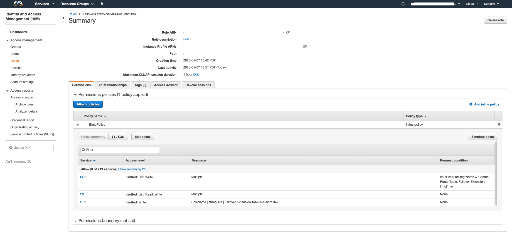

.. _aws:

AWS
===

In this section, you can see a failover event diagram, example declaration, and requirements for implementing Cloud Failover in AWS. 

Failover Event Diagram
----------------------

This diagram shows a failover event with CFE implemented in AWS. You can see Elastic IP addresses with matching tags are associated with the secondary private IP matching the virtual address corresponding to the active BIG-IP device. Route targets with destinations matching the Failover Extension configuration are updated with the network interface of the active BIG-IP device.

.. image:: ../images/aws/AWSFailoverExtensionHighLevel.gif
  :width: 800


.. _aws-example:

Example Declaration
-------------------
This example declaration shows the minimum information needed to update the cloud resources in AWS. See the :ref:`quickstart` section for steps on how to post this declaration.

.. literalinclude:: ../../examples/declarations/aws.json
   :language: json
   :tab-width: 4

Requirements
------------
These are the minimum requirements for setting up Cloud Failover in AWS:

- **2 BIG-IP systems in Active/Standby configuration**. You can find an example AWS Cloudformation template |cloudformation|. Any configuration tool can be used to provision the resources.
<<<<<<< HEAD
- **An AWS Identity and Access Management (IAM) role with sufficient access**. See the instructions below for creating and assigning an IAM role.
- **An S3 bucket for Cloud Failover Extension cluster-wide file(s)**. This must be tagged with a key/value pair corresponding to the key/value(s) provided in the `externalStorage.scopingTags` section of the Cloud Failover Extension configuration.

  .. IMPORTANT:: Ensure the required storage accounts do not have public access.

- Elastic IP addresses tagged with:
    - a key/value corresponding to the key/value(s) provided in the `failoverAddresses.scopingTags` section of the Cloud Failover Extension configuration
    - a special key called `VIPS` containing a comma-separated list of addresses mapping to a private IP address on each instance in the cluster that the Elastic IP is associated with. For example: ``10.0.0.10,10.0.0.11``

- Route(s) in a route table tagged with:
    - a key/value corresponding to the key/value(s) provided in the `failoverRoutes.scopingTags` section of the Cloud Failover Extension configuration
    - a special key called `f5_self_ips` containing a comma-separated list of addresses that map to a self IP address on each instance in the cluster. Example: ``10.0.0.10,10.0.0.11``
=======
- **An AWS Identity and Access Management (IAM) role with sufficient access**. See the instructions below for :ref:`aws-iam`.
- **An S3 bucket for Cloud Failover extension cluster-wide file(s)**. This must be tagged with a key/value pair corresponding to the key/value(s) to provide in the `externalStorage.scopingTags` section of the Cloud Failover extension configuration.

  .. IMPORTANT:: Ensure the required storage accounts do not have public access.

- **Route(s) in a route table** tagged with:
    - a key/value corresponding to the key/value(s) to provide in the `failoverRoutes.scopingTags` section of the Cloud Failover Extension configuration
    - a special key called `f5_self_ips` containing a comma-separated list of addresses that map to a self IP address on each instance in the cluster. For example: ``10.0.0.10,10.0.0.11``.
>>>>>>> develop
  
  .. NOTE:: The failover extension configuration `failoverRoutes.scopingAddressRanges` contains a list of destination routes to update.
  

- **If provisioning Same Network Topology, you will need**:

  - Network Interfaces tagged with:

    - a key/value corresponding to the key/value(s) to provide in the `failoverAddresses.scopingTags` section of the Cloud Failover extension configuration
    - a special key called ``f5_cloud_failover_nic_map``. This key is a NIC mapping tag where the key is static but the value is user-provided and must match the corresponding NIC on the secondary BIG-IP. For example, ``f5_cloud_failover_nic_map:<your value>``.

  - to disable the built-in script (/usr/libexec/aws/aws-failover-tgactive.sh) from a BIG-IP shell, either manually or using automation:

    .. code-block:: bash

      mount -o remount,rw /usr
      mv /usr/libexec/aws/aws-failover-tgactive.sh /usr/libexec/aws/aws-failover-tgactive.sh.disabled
      mount -o remount,ro /us

- **If provisioning Across Network Topology, you will need**:

  - Elastic IP addresses tagged with:

    - a key/value corresponding to the key/value(s) to provide in the `failoverAddresses.scopingTags` section of the Cloud Failover extension configuration
    - a special key called `VIPS` containing a comma-separated list of addresses mapping to a private IP address on each instance in the cluster that the Elastic IP is associated with. For example: ``10.0.0.10,10.0.0.11``


.. _aws-iam:

Creating and assigning an IAM Role
``````````````````````````````````
To create and assign an IAM role you must have a user role of `iam:CreateUser`.

1. In AWS, go to **IAM > Roles** and create a policy with the following permissions:

- EC2 Read/Write
- S3 Read/Write
- STS Assume Role

    
For example:


    

2. Assign an IAM role to each instance by navigating to **EC2 > Instances > Instance > Actions > Instance Settings > Attach/Replace IAM Role**

For example:

.. image:: ../images/aws/AWSIAMRoleAssignedToInstance.png
  :width: 800


IAM Role Example Declaration
````````````````````````````

Below is an example F5 policy that includes IAM roles.

.. IMPORTANT:: This example provides the minimum permissions required and serves as an illustration. You are responsible for following the provider's IAM best practices.

.. code-block:: json

    Examples for ec2:ReplaceRoute
      {
        "Effect": "Allow",
        "Action": [
            "ec2:CreateRoute",
            "ec2:ReplaceRoute"
        ],
        "Resource": "arn:aws:ec2:::route-table/*",
        "Condition": {
            "StringEquals": {
            "ec2:Vpc": "arn:aws:ec2:region:account:vpc/vpc-ec43eb89"
            }
        }
    },

    Or 
    {
        "Effect": "Allow",
        "Action": [
            "ec2:CreateRoute",
            "ec2:ReplaceRoute"
        ],
        "Resource": "arn:aws:ec2:::route-table/*",
        "Condition": {
            "StringEquals": {
            "ec2:ResourceTag/Owner": "${aws:username}"
            }
        }
    },


    ==
    resource "aws_iam_role_policy" "BigIpPolicy" {
      name = "BigIpPolicy"
      role = "${aws_iam_role.main.id}"

      policy = <<EOF
    {
      "Version": "2012-10-17",
      "Statement": [
        {
        "Effect": "Allow",
        "Action": [
            "ec2:DescribeInstances",
            "ec2:DescribeInstanceStatus",
            "ec2:DescribeAddresses",
            "ec2:DescribeNetworkInterfaces",
            "ec2:DescribeNetworkInterfaceAttribute",
            "ec2:DescribeRouteTables",
            "ec2:AssociateAddress",
            "ec2:DisassociateAddress",
            "ec2:assignprivateipaddresses",
            "ec2:unassignPrivateIpAddresses",
            "s3:ListAllMyBuckets"
        ],
        "Resource": "*",
        "Condition": {
            "StringEquals": {
            "ec2:ResourceTag/Owner": "${aws:username}"
            }
        }
      },
      {
        "Effect": "Allow",
        "Action": [
            "sts:AssumeRole"
        ],
        "Resource": "arn:aws:iam:::role/Failover-Extension-IAM-role-${module.utils.env_prefix}"
        },
        {
          "Effect": "Allow",
          "Action": [
            "ec2:CreateRoute",
            "ec2:ReplaceRoute"
          ],
          "Resource": "arn:aws:ec2:::route-table/*",
          "Condition": {
            "StringEquals": {
            "ec2:Vpc": "arn:aws:ec2:region:account:vpc/vpc-ec43eb89"
            }
          }
        },
        {
          "Effect": "Allow",
          "Action": [
            "s3:ListBucket",
            "s3:GetBucketTagging"
          ],
          "Resource": "arn:aws:s3:::${aws_s3_bucket.configdb.id}"
        },
        {
          "Effect": "Allow",
          "Action": [
            "s3:PutObject",
            "s3:GetObject",
            "s3:DeleteObject"
          ],
          "Resource": "arn:aws:s3:::${aws_s3_bucket.configdb.id}/*"
        }
      ]
    }
    EOF
    }


.. NOTE:: To provide feedback on this documentation, you can file a |issue|.


.. |github| raw:: html

   <a href="https://github.com/F5Networks/f5-aws-cloudformation/tree/master/supported/failover/across-net/via-api/2nic/existing-stack/payg" target="_blank">GitHub</a>

.. |cloudformation| raw:: html

   <a href="https://github.com/F5Networks/f5-aws-cloudformation/tree/master/supported/failover/across-net/via-api/2nic/existing-stack/payg" target="_blank">here</a>


.. |issue| raw:: html

   <a href="https://github.com/F5Devcentral/f5-cloud-failover-extension/issues" target="_blank">GitHub Issue</a>
