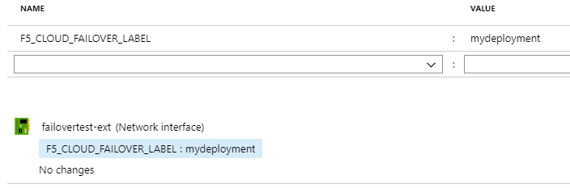
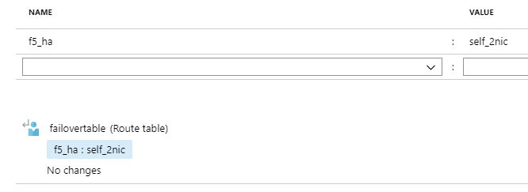

.. _azure:

Azure
=====

Failover Event Diagram
----------------------

.. image:: ../images/AzureFailoverExtensionHighLevel.gif
  :width: 800

Prerequisites
-------------

- 2 clustered BIG-IPs in Azure. See the example ARM templates on |github|.
- An Azure system-assigned or user-managed identity with Contributor role to the virtual machines and resource group where network interfaces and route tables are configured. These network interfaces need to be tagged with the key(s) and value(s) from the addressTags section in the Failover Extension configuration request. For example:

- Network access to the Azure metadata service
- Virtual addresses created in a named traffic group and matching Secondary Private IP addresses on the IP configurations of the BIG-IP NICs serving application traffic
- Route(s) in the route table with destination networks corresponding to the values from the managedRoutes section in the Failover Extension Configuration request
- Route table(s) tagged with key(s) named "f5_ha" with value(s) matching the self IP address name(s) from the BIG-IP devices. For example:

Example Declaration
-------------------

.. |github| raw:: html

   <a href="https://github.com/F5Networks/f5-azure-arm-templates/tree/master/supported/failover/same-net/via-api/n-nic/existing-stack/payg" target="_blank">Github</a>