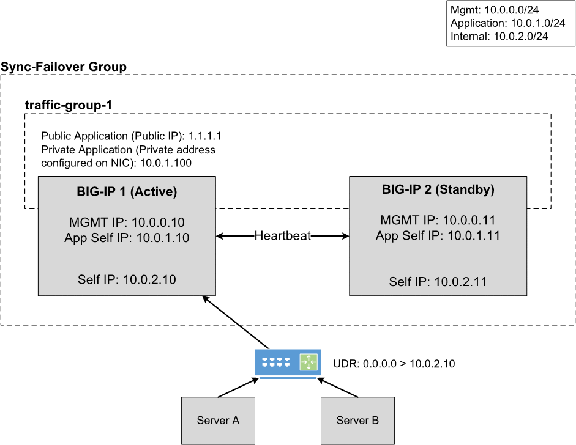
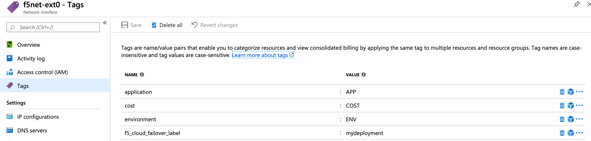
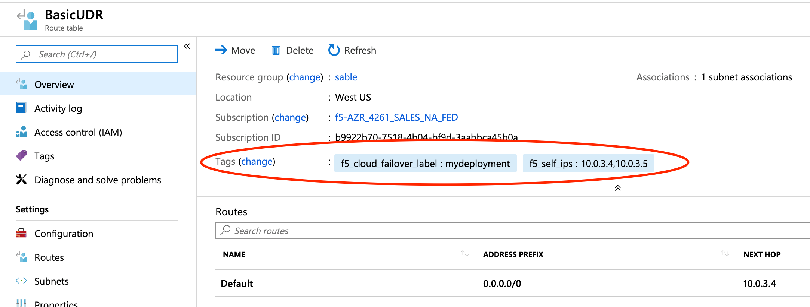

.. _azure:

Azure
=====

In this section, you will see the complete steps for implementing Cloud Failover Extension in Microsoft Azure. You can also go straight to the :ref:`azure-example`.

.. _azure-prereqs:

Azure CFE Prerequisites
-----------------------
These are the basic prerequisites for setting up CFE in Microsoft Azure.

- **2 BIG-IP systems in Active/Standby configuration**. You can find an example ARM template |armtemplate|. Any configuration tool can be used to provision the resources.
- **Virtual addresses** created in a floating traffic group and matching addresses (secondary) on the IP configurations of the instance NICs serving application traffic.
- **Access to Azure's Instance Metadata Service**, which is a REST Endpoint accessible to all IaaS VMs created with the Azure Resource Manager. The endpoint is available at a well-known non-routable IP address (169.254.169.254) that can only be accessed from within the VM. See the instructions below to :ref:`azure-ims`.

.. NOTE:: CFE makes calls to the Azure APIs in order to failover cloud resource objects such as private IP addresses and route tables. These calls may vary significantly in response time. 

|

Complete these tasks to deploy Cloud Failover Extension in Microsoft Azure. Before getting started, we recommend you review the `Known Issues <https://github.com/F5Networks/f5-cloud-failover-extension/issues>`_ and :ref:`faq`. 

.. include:: /_static/reuse/initial-config.rst

.. table:: Task Summary

   =======  ===================================================================
   Step     Task
   =======  ===================================================================
   1.       :ref:`download-rpm`

            - :ref:`verify-rpm`

   2.       :ref:`upload-install`

            - :ref:`installgui-ref` (or)
            - :ref:`installcurl-ref`

   3.       :ref:`azure-msi`
   4.       :ref:`azure-tag-objects`

            - :ref:`azure-storage`
            - :ref:`azure-nictagging`
            - :ref:`azure-udrtagging`

   5.       :ref:`azure-ims`
   6.       Modify and POST the :ref:`azure-example`
   7.       :ref:`update-revert`
   =======  ===================================================================


.. _azure-diagram:

Failover Event Diagram
----------------------

The following diagram shows a failover event with CFE implemented in Microsoft Azure with an HA pair in an Active/Standby configuration.

In the diagram, the IP configuration has a secondary private address that matches a virtual address in a traffic group owned by the active BIG-IP. In the event of a failover, the IP configuration is deleted and recreated on that device's network interface. Simultaneously, the user-defined routes are updated with a next hop attribute the corresponds to the self IP address of the active BIG-IP.




|

.. _azure-example:

Example Azure Declaration
-------------------------
This example declaration shows the minimum information needed to update the cloud resources in Azure. See the :ref:`quickstart` section for steps on how to post this declaration.


.. literalinclude:: ../../examples/declarations/azure.json
   :language: json
   :tab-width: 4

:fonticon:`fa fa-download` :download:`azure.json <../../examples/declarations/azure.json>`

|


.. _azure-msi:

Create and assign a Managed Service Identity (MSI)
--------------------------------------------------
In order to successfully implement CFE in Azure, you need a system-assigned or user-managed identity with sufficient access. Your Managed Service Identity (MSI) should be limited to the resource groups that contain the BIG-IP instances, VNET, route tables, etc. that will be updated. Read more about managed identities |managed-identity|.
To create and assign a Managed Service Identity (MSI) you must have a role of `User Access Administrator` or `Contributor access`. The following example shows a system-assigned MSI.

#. Enable MSI for each VM: go to **Virtual Machine > Identity > System assigned** and set the status to ``On``.

   For example:

   .. image:: ../images/azure/AzureMSIVMIdentity.png
     :width: 800

   | 

#. Assign permissions to each MSI: go to **Resource Group > Access control (IAM) > Role assignments > Add**, make the changes listed below, and then add the MSI.

   - Role: Contributor
   - Assign access to: **System assigned managed identity > Virtual Machine**

   |

   For example: 

   .. image:: ../images/azure/AzureMSIAssignedToResourceGroup.png
     :width: 800


.. _azure-rbac:

RBAC Role Definition
````````````````````

Below is an example Azure role definition with permissions required by CFE.

.. IMPORTANT:: This example provides the minimum permissions required and serves as an illustration. You are responsible for following the provider's IAM best practices.

- Microsoft.Authorization/*/read
- Microsoft.Compute/locations/*/read
- Microsoft.Compute/virtualMachines/*/read
- Microsoft.Network/networkInterfaces/read
- Microsoft.Network/networkInterfaces/write
- Microsoft.Network/*/join/action
- Microsoft.Network/routeTables/*/read
- Microsoft.Network/routeTables/*/write
- Microsoft.Resources/subscriptions/resourceGroups/read
- Microsoft.Storage/storageAccounts/read
- Microsoft.Storage/storageAccounts/listKeys/action

.. IMPORTANT:: Certain resources such as the virtual network are commonly deployed in a seperate resource group, ensure the correct scopes are applied to all applicable resource groups.

|


.. _azure-tag-objects:

Tag your Azure Network Infrastructure Objects
---------------------------------------------

Tag your infrastructure with the the names and values that you will send in your CFE declaration.

.. IMPORTANT:: You must tag the following resources. Even if you only have routes to update during failover (for example, there are no NIC IP configuration objects to re-map) you still have to tag the NICs on the Virtual Machines associated with the IPs in your CFE declaration.


.. _azure-storage:

Tag the storage account in Azure
````````````````````````````````
Add a storage account to your resource group, and tag with a name/value pair that corresponds to the name/value pair in the `externalStorage.scopingTags` section of the CFE declaration.

.. WARNING:: Ensure the required storage accounts do not have public access.


.. _azure-nictagging:

Tag the Network Interfaces in Azure
```````````````````````````````````
Within Azure, go to **NIC > Tags** to create two distinct tags:

- **Deployment scoping tag**: the example below uses ``f5_cloud_failover_label:mydeployment`` but the name and value can be anything. 
- **NIC mapping tag**: the name is static but the value is user-provided (``f5_cloud_failover_nic_map:<your value>``) and must match the corresponding NIC on the secondary BIG-IP. The example below uses ``f5_cloud_failover_nic_map:external``.




|

.. _azure-udrtagging:

Tag the User-Defined routes in Azure
````````````````````````````````````
.. include:: /_static/reuse/discovery-type-note.rst

If you are using the ``routeTag`` option for ``discoveryType`` within the CFE declaration, you need to tag the route(s) with a name/value pair that will correspond to the name/value pair in the `failoverRoutes.scopingTags` section of the CFE declaration.

Within Azure, go to **Basic UDR > Tags** to create a deployment scoping tag. The name and value can be anything; the example below uses ``f5_cloud_failover_label:mydeployment``.




|


.. _azure-ims:

Set up access to Azure's Instance Metadata Service
--------------------------------------------------

Azure's Instance Metadata Service is a REST Endpoint accessible to all IaaS VMs created via the Azure Resource Manager. The endpoint is available at a well-known non-routable IP address (169.254.169.254) that can be accessed only from within the VM.

.. IMPORTANT:: Certain BIG-IP versions and/or topologies may use DHCP to create the management routes (for example: ``dhclient_route1``), if that is the case the below steps are not required.

To configure the route on BIG-IP to talk to Azure's Instance Metadata Services, use either of the following commands:

Using TMSH
``````````

.. code-block:: bash

  tmsh modify sys db config.allow.rfc3927 value enable
  tmsh create sys management-route metadata-route network 169.254.169.254/32 gateway 192.0.2.1
  tmsh save sys config

Using Declarative Onboarding
````````````````````````````
        
.. code-block:: json

  {
    "managementRoute": {
      "class": "ManagementRoute",
      "gw": "192.0.2.1",
      "network": "169.254.169.254",
      "mtu": 1500
    },
    "dbVars": {
      "class": "DbVariables",
      "config.allow.rfc3927": "enable"
    }
  }


|

.. include:: /_static/reuse/feedback.rst


.. |github| raw:: html

   <a href="https://github.com/F5Networks/f5-azure-arm-templates/tree/master/supported/failover/same-net/via-api/n-nic/existing-stack/payg" target="_blank">Github</a>


.. |armtemplate| raw:: html

   <a href="https://github.com/F5Networks/f5-azure-arm-templates/tree/master/supported/failover/same-net/via-api/n-nic/existing-stack/payg" target="_blank">here</a>


.. |managed-identity| raw:: html

   <a href="https://docs.microsoft.com/en-us/azure/active-directory/managed-identities-azure-resources/overview" target="_blank">here</a>
