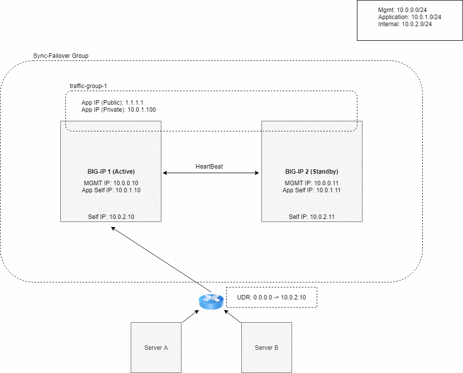

.. _azure:

Azure
=====

In this section, you can see a failover event diagram, example declaration, and requirements for implementing Cloud Failover in Microsoft Azure. 

Failover Event Diagram
----------------------

This diagram shows a failover event with Cloud Failover implemented in Microsoft Azure. IP configuration(s) with a secondary private address that matches a virtual address in a traffic group owned by the active BIG-IP are deleted and recreated on that device's network interface(s). User-defined routes with a destination and parent route table with tags matching the Failover Extension configuration are updated with a next hop attribute that corresponds to the self-IP address of the active BIG-IP.





.. _azure-example:

Example Declaration
-------------------
This example declaration shows the minimum information needed to update the cloud resources in Azure. See the :ref:`quickstart` section for steps on how to post this declaration.

.. code-block:: json

    {
        "class": "Cloud_Failover",
        "environment": "azure",
        "externalStorage": {
            "scopingTags": {
              "f5_cloud_failover_label": "mydeployment"
            }
        },
        "failoverAddresses": {
            "scopingTags": {
              "f5_cloud_failover_label": "mydeployment"
            }
        },
        "failoverRoutes": {
          "scopingTags": {
            "f5_cloud_failover_label": "mydeployment"
          },
          "scopingAddressRanges": [
            "192.168.1.0/24"
          ]
        }
    }


Requirements
------------
These are the requirements for setting up Cloud Failover in Microsoft Azure. More information is provided in the sections below.

- **2 BIG-IP systems in Active/Standby configuration**. You can find an example ARM template |armtemplate|. Any configuration tool can be used to provision the resources.
- **An Azure system-assigned or user-managed identity with sufficient access**. This should be limited to the appropriate resource groups that contain the BIG-IP VNet as well as any route tables that will be updated. See the instructions below for :ref:`azure-msi`. Read more about managed identities |managed-identity|.
- **A storage account for Cloud Failover extension cluster-wide file(s)** that is tagged with a key/value pair corresponding to the key/value(s) provided in the `externalStorage.scopingTags` section of the Cloud Failover extension configuration. See the instructions below for tagging a :ref:`azure-storage`.
  
  .. IMPORTANT:: Ensure the required storage accounts do not have public access.

- **Network Interfaces** that are tagged with a key/value corresponding to the key/value(s) provided in the `failoverAddresses.scopingTags` section of the Cloud Failover extension configuration. See the instructions below for tagging :ref:`azure-nictagging`.
- **Virtual addresses** created in a traffic group (floating) and matching addresses (secondary) on the IP configurations of the instance NICs serving application traffic
- **Route(s) in a route table tagged with:**

  - a key/value corresponding to the key/value(s) provided in the `failoverRoutes.scopingTags` section of the Cloud Failover extension configuration
  - a special key ``f5_self_ips`` containing a comma-separated list of addresses mapping to a self IP address on each instance in the cluster. For example: ``10.0.0.10,10.0.0.11``

  See :ref:`azure-udrtagging` for more information.

- **Access to Azure's Instance Metadata Service**, which is a REST Endpoint accessible to all IaaS VMs created with the Azure Resource Manager. The endpoint is available at a well-known non-routable IP address (169.254.169.254) that can only be accessed from within the VM. See the instructions below for :ref:`azure-ism`.


Tagging Azure Network Infrastructure Objects
--------------------------------------------

Tag your infrastructure with the the labels/value or keys that you sent in your declaration.


.. _azure-nictagging:

Network Interfaces
``````````````````
Within Azure, go to **NIC > Tags**.

The network interfaces should have ``f5_cloud_failover_nic_map`` tagged with a specific value. For example, network interface 1 (nic01) and network interface 2 (nic-02) should be tagged with ``f5_cloud_failover_nic_map: external`` to indicate association between the NICs.


In the example below, each external traffic NIC on both BIG-IP systems is tagged with:

- Name: f5_cloud_failover_label
- Value: mydeployment


.. image:: ../images/azure/AzureNICTags.png
  :width: 800


.. _azure-udrtagging:

User-Defined routes
```````````````````
Within Azure, go to **Basic UDR > Tags** to set:

- a key/value corresponding to the key/value(s) provided in the `failoverRoutes.scopingTags` section of the Cloud Failover extension configuration
- a special key call ``f5_self_ips`` containing a comma-separated list of addresses mapping to a self IP address on each instance in the cluster. For example: ``10.0.0.10,10.0.0.11``

.. NOTE:: The failover extension configuration `failoverRoutes.scopingAddressRanges` contains a list of destination routes to update.


.. _azure-storage:

Storage account
```````````````
Add a storage account to your resource group, and tag with a key/value pair corresponding to the key/value(s) provided in the `externalStorage.scopingTags` section of the Cloud Failover extension configuration.

.. IMPORTANT:: Ensure the required storage accounts do not have public access.

Under the storage account, create a special key ``f5_self_ips`` containing a comma-separated list of addresses mapping to a self IP address on each instance in the cluster to which the routes should point. The example below uses ``10.0.3.4,10.0.3.5``. 

.. image:: ../images/azure/AzureSelfipTags.png
  :width: 800


.. _azure-msi:

Creating and assigning an MSI
-----------------------------
To create and assign a Managed Service Identity (MSI) you must have a role of `User Access Administrator` or `Contributor access`. This example shows a system-assigned MSI. Read more about managed identities |managed-identity|.

1. To enable MSI for each VM, go to **Virtual Machine > Identity > System assigned** and set the status to ``On``.

For example:


2. To assign permissions to each MSI, go to **Resource Group > Access control (IAM) > Role assignments > Add**, make the changes listed below, and then add the MSI.

- Role: Contributor
- Assign access to: **System assigned managed identity > Virtual Machine**

For example: 


.. _azure-ism:

Setting up access to Azure's Instance Metadata Service
------------------------------------------------------

Azure's Instance Metadata Service is a REST Endpoint accessible to all IaaS VMs created via the Azure Resource Manager. The endpoint is available at a well-known non-routable IP address (169.254.169.254) that can be accessed only from within the VM.

.. IMPORTANT:: Certain BIG-IP versions and/or topologies may use DHCP to create the management routes (example: dhclient_route1), if that is the case the below steps are not required.

To configure the route on BIG-IP to talk to Azure's Instance Metadata Services, use either of the following commands:

Using TMSH
``````````

.. code-block:: bash

  tmsh modify sys db config.allow.rfc3927 value enable
  tmsh create sys management-route metadata-route network 169.254.169.254/32 gateway 192.0.2.1
  tmsh save sys config

Using Declarative Onboarding
````````````````````````````
        
.. code-block:: json

  {
    "managementRoute": {
      "class": "ManagementRoute",
      "gw": "192.0.2.1",
      "network": "169.254.169.254",
      "mtu": 1500
    },
    "dbVars": {
      "class": "DbVariables",
      "config.allow.rfc3927": "enable"
    }
  }


.. NOTE:: To provide feedback on this documentation, you can file a |issue|.


.. |github| raw:: html

   <a href="https://github.com/F5Networks/f5-azure-arm-templates/tree/master/supported/failover/same-net/via-api/n-nic/existing-stack/payg" target="_blank">Github</a>


.. |armtemplate| raw:: html

   <a href="https://github.com/F5Networks/f5-azure-arm-templates/tree/master/supported/failover/same-net/via-lb/3nic/existing-stack/byol" target="_blank">here</a>


.. |managed-identity| raw:: html

   <a href="https://docs.microsoft.com/en-us/azure/active-directory/managed-identities-azure-resources/overview" target="_blank">here</a>


.. |issue| raw:: html

   <a href="https://github.com/F5Devcentral/f5-cloud-failover-extension/issues" target="_blank">GitHub Issue</a>