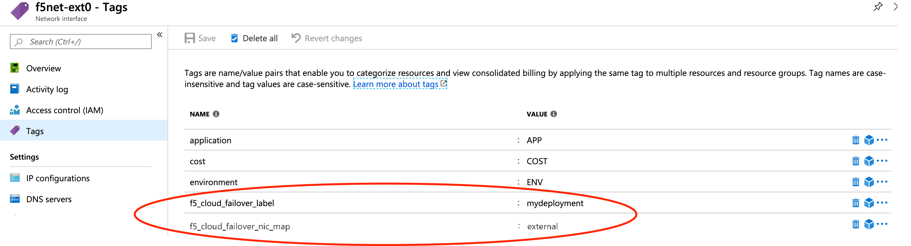

.. _azure:

Azure
=====

In this section, you will see the complete steps for implementing Cloud Failover Extension in Microsoft Azure. You can also go straight to the :ref:`azure-example`.

.. _azure-prereqs:

Azure CFE Prerequisites
-----------------------
These are the basic prerequisites for setting up CFE in Microsoft Azure.

- **2 BIG-IP systems in Active/Standby configuration**. You can find an example ARM template |armtemplate|. Any configuration tool can be used to provision the resources.
- **Virtual addresses** created in a floating traffic group and matching addresses (secondary) on the IP configurations of the instance NICs serving application traffic.

  .. TIP:: Use Static allocation for each IP configuration that will serve application traffic. Using Dynamic allocation is discouraged for production deployments.

- **Access to Azure's Instance Metadata Service**, which is a REST Endpoint accessible to all IaaS VMs created with the Azure Resource Manager. The endpoint is available at a well-known non-routable IP address (169.254.169.254) that can only be accessed from within the VM. See the instructions below to :ref:`azure-ims`.
- **Enable "enableIPForwarding"** on the NICs if enabling routing or avoiding SNAT. See https://docs.microsoft.com/en-us/azure/virtual-network/virtual-network-network-interface#enable-or-disable-ip-forwarding


.. NOTE:: CFE makes calls to the Azure APIs in order to failover cloud resource objects such as private IP addresses and route tables. These calls may vary significantly in response time. See the :ref:`performance-sizing` section for example times.


|

Complete these tasks to deploy Cloud Failover Extension in Microsoft Azure. Before getting started, we recommend you review the `Known Issues <https://github.com/F5Networks/f5-cloud-failover-extension/issues>`_ and :ref:`faq`. 

.. include:: /_static/reuse/initial-config.rst

.. table:: Task Summary

   =======  ===================================================================
   Step     Task
   =======  ===================================================================
   1.       :ref:`download-rpm`

            - :ref:`verify-rpm`

   2.       :ref:`upload-install`

            - :ref:`installgui-ref` (or)
            - :ref:`installcurl-ref`

   3.       :ref:`azure-msi`
   4.       :ref:`azure-tag-objects`

            - :ref:`azure-storage`
            - :ref:`azure-nictagging`
            - :ref:`azure-udrtagging`

   5.       :ref:`azure-ims`
   6.       Modify and POST the :ref:`azure-example`
   7.       :ref:`update-revert`
   =======  ===================================================================


.. _azure-diagram:

Azure Failover Event Diagram
----------------------------

The following diagram shows a failover event with CFE implemented in Microsoft Azure with an HA pair in an Active/Standby configuration.

In the diagram, the IP configuration has a secondary private address that matches a virtual address in a traffic group owned by the active BIG-IP. In the event of a failover, the IP configuration is deleted and recreated on that device's network interface. Simultaneously, the user-defined routes are updated with a next hop attribute the corresponds to the self IP address of the active BIG-IP.


|

.. Note:: Management NICs/Subnets are not shown in this diagram.

.. _azure-example:

Example Azure Declaration
-------------------------
This example declaration shows the minimum information needed to update the cloud resources in Azure. See the :ref:`quickstart` section for steps on how to post this declaration. See the :ref:`example-declarations` section for more examples.


.. literalinclude:: ../../examples/declarations/azure.json
   :language: json
   :caption: Example Azure Declaration with Single Routing Table
   :tab-width: 4
   :linenos:

:fonticon:`fa fa-download` :download:`azure.json <../../examples/declarations/azure.json>`

|


.. _azure-msi:

Create and assign a Managed Service Identity (MSI)
--------------------------------------------------
In order to successfully implement CFE in Azure, you need a system-assigned or user-managed identity with sufficient access. Your Managed Service Identity (MSI) should be limited to the resource groups that contain the BIG-IP instances, VNET, route tables, etc. that will be updated. Read more about managed identities |managed-identity|.
To create and assign a Managed Service Identity (MSI) you must have a role of `User Access Administrator` or `Contributor access`. The following example shows a system-assigned MSI.

#. Enable MSI for each VM: go to **Virtual Machine > Identity > System assigned** and set the status to ``On``.

   For example:

   .. image:: ../images/azure/AzureMSIVMIdentity.png


   | 

#. Assign permissions to each MSI: go to **Resource Group > Access control (IAM) > Role assignments > Add**, make the changes listed below, and then add the MSI.

   - Role: Contributor
   - Assign access to: **System assigned managed identity > Virtual Machine**

   |

   For example: 

   .. image:: ../images/azure/AzureMSIAssignedToResourceGroup.png


.. NOTE:: Certain resources may be deployed in a separate subscription, add role assignments for each subscription where resources are located.


.. _azure-rbac:

RBAC Role Definition
````````````````````

Below is an example Azure role definition with permissions required by CFE.

- Microsoft.Authorization/*/read
- Microsoft.Compute/locations/*/read
- Microsoft.Compute/virtualMachines/*/read
- Microsoft.Network/networkInterfaces/read
- Microsoft.Network/networkInterfaces/write
- Microsoft.Network/*/join/action
- Microsoft.Network/routeTables/*/read
- Microsoft.Network/routeTables/*/write
- Microsoft.Resources/subscriptions/resourceGroups/read
- Microsoft.Storage/storageAccounts/read
- Microsoft.Storage/storageAccounts/listKeys/action

.. IMPORTANT::

   - This example provides the minimum permissions required and serves as an illustration. You are responsible for following the provider's IAM best practices.
   - Certain resources such as the virtual network are commonly deployed in a separate resource group, ensure the correct scopes are applied to all applicable resource groups.
   - Certain resources such as route tables may be deployed in a separate subscription, ensure the assignable scopes applies to all relevant subscriptions.

|


.. _azure-tag-objects:

Tag your Azure Network Infrastructure Objects
---------------------------------------------

Tag your infrastructure with the the names and values that you will send in your CFE declaration.

.. IMPORTANT:: You must tag the following resources. Even if you only have routes to update during failover (for example, there are no NIC IP configuration objects to re-map) you still have to tag the NICs on the Virtual Machines associated with the IPs in your CFE declaration.


.. _azure-storage:

Tag the Storage Account in Azure
````````````````````````````````
Add a storage account to your resource group, and tag with a name/value pair that corresponds to the name/value pair in the `externalStorage.scopingTags` section of the CFE declaration.

.. WARNING:: Ensure the required storage accounts do not have public access.


.. _azure-nictagging:

Tag the Network Interfaces in Azure
```````````````````````````````````

#. Within Azure, go to **NIC > Tags**. Create two sets of tags for Network Interfaces:

   - **Deployment scoping tag**: a key-value pair that will correspond to the key-value pair in the `failoverAddresses.scopingTags` section of the CFE declaration.

     .. NOTE:: If you use our declaration example, the key-value tag would be: ``"f5_cloud_failover_label":"mydeployment"``
   
   - **NIC mapping tag**: a key-value pair with the reserved key named ``f5_cloud_failover_nic_map`` and a user-provided value that can be anything. For example ``"f5_cloud_failover_nic_map":"external"``.

     .. IMPORTANT:: The same tag (matching key:value) must be placed on corresponding NIC on the peer BIG-IP. For example, each BIG-IP would have their external NIC tagged with ``"f5_cloud_failover_nic_map":"external"`` and their internal NIC tagged with ``"f5_cloud_failover_nic_map":"internal"``.

Example:





|

.. _azure-udrtagging:

Tag the User-Defined routes in Azure
````````````````````````````````````

.. sidebar:: :fonticon:`fa fa-info-circle fa-lg` Version Notice:

   Use these steps for CFE version 1.5.0 and newer.

In CFE version 1.5.0, the parameter ``routeGroupDefinitions`` was added. It allows more granular route operations and you are not required to tag the routes. Provide the name of the route you want to manage with ``scopingName``.  See :ref:`failover-routes` for more information. 

.. code-block:: json

   "failoverRoutes":{
       "enabled":true,
       "routeGroupDefinitions":[
           {
             "scopingName":"myroutetable-1",
             "scopingAddressRanges":[
                 {
                   "range":"0.0.0.0/0"
                 }
             ],
             "defaultNextHopAddresses":{
                 "discoveryType":"static",
                 "items":[
                   "10.0.13.11",
                   "10.0.13.12"
                 ]
             }
           }
       ]
   }

|

- See :ref:`azure_multiple_subscriptions` for examples of managing route tables in multiple subscriptions.
- See :ref:`advanced-routing-examples-azure` for additional examples of more advanced configurations.

|

.. sidebar:: :fonticon:`fa fa-info-circle fa-lg` Version Notice:

   Use these steps for CFE versions earlier than 1.5.0.

To enable route failover in versions earlier than 1.5.0, tag the route tables containing the routes that you want to manage:

1. In Azure, create a key-value pair that will correspond to the key-value pair in the `failoverAddresses.scopingTags` section of the CFE declaration.

   .. NOTE:: If you use our declaration example, the key-value tag would be ``"f5_cloud_failover_label":"mydeployment"``

2. In the case where BIG-IP has multiple NICs, CFE needs to know what interfaces (by using the Self-IPs associated with those NICs) it needs to re-map the routes to. You can either define the nextHopAddresses using an additional tag on the route table, or you can provide them statically in the cloud failover configuration.

   - If you use discoveryType ``routeTag``, you will need to add another tag to the route table in your cloud environment with the reserved key ``f5_self_ips``. For example, ``"f5_self_ips":"10.0.13.11,10.0.13.12"``. 

   |

   .. code-block:: json

       "failoverRoutes": {
         "enabled": true,
         "scopingTags": {
           "f5_cloud_failover_label": "mydeployment"
         },
         "scopingAddressRanges": [
           {
             "range": "0.0.0.0/0",
             "nextHopAddresses": {
                 "discoveryType":"routeTag"
             }
           }
         ]
       }

   - If you use discoveryType ``static``, you can provide the Self-IPs in the items area of the CFE configuration. See :ref:`failover-routes` for more information.  

| 

3. Within Azure, go to **Basic UDR > Tags** to create a deployment scoping tag. The name and value can be anything; the example below uses ``f5_cloud_failover_label:mydeployment``.


   .. image:: ../images/azure/AzureUDR.png


|

|

.. _azure-ims:

Set up access to Azure's Instance Metadata Service
--------------------------------------------------

Azure's Instance Metadata Service is a REST Endpoint accessible to all IaaS VMs created via the Azure Resource Manager. The endpoint is available at a well-known non-routable IP address (169.254.169.254) that can be accessed only from within the VM.

.. IMPORTANT:: Certain BIG-IP versions and/or topologies may use DHCP to create the management routes (for example: ``dhclient_route1``), if that is the case the below steps are not required.

To configure the route on BIG-IP to talk to Azure's Instance Metadata Services, use either of the commands below. Note that in this example, 192.0.2.1 is the management subnet's default gateway.

Using TMSH
``````````

.. code-block:: bash

  tmsh modify sys db config.allow.rfc3927 value enable
  tmsh create sys management-route metadata-route network 169.254.169.254/32 gateway 192.0.2.1
  tmsh save sys config

Using Declarative Onboarding
````````````````````````````
        
.. code-block:: json

  {
    "managementRoute": {
      "class": "ManagementRoute",
      "gw": "192.0.2.1",
      "network": "169.254.169.254",
      "mtu": 1500
    },
    "dbVars": {
      "class": "DbVariables",
      "config.allow.rfc3927": "enable"
    }
  }


|


.. _azure-as3-example:

Example Virtual Service Declaration
-----------------------------------

See below for example Virtual Services created with `AS3 <https://clouddocs.f5.com/products/extensions/f5-appsvcs-extension/latest/>`_ in :ref:`azure-diagram` above:

.. literalinclude:: ../../examples/toolchain/as3/azure-as3.json
   :language: json
   :caption: Example AS3 Declaration
   :tab-width: 4
   :linenos:

:fonticon:`fa fa-download` :download:`azure-as3.json <../../examples/toolchain/as3/azure-as3.json>`


.. include:: /_static/reuse/feedback.rst


.. |github| raw:: html

   <a href="https://github.com/F5Networks/f5-azure-arm-templates/tree/master/supported/failover/same-net/via-api/n-nic/existing-stack/payg" target="_blank">Github</a>


.. |armtemplate| raw:: html

   <a href="https://github.com/F5Networks/f5-azure-arm-templates/tree/master/supported/failover/same-net/via-api/n-nic/existing-stack/payg" target="_blank">here</a>


.. |managed-identity| raw:: html

   <a href="https://docs.microsoft.com/en-us/azure/active-directory/managed-identities-azure-resources/overview" target="_blank">here</a>