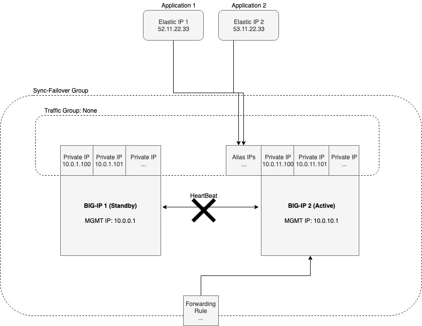

.. _gcp:

Google Cloud
============

In this section, you can see a failover event diagram, example declaration, requirements, and tasks for implementing Cloud Failover in Google Cloud. 


Failover Event Diagram
----------------------

This diagram shows a failover event with Cloud Failover implemented in Google Cloud. In the event of a failover, alias IPs are updated to point to the network interface of the active BIG-IP device. The forwarding rule targets matching a self IP address of the active BIG-IP device are associated with the network interface of the active BIG-IP device.



|

.. _gcp-example:

Example Declaration
-------------------
This example declaration shows the minimum information needed to update the cloud resources in Google Cloud.  See the :ref:`quickstart` section for steps on how to post this declaration.

.. literalinclude:: ../../examples/declarations/gcp.json
   :language: json
   :tab-width: 4

:fonticon:`fa fa-download` :download:`gcp.json <../../examples/declarations/gcp.json>`

|

Requirements
------------
These are the minimum requirements for setting up Cloud Failover in Google Cloud Platform:

- **2 BIG-IP systems in Active/Standby configuration**. You can find an example GDM Template |gdmtemplate|. Any configuration tool can be used to provision the resources.
- **A GCP Identity and Access Management (IAM) service account with sufficient access**. See the instructions below for :ref:`gcp-iam`.
- **A storage bucket for Cloud Failover Extension cluster-wide file(s)** that is tagged with a key/value pair that corresponds to the key/value(s)  in the `externalStorage.scopingTags` section of the Cloud Failover Extension configuration.

  .. IMPORTANT:: Ensure the required storage accounts do not have public access.

- **Instances tagged with a key/value that corresponds to the key/value(s) in the `failoverAddresses.scopingTags` section of the Cloud Failover Extension configuration**.
- **Virtual addresses** created in a floating traffic group and matching Alias IP addresses on the instance serving application traffic.
- **Forwarding rules(s)** configured with targets that match a virtual address or floating self IP on the instance serving application traffic. 
- **Route(s) in a route table tagged with**:

  - a key/value that corresponds to the key/value(s) in the `failoverRoutes.scopingTags` section of the Cloud Failover Extension configuration
  
  .. NOTE:: The failover extension configuration `failoverRoutes.scopingAddressRanges` contains a list of destination routes to update.

  .. IMPORTANT:: Since GCP routes do not support GCP labels, a JSON blob **must** be added to the description, for example: ``f5_cloud_failover_labels={"f5_cloud_failover_label":"mydeployment"}``

|


.. _gcp-iam:

Creating and assigning an IAM Role
``````````````````````````````````
To create and assign an IAM role you must have a user role of `Editor`.

#. In GCP, go to **IAM > Roles**.
  
#. Select :guilabel:`Create Role` and fill in the required fields.
   
#. Ensure that Role launch stage is set to :guilabel:`General Availability`.

#. Select :guilabel:`Add Permissions` and select the required permissions.

   - compute.forwardingRules.get
   - compute.forwardingRules.list
   - compute.forwardingRules.setTarget
   - compute.instances.create
   - compute.instances.get
   - compute.instances.list
   - compute.instances.updateNetworkInterface
   - compute.networks.updatePolicy
   - compute.routes.create
   - compute.routes.delete
   - compute.routes.get
   - compute.routes.list
   - compute.targetInstances.get
   - compute.targetInstances.list
   - compute.targetInstances.use
   - storage.buckets.create
   - storage.buckets.delete
   - storage.buckets.get
   - storage.buckets.list
   - storage.buckets.update
   - storage.objects.create
   - storage.objects.delete
   - storage.objects.get
   - storage.objects.list
   - storage.objects.update

   |

#. Select :guilabel:`Create` to finish creating the custom role.

   .. NOTE:: These permissions are also included in by default in GCP primitives roles (Editor/Owner) and pre-defined roles (Compute Admin and Storage Admin). As long as the service account has a role bind to it with all the necessary permissions then it should be sufficient to work.

   .. image:: ../images/gcp/GCPIAMRoleSummary.png
    :width: 800


#. Bind the custom role in the step above to a service account by navigating to **IAM & admin > IAM** 

#. Select the edit icon next to the service account for binding.

#. Select :guilabel:`Add Another Role` and choose the custom role to add.

#. Select :guilabel:`Save` to update the service account.
  
#. Assign an IAM member to each instance by navigating to **Compute Engine > VM Instances > Instance**, select Edit, and then update the Service Account.

   For example:

   .. image:: ../images/gcp/GCPIamRoleAssignedToInstance.png
     :width: 800

|

.. NOTE:: To provide feedback on this documentation, you can file a |issue|.


.. |github| raw:: html

   <a href="https://github.com/F5Devcentral/f5-google-gdm-templates/tree/master/supported/failover/same-net/via-api/3nic/existing-stack/payg" target="_blank">F5 Cloud Failover Extension site on GitHub</a>

.. |gdmtemplate| raw:: html

   <a href="https://github.com/F5Devcentral/f5-google-gdm-templates/tree/master/supported/failover/same-net/via-api/3nic/existing-stack/payg" target="_blank">here</a>

.. |issue| raw:: html

   <a href="https://github.com/F5Devcentral/f5-cloud-failover-extension/issues" target="_blank">GitHub Issue</a>