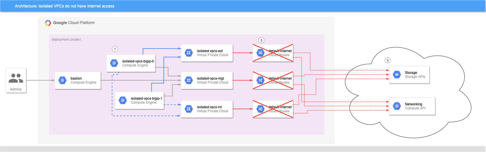
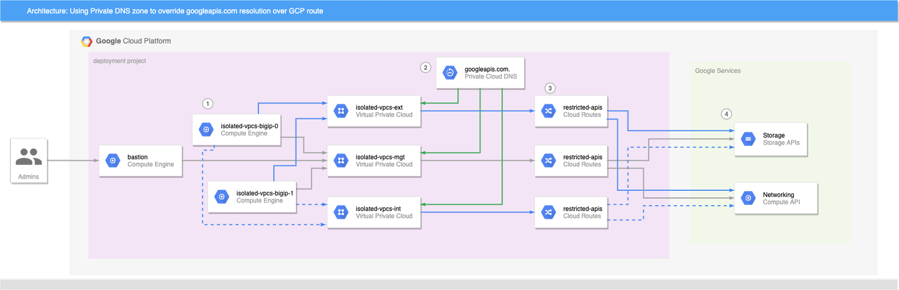

.. _gcp:

Google Cloud
============

In this section, you can see the complete steps for implementing Cloud Failover Extension in Google Cloud. You can also go straight to the :ref:`gcp-example`.

.. _gcp-prereqs:

Google CFE Prerequisites
------------------------
These are the basic prerequisites for setting up CFE in Google Cloud Platform:

- **2 BIG-IP systems in Active/Standby configuration**. You can find an example GDM Template |gdmtemplate|. Any configuration tool can be used to provision the resources.
- **Virtual addresses** or **Self IPs** created in a floating traffic group on the instances serving application traffic which will match either an Alias IP  or Forwarding Rule.
- **Target Instance Pair** created where each target instance is pointing at a BIG-IP instance.  Note that this is only required if failover of any forwarding rules is desired.

|

Complete these tasks to deploy Cloud Failover Extension in GCP. Before getting started, we recommend you review the `Known Issues <https://github.com/F5Networks/f5-cloud-failover-extension/issues>`_ and :ref:`faq`. 

.. include:: /_static/reuse/initial-config.rst

.. table:: Task Summary

   =======  ===================================================================
   Step     Task
   =======  ===================================================================
   1.       :ref:`download-rpm`

            - :ref:`verify-rpm`

   2.       :ref:`upload-install`

            - :ref:`installgui-ref` (or)
            - :ref:`installcurl-ref`

   3.       :ref:`gcp-iam`
   4.       :ref:`gcp-tag-objects`

            - :ref:`gcp-tag-storage`
            - :ref:`gcp-tag-addresses`
            - :ref:`gcp-tag-forwarding-rules`
            - :ref:`gcp-tag-routes`

   5.       Modify and POST the :ref:`gcp-example`
   6.       :ref:`update-revert`
   =======  ===================================================================


.. _gcp-diagram:

GCP Failover Event Diagram
--------------------------

This diagram shows a failover event with Cloud Failover implemented in Google Cloud. In the event of a failover, alias IPs are updated to point to the network interface of the active BIG-IP device. The forwarding rule targets matching a self IP address of the active BIG-IP device are associated with the network interface of the active BIG-IP device. Management NICs/VPC are not shown in this diagram.

.. image:: ../images/gcp/gcp-failover-3nic-multiple-vs-animated.gif

|


.. _gcp-example:

Example GCP Declaration
-----------------------
This example declaration shows the minimum information needed to update the cloud resources in Google Cloud. See the :ref:`quickstart` section for steps on how to post this declaration. See the :ref:`example-declarations` section for more examples.

.. literalinclude:: ../../examples/declarations/gcp.json
   :language: json
   :caption: Example GCP Declaration
   :tab-width: 4
   :linenos:

:fonticon:`fa fa-download` :download:`gcp.json <../../examples/declarations/gcp.json>`

  

|

.. _gcp-iam:

Create and assign an IAM Role
-----------------------------
In order to successfully implement CFE in GCP, you need to have a GCP Identity and Access Management (IAM) service account with sufficient access. To create and assign an IAM role you must have a user role of `Editor`.

#. In GCP, go to **IAM > Roles**.
  
#. Select :guilabel:`Create Role` and fill in the required fields.
   
#. Ensure that Role launch stage is set to :guilabel:`General Availability`.

#. Select :guilabel:`Add Permissions` and select the required permissions.

   - compute.forwardingRules.get
   - compute.forwardingRules.list
   - compute.forwardingRules.setTarget
   - compute.instances.create
   - compute.instances.get
   - compute.instances.list
   - compute.instances.updateNetworkInterface
   - compute.networks.updatePolicy
   - compute.routes.create
   - compute.routes.delete
   - compute.routes.get
   - compute.routes.list
   - compute.targetInstances.get
   - compute.targetInstances.list
   - compute.targetInstances.use
   - storage.buckets.create
   - storage.buckets.delete
   - storage.buckets.get
   - storage.buckets.list
   - storage.buckets.update
   - storage.objects.create
   - storage.objects.delete
   - storage.objects.get
   - storage.objects.list
   - storage.objects.update

   |

#. Select :guilabel:`Create` to finish creating the custom role.

   .. NOTE:: These permissions are also included in by default in GCP primitives roles (Editor/Owner) and pre-defined roles (Compute Admin and Storage Admin). As long as the service account has a role bind to it with all the necessary permissions then it should be sufficient.

   .. image:: ../images/gcp/GCPIAMRoleSummary.png
      :scale: 50%


#. Bind the custom role in the step above to a service account by navigating to **IAM & admin > IAM**.

#. Select the edit icon next to the service account for binding.

#. Select :guilabel:`Add Another Role` and choose the custom role to add.

#. Select :guilabel:`Save` to update the service account.
  
#. Assign an IAM member to each instance by navigating to **Compute Engine > VM Instances > Instance**, select :guilabel:`Edit`, and then update the Service Account.

   For example:

   .. image:: ../images/gcp/GCPIamRoleAssignedToInstance.png


|

.. _gcp-tag-objects:

Label your Google Cloud Network Infrastructure Objects
------------------------------------------------------

Label your infrastructure with the the keys and values that you will send in your CFE declaration. 

.. Note::  

   - GCP uses the term `labels` rather than the term `tags`, which is used by other cloud providers. 
   - In cases where cloud objects do not have labels (for example, Forwarding Rules and Routes), Cloud Failover will leverage the ``Description`` field instead. Cloud Failover Extension will search the ``Description`` field/string for tags contained in the reserved string ``f5_cloud_failover_labels={}``. See examples below.

.. _gcp-tag-storage:

Label the Storage Account in GCP
````````````````````````````````
You need to add a label to the storage bucket for Cloud Failover Extension cluster-wide file(s) and then specify a key and value for the label. This key/value will correspond to the key/value you use in the `externalStorage.scopingTags` section of the CFE configuration.

.. WARNING:: Ensure the required storage accounts do not have public access.

#. Open the Cloud Storage browser in the Google Cloud Console.

#. In the bucket list, find the bucket you want to apply a label to, and click its :guilabel:`Bucket overflow menu (...)`.

#. Click :guilabel:`Edit labels`.

#. In the side panel that appears, click the :guilabel:`+ Add label` button.

#. Specify a ``key`` and ``value`` for your label.

#. Click :guilabel:`Save`.

|

.. _gcp-tag-addresses:

Label the Virtual Machine Instances in GCP
``````````````````````````````````````````

Now you need to label the virtual machine instances with a key and value. 

.. Note:: GCP does not have NICs as independent objects of the instance, so you only need to label the instance. 

This key/value will correspond to the key/value you use in the `failoverAddresses.scopingTags` section of the CFE configuration.

#. Go to the VM instances page.

#. Select an instance.

#. On the `VM instance details` page, click :guilabel:`Edit`.

#. In the :guilabel:`Labels` section, specify a name and a value

#. Click :guilabel:`Save`.


.. image:: ../images/gcp/gcp-network-tags.png


|
|

.. _gcp-tag-forwarding-rules:

Label the Forwarding Rules in GCP
`````````````````````````````````

By default, you do not need to tag forwarding rules. You only need to create a `target instance <https://cloud.google.com/sdk/gcloud/reference/compute/target-instances>`_ object for each BIG-IP. CFE will match Virtual Addresses configured on the BIG-IP to any forwarding rules with same IPs pointed at a BIG-IP target instance.

**Performance Note:**

CFE provides additional control and performance optimizations by leveraging tags on forwarding rules.

CFE sends update requests asynchronously. For instance, if CFE updates 10 forwarding rules, Cloud Failover sends the 10 update requests all at once (instead of serially waiting for a response from the first request). By creating multiple target-instance objects for each BIG-IP and spreading requests to those, GCP backend will process the updates quicker.

To leverage this optimization, for every Forwarding Rule:

#. Create another target instance object for each BIG-IP instance in the cluster. For example, for Forwarding Rule 1:

   .. code-block:: python

      gcloud compute target-instances create ti-cluster1-a-1 --instance=cluster1-a --instance-zone=us-west1-a --zone=us-west1-a
      gcloud compute target-instances create ti-cluster1-b-1 --instance=cluster1-b --instance-zone=us-west1-b --zone=us-west1-b

   |

#. Tag the Fowarding Rule (using `Description` field) with the following two tags:
   
   - **Deployment scoping tag**: an arbitrary key-value pair that will correspond to the key-value pair in the `failoverAddresses.scopingTags` section of the CFE declaration.

     .. NOTE:: If you use our declaration example, the key-value tag would be: ``"f5_cloud_failover_label":"mydeployment"``
   
   - **Target Instance mapping tag**: a key-value pair with the reserved key named ``f5_target_instance_pair`` and a user-provided value containting the two BIG-IP target instance objects. 
      
     ``"f5_target_instance_pair":"<target-instance-1-name>,<target-instance-2-name>"``


For example, if you have a failoverAddresses declaration with arbitrary ``scopingTags`` of "my_deployment_scoping_label":"cluster1":

.. code-block:: json

    "failoverAddresses":{
       "enabled":true,
       "scopingTags":{
          "my_deployment_scoping_label":"cluster1"
       }
    },

|

and 4 forwarding rules (one IP 1.1.1.1 for four different protocols, tcp,udp,icmp,esp): 

.. code-block:: python

   # Create unique Target Instances for each Forwarding Rule
   # where the BIG-IP's instance names are cluster1-a and cluster1-b

   # 1.1.1.1:TCP
   gcloud compute target-instances create ti-cluster1-a-1 --instance=cluster1-a --instance-zone=us-west1-a --zone=us-west1-a
   gcloud compute target-instances create ti-cluster1-b-1 --instance=cluster1-b --instance-zone=us-west1-b --zone=us-west1-b
 
   # 1.1.1.1:UDP
   gcloud compute target-instances create ti-cluster1-a-2 --instance=cluster1-a --instance-zone=us-west1-a --zone=us-west1-a
   gcloud compute target-instances create ti-cluster1-b-2 --instance=cluster1-b --instance-zone=us-west1-b --zone=us-west1-b
 
   # 1.1.1.1:ICMP
   gcloud compute target-instances create ti-cluster1-a-3 --instance=cluster1-a --instance-zone=us-west1-a --zone=us-west1-a
   gcloud compute target-instances create ti-cluster1-b-3 --instance=cluster1-b --instance-zone=us-west1-b --zone=us-west1-b
 
   # 1.1.1.1:ESP
   gcloud compute target-instances create ti-cluster1-a-4 --instance=cluster1-a --instance-zone=us-west1-a --zone=us-west1-a
   gcloud compute target-instances create ti-cluster1-b-4 --instance=cluster1-b --instance-zone=us-west1-b --zone=us-west1-b
 
   $ gcloud compute target-instances list
   NAME                               ZONE        INSTANCE            NAT_POLICY
   ti-cluster1-a-1                    us-west1-a  cluster1-a          NO_NAT
   ti-cluster1-a-2                    us-west1-a  cluster1-a          NO_NAT
   ti-cluster1-a-3                    us-west1-a  cluster1-a          NO_NAT
   ti-cluster1-a-4                    us-west1-a  cluster1-a          NO_NAT
   ti-cluster1-b-1                    us-west1-a  cluster1-b          NO_NAT
   ti-cluster1-b-2                    us-west1-a  cluster1-b          NO_NAT
   ti-cluster1-b-3                    us-west1-a  cluster1-b          NO_NAT
   ti-cluster1-b-4                    us-west1-a  cluster1-b          NO_NAT
 
   # Create Forwarding Rules with a Description containing Deployment Scoping Tag and Target Instance Pair mappings, pointed first at target-instance objects associated with cluster-1a.

   $ gcloud compute forwarding-rules create forwrule-1 --address 1.1.1.1 --target-instance='ti-cluster1-a-1' --ip-protocol=TCP --load-balancing-scheme=EXTERNAL --region us-west1 --target-instance-zone us-west1-a --description "f5_cloud_failover_labels={\"my_deployment_scoping_label\":\"cluster1\",\"f5_target_instance_pair\":\"ti-cluster1-a-1,ti-cluster1-b-1\"}"
   $ gcloud compute forwarding-rules create forwrule-2 --address 1.1.1.1 --target-instance='ti-cluster1-a-2' --ip-protocol=UDP --load-balancing-scheme=EXTERNAL --region us-west1 --target-instance-zone us-west1-a --description "f5_cloud_failover_labels={\"my_deployment_scoping_label\":\"cluster1\",\"f5_target_instance_pair\":\"ti-cluster1-a-2,ti-cluster1-b-2\"}"
   $ gcloud compute forwarding-rules create forwrule-3 --address 1.1.1.1 --target-instance='ti-cluster1-a-3' --ip-protocol=ICMP --load-balancing-scheme=EXTERNAL --region us-west1 --target-instance-zone us-west1-a --description "f5_cloud_failover_labels={\"my_deployment_scoping_label\":\"cluster1\",\"f5_target_instance_pair\":\"ti-cluster1-a-3,ti-cluster1-b-3\"}"
   $ gcloud compute forwarding-rules create forwrule-4 --address 1.1.1.1 --target-instance='ti-cluster1-a-4' --ip-protocol=ESP --load-balancing-scheme=EXTERNAL --region us-west1 --target-instance-zone us-west1-a --description "f5_cloud_failover_labels={\"my_deployment_scoping_label\":\"cluster1\",\"f5_target_instance_pair\":\"ti-cluster1-a-4,ti-cluster1-b-4\"}"


   # Before Failover (pointed at BIG-IP cluster-1a target-instances):

   $ gcloud compute forwarding-rules list
   NAME                    REGION    IP_ADDRESS      IP_PROTOCOL  TARGET
   forwrule-1                us-west1  1.1.1.1         TCP          us-west1-a/targetInstances/ti-cluster1-a-1
   forwrule-2                us-west1  1.1.1.1         UDP          us-west1-a/targetInstances/ti-cluster1-a-2
   forwrule-3                us-west1  1.1.1.1         ICMP         us-west1-a/targetInstances/ti-cluster1-a-3
   forwrule-4                us-west1  1.1.1.1         ESP          us-west1-a/targetInstances/ti-cluster1-a-4
 
   # After Failover (pointed at BIG-IP cluster-1b target-instances):

   $ gcloud compute forwarding-rules list
   NAME                    REGION    IP_ADDRESS      IP_PROTOCOL  TARGET
   forwrule-1                us-west1  1.1.1.1         TCP          us-west1-a/targetInstances/ti-cluster1-b-1
   forwrule-2                us-west1  1.1.1.1         UDP          us-west1-a/targetInstances/ti-cluster1-b-2
   forwrule-3                us-west1  1.1.1.1         ICMP         us-west1-a/targetInstances/ti-cluster1-b-3
   forwrule-4                us-west1  1.1.1.1         ESP          us-west1-a/targetInstances/ti-cluster1-b-4

|


*Introduced in 1.6.0*

In some cases you may have forwarding rules that match an IP address configured on BIG-IP, but you do not want BIG-IP to own that address. To manage only Forwarding Rules that are explicitly tagged, set ``requireTags`` to ``true`` in the CFE configuration.

.. code-block:: json

    "failoverAddresses":{
       "enabled":true,
       "requireTags": true, 
       "scopingTags":{
          "f5_cloud_failover_label":"mydeployment"
       }
    },

|


.. _gcp-tag-routes:

Label the User-Defined routes in GCP
````````````````````````````````````

.. sidebar:: :fonticon:`fa fa-info-circle fa-lg` Version Notice:

   Use these steps for CFE version 1.5.0 and newer.

In CFE version 1.5.0, the parameter ``routeGroupDefinitions`` was added. It allows more granular route operations and you are not required to tag the routes. Simply provide the name of the route you want to manage with ``scopingName``.  See :ref:`failover-routes` for more information. 

.. code-block:: json

  "failoverRoutes":{
      "enabled":true,
      "routeGroupDefinitions":[
          {
            "scopingName":"example-route-1",
            "defaultNextHopAddresses":{
                "discoveryType":"static",
                "items":[
                  "10.0.13.11",
                  "10.0.13.12"
                ]
            }
          }
      ]
  }


See :ref:`advanced-routing-examples-gcp` for additional examples of more advanced configurations.

|

.. sidebar:: :fonticon:`fa fa-info-circle fa-lg` Version Notice:

   Use these steps for CFE versions earlier than 1.5.0.

To enable route failover in versions earlier than 1.5.0, tag the routes that you want to manage:

1. Tag by adding a description that contains the key-value pair in the `failoverAddresses.scopingTags` section of the CFE declaration. For example, the description will contain:

   ``f5_cloud_failover_labels={"f5_cloud_failover_label":"mydeployment"}``

2. In the case where BIG-IP has multiple NICs, CFE needs to know what interfaces (by using the Self-IPs associated with those NICs) it needs to re-map the routes to. You can either define the nextHopAddresses using an additional tag on the route table, or you can provide them statically in the cloud failover configuration.

   - If you use discoveryType ``routeTag``, you will need to add another key-value pair to the route in your cloud environment with the reserved key ``f5_self_ips``. For example, the description will contain: ``f5_cloud_failover_labels={"f5_cloud_failover_label":"mydeployment","f5_self_ips":"10.0.13.11,10.0.13.12"}``

   |

   .. code-block:: json

       "failoverRoutes": {
         "enabled": true,
         "scopingTags": {
           "f5_cloud_failover_label": "mydeployment"
         },
         "scopingAddressRanges": [
           {
             "range": "0.0.0.0/0",
             "nextHopAddresses": {
                 "discoveryType":"routeTag"
             }
           }
         ]
       }


   |

   - If you use discoveryType ``static``, you can provide the Self-IPs in the items area of the CFE configuration. See :ref:`failover-routes` for more information.  


For example, to add a ``Description`` with key:pair: 

#. Go to the Routes page in the Google Cloud Console.

#. Click :guilabel:`Create route`.

#. Specify a :guilabel:`Name` and a :guilabel:`Description` for the route.

#. Select an existing :guilabel:`Network` where the route will apply.

#. Specify a :guilabel:`Destination IP range` to define the destination of the route.

#. Select a :guilabel:`Priority` for the route. 

#. Go to the :guilabel:`Instance tags` field to create a tag. For example ``f5_cloud_failover_labels={"f5_cloud_failover_label":"mydeployment"}``.

#. Select a :guilabel:`Next hop` for the route and :guilabel:`Specify a forwarding rule of internal TCP/UDP load balancer` to specify the BIG-IP as a next hop.

   .. TIP:: Make sure the route targets a ``next-hop-address`` instead of a ``next-hop-instance``.

#. Click :guilabel:`Create`.

#. In your CFE declaration, enter the key/value in the `failoverRoutes.scopingTags` section that matches the tag that you attached to the routing table in GCP. Then update the list of destination routes in the `failoverRoutes.scopingAddressRanges` section.

|

or via gcloud CLI:

.. code-block:: python
   :caption: Example of a gcloud compute command to create a route

    gcloud compute routes create example-route-1 --destination-range=0.0.0.0/0 --network=example-network --next-hop-address=10.0.13.11 --description='f5_cloud_failover_labels={"f5_cloud_failover_label":"mydeployment"}'

|


How to use CFE on GCP when BIG-IP instances have no route to public internet
````````````````````````````````````````````````````````````````````````````
CFE will not function correctly out of the box when the BIG-IP instances are not able to reach the public internet directly or via a NAT. CFE must have access to Storage APIs for state management, and to Compute APIs for network updates. This section shows you how to make CFE work in an isolated VPC using a scenario.

In the following scenario:

- VMs do not have a public IP address
- NAT is not provided
- Default VPC network routes to the internet are removed and only the default subnet and any custom routes exist



|

This scenario causes problems for CFE:

- CFE tries to initialize shared instance state in dedicated bucket, or update a route via API.
- Bucket access is via storage.googleapis.com endpoint and networking API is via compute.googleapis.com, both of which resolve to public IP addresses.
- Default internet routes have been removed from the network, and NAT gateway or instance with custom routes is not in place: Access to the APIs fails.

*Private Google Access*
Enabling Private Google Access on each VPC subnet that may need to access Google Cloud APIs makes a change to the underlying SDN such that the CIDR for restricted.googleapis.com (199.36.153.4/30) will be routed without going through the internet. When combined with a private DNS zone which resolves all googleapis.com lookups to restricted.googleapis.com1 API endpoint addresses, the VPC networks effectively have private endpoint access for all GCP APIs.

1. Enable Private Google Access on each VPC subnet as necessary.
2. Create a Cloud DNS private zone\ :sup:`2` for googleapis.com.

  a. Add a CNAME for *.googleapis.com that aliases to restricted.googleapis.com.
  b. Add an A record for restricted.googleapis.com that resolves to 199.36.153.4/30.

With this configuration in place, any VMs that are attached to the VPC networks that are associated with this private DNS zone will automatically try to use 199.36.153.4/30 endpoints for all GCP API calls. If the customer did not remove the default-internet routes, this is all you need to do to make the APIs functional again and CFE will work correctly.


In this scenario, the default route to internet was removed, and the customer insists that it cannot be re-added. In this case, a custom route\ :sup:`3` must be added to each VPC network that will use GCP APIs.

1. Define a custom route​​​​​​​ on each network\ :sup:`4` for 199.36.153.4/30 with next-hop set for ``internet gateway``.

Once the custom routes are in place, GCP will route traffic for the /30 CIDR to an internet gateway, which will effectively route via a private VPC network to an internal GCP endpoint; the traffic will never go to the internet even though the target IP is a public address.



Now CFE can access the GCP APIs and function correctly:-

- BIG-IP (and bastion) instances attempt to connect to GCP APIs.
- Cloud DNS private zone for googleapis.com has been injected into each VPC network; DNS returns a CNAME alias of restricted.googleapis.com for all googleapis.com lookups, which in turn resolves to an IP address in 199.36.153.4/30.
- Custom routes provides a way to reach Google API endpoints from VMs to GCP services that does not traverse the public internet.
- API endpoints in Google's private VPC respond.


The approach described here applies at VPC network and subnet resources, which means that any VM that is instantiated on those networks after these changes will be able to use GCP APIs, including Cloud Storage. This makes GCS a viable option for storing Cloud Libs, RPMs, etc. needed by the BIG-IP boot-time initialization scripts.

A fully-functional example can be found `here <https://github.com/memes/f5-google-bigip-isolated-vpcs>`_. When executed, Terraform will create three network VPCs that lack the default-internet egress route, but have a custom route to allow traffic to restricted.googleapis.com CIDR. It will also create a Cloud DNS private zone to override googleapis.com and resolve to restricted.googleapis.com, and associate the private zone with all three networks. A pair of BIG-IPs are spun up with CFE  enabled and using a dedicated CFE bucket for state management. An IAP bastion host with tinyproxy allows for SSH and GUI access to the BIG-IPs (See the repo README for details). If you force the active instance to standby, you will see CFE state being created or updated in the GCS bucket.

|


.. _gcp-as3-example:

Example Virtual Service Declaration
-----------------------------------

See below for example Virtual Services created with `AS3 <https://clouddocs.f5.com/products/extensions/f5-appsvcs-extension/latest/>`_ in :ref:`gcp-diagram` above:

.. literalinclude:: ../../examples/toolchain/as3/gcp-as3.json
   :language: json
   :caption: Example AS3 Declaration
   :tab-width: 4
   :linenos:

:fonticon:`fa fa-download` :download:`gcp-as3.json <../../examples/toolchain/as3/gcp-as3.json>`


.. _gcp-shared-vpc:

Shared VPC Configuration
------------------------

A `Shared VPC <https://cloud.google.com/vpc/docs/shared-vpc>`_ allows an organization to connect resources from multuple projects to a common VPC. CFE works with Shared VPC in the following topologies:

- BIG-IP cluster deployed in the Shard VPC Host project: In this scenario all objects such as Alias IPs, Forwarding Rules and Routes in the host project will continue to failover per normal conditions.
- BIG-IP cluster deployed in a Shared VPC Service project where NIC 0 is attached to a Shared VPC in the Host project: In this scenario all objects such as Alias IPs, Forwarding Rules and Routes in the service project will continue to failover per normal conditions. However, any objects in the Shared VPC Host project will not be discovered/updated during a failover event.

|

.. include:: /_static/reuse/feedback.rst


.. |github| raw:: html

   <a href="https://github.com/F5networks/f5-google-gdm-templates/tree/master/supported/failover/same-net/via-api/3nic/existing-stack/payg" target="_blank">F5 Cloud Failover Extension site on GitHub</a>

.. |gdmtemplate| raw:: html

   <a href="https://github.com/F5networks/f5-google-gdm-templates/tree/master/supported/failover/same-net/via-api/3nic/existing-stack/payg" target="_blank">here</a>


.. |gcp-route-considerations| raw:: html

   <a href="https://cloud.google.com/vpc/docs/routes#instance_next_hops" target="_blank">Google documentation</a>
