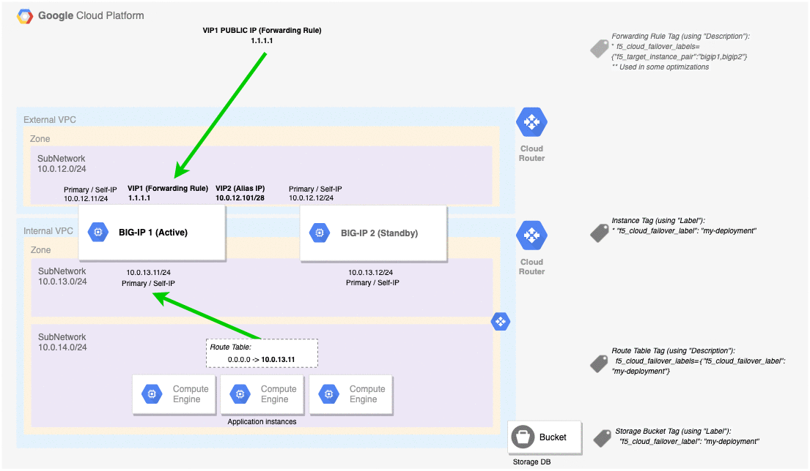

.. _gcp:

Google Cloud
============

In this section, you can see the complete steps for implementing Cloud Failover Extension in Google Cloud. You can also go straight to the :ref:`gcp-example`.

.. _gcp-prereqs:

Google CFE Prerequisites
------------------------
These are the basic prerequisites for setting up CFE in Google Cloud Platform:

- **2 BIG-IP systems in Active/Standby configuration**. You can find an example GDM Template |gdmtemplate|. Any configuration tool can be used to provision the resources.
- **Virtual addresses** or **Self IPs** created in a floating traffic group on the instances serving application traffic which will match either an Alias IP  or Forwarding Rule.
- **Target Instance Pair** created where each target instance is pointing at a BIG-IP instance.  Note that this is only required if failover of any forwarding rules is desired.

|

Complete these tasks to deploy Cloud Failover Extension in GCP. Before getting started, we recommend you review the `Known Issues <https://github.com/F5Networks/f5-cloud-failover-extension/issues>`_ and :ref:`faq`. To see how to run CFE on GCP when BIG-IP instances have no route to public internet, see :ref:`isolated-env`. 

.. include:: /_static/reuse/initial-config.rst

.. table:: Task Summary

   =======  ===================================================================
   Step     Task
   =======  ===================================================================
   1.       :ref:`download-rpm`

            - :ref:`verify-rpm`

   2.       :ref:`upload-install`

            - :ref:`installgui-ref` (or)
            - :ref:`installcurl-ref`

   3.       :ref:`gcp-iam`
   4.       :ref:`gcp-define-objects`

            - :ref:`gcp-define-storage`
            - :ref:`gcp-define-addresses`
            - :ref:`gcp-define-routes`

   5.       Modify and POST the :ref:`gcp-example`
   6.       :ref:`update-revert`
   =======  ===================================================================


.. _gcp-diagram:

GCP Failover Event Diagram
--------------------------

This diagram shows a failover event with Cloud Failover implemented in Google Cloud. In the event of a failover, alias IPs are updated to point to the network interface of the active BIG-IP device. The forwarding rule targets matching a self IP address of the active BIG-IP device are associated with the network interface of the active BIG-IP device. Management NICs/VPC are not shown in this diagram.



|


.. _gcp-example:

Example GCP Declaration
-----------------------
This example declaration shows the minimum information needed to update the cloud resources in Google Cloud. See the :ref:`quickstart` section for steps on how to post this declaration. See the :ref:`example-declarations` section for more examples.

.. literalinclude:: ../../examples/declarations/gcp-1.7.0.json
   :language: json
   :caption: Example GCP Declaration
   :tab-width: 4
   :linenos:

:fonticon:`fa fa-download` :download:`gcp.json <../../examples/declarations/gcp-1.7.0.json>`

  

|

.. _gcp-iam:

Create and assign an IAM Role
-----------------------------
In order to successfully implement CFE in GCP, you need to have a GCP Identity and Access Management (IAM) service account with sufficient access. To create and assign an IAM role you must have a user role of `Editor`.

1. In GCP, go to **IAM > Roles**.
  
2. Select :guilabel:`Create Role` and fill in the required fields.
   
3. Ensure that Role launch stage is set to :guilabel:`General Availability`.

4. Select :guilabel:`Add Permissions` and select the required permissions.

    ======================================================== ==================================== ======================= ============================================================================= 
     Name                                                     Scope                                CFE Component           Description   
    ======================================================== ==================================== ======================= =============================================================================  
     compute.forwardingRules.get                              Project                              failoverAddresses       To get information about a forwarding rule.
     compute.forwardingRules.list                             Project                              failoverAddresses       To list the forwarding rules in a project.
     compute.forwardingRules.setTarget                        Project                              failoverAddresses       To update the forwarding rule to use the active BIG-IP instance.
     compute.instances.get                                    Project                              All                     To get information about the BIG-IP instance.
     compute.instances.list                                   Project                              All                     To list the instances in a project.
     compute.instances.updateNetworkInterface                 Project                              All                     To update the instance network interface.
     compute.networks.updatePolicy                            Project                              All                     To update the network policy.
     compute.routes.create                                    Project                              failoverRoutes          To update the route to use the active BIG-IP instance as next hop.
     compute.routes.delete                                    Project                              failoverRoutes          To delete a route.
     compute.routes.get                                       Project                              failoverRoutes          To get information about a route.
     compute.routes.list                                      Project                              failoverRoutes          To list the routes in a project.
     compute.targetInstances.get                              Project                              failoverAddresses       To get information about a target instance.
     compute.targetInstances.list                             Project                              failoverAddresses       To list the target instances in a project.
     compute.targetInstances.use                              Project                              failoverAddresses       To update the target instance to use the active BIG-IP instance.
     storage.buckets.get                                      Project                              externalStorage         To get information about a storage bucket for the failover state file.
     storage.buckets.list                                     Project                              externalStorage         To list the storage buckets in a project.
     storage.buckets.update                                   Project                              externalStorage         To update the storage bucket for the failover state file.
     storage.objects.create                                   Project                              externalStorage         To create the failover state file.
     storage.objects.delete                                   Project                              externalStorage         To delete the failover state file.
     storage.objects.get                                      Project                              externalStorage         To get information about the failover state file.
     storage.objects.list                                     Project                              externalStorage         To list files in a storage bucket.
     storage.objects.update                                   Project                              externalStorage         To update the failover state file.
    ======================================================== ==================================== ======================= ============================================================================= 

   |

5. Select :guilabel:`Create` to finish creating the custom role.

   .. NOTE:: 

      These permissions are also included, by default, in GCP pre-defined roles (Compute Admin and Storage Admin). As long as the service account has a role to bind to it with all the necessary permissions, then it should be sufficient. Please see your `cloud provider <https://cloud.google.com/iam/docs/overview>`_ for the latest best practices.

   .. image:: ../images/gcp/GCPIAMRoleSummary.png
      :scale: 50%


6. Bind the custom role in the step above to a service account by navigating to **IAM & admin > IAM**.

7. Select the edit icon next to the service account for binding.

8. Select :guilabel:`Add Another Role` and choose the custom role to add.

9. Select :guilabel:`Save` to update the service account.
  
10. Assign an IAM member to each instance by navigating to **Compute Engine > VM Instances > Instance**, select :guilabel:`Edit`, and then update the Service Account.

   For example:

   .. image:: ../images/gcp/GCPIamRoleAssignedToInstance.png


|

.. _gcp-define-objects:

Define your Google Cloud Network Infrastructure Objects
-------------------------------------------------------

Define your infrastructure with the the keys and values that you will send in your CFE declaration. 

.. Note::  

   - GCP uses the term `labels` rather than the term `tags`, which is used by other cloud providers. 
   - In cases where cloud objects do not have labels (for example, Forwarding Rules and Routes), Cloud Failover will leverage the ``Description`` field instead. Cloud Failover Extension will search the ``Description`` field/string for tags contained in the reserved string ``f5_cloud_failover_labels={}``. See examples below.
   - To see how to run CFE on GCP when BIG-IP instances have no route to public internet, see :ref:`isolated-env`.


.. _gcp-define-storage:

Define the Storage Account in GCP
`````````````````````````````````

1. Create a `storage bucket in GCP <https://cloud.google.com/storage/docs/creating-buckets>`_ for Cloud Failover Extension cluster-wide file(s).

   .. WARNING:: To avoid a potential data breach, ensure the required storage buckets are properly secured and do not have public access. See your cloud provider for best practices.

.. sidebar:: :fonticon:`fa fa-info-circle fa-lg` Version Notice:

   The property ``scopingName`` is available in Cloud Failover Extension v1.7.0 and later.

2. Update/modify the Cloud Failover ``scopingName`` value with name of your storage bucket:

   .. code-block:: json

      "externalStorage":{
        "scopingName": "yourBucketforCloudFailover"
      },

   |


   Alternatively, if you are using the Discovery via Tag option, label the bucket with your custom key:values in the `externalStorage.scopingTags` section of the CFE declaration.

   .. code-block:: json

      "externalStorage":{
         "scopingTags":{
            "f5_cloud_failover_label":"mydeployment"
         }
      },


   a. Open the Cloud Storage browser in the Google Cloud Console.

   b. In the bucket list, find the bucket you want to apply a label to, and click its :guilabel:`Bucket overflow menu (...)`.

   c. Click :guilabel:`Edit labels`.

   d. In the side panel that appears, click the :guilabel:`+ Add label` button.

   e. Specify a ``key`` and ``value`` for your label.

   d. Click :guilabel:`Save`.

|

.. _gcp-define-addresses:

Define the Failover Addresses in GCP
````````````````````````````````````

.. sidebar:: :fonticon:`fa fa-info-circle fa-lg` Version Notice:

   The property ``addressGroupDefinitions`` is available in Cloud Failover Extension v1.7.0 and later.

1. Update/modify the ``addressGroupDefiniitions`` list to match the addresses in your deployment. In the example below, there are two virtual services defined:

   - Virtual Service 1 (1.1.1.1): On a Forwarding Rule 
   - Virtual Service 2 (10.0.12.101): On an alias range 

   .. code-block:: json

      "failoverAddresses": {
        "enabled": true,
        "addressGroupDefinitions": [
          {
            "type": "forwardingRule",
            "scopingName": "forwarding-rule-1-1-1-1",
            "targetInstances": [
              "ti-cluster-1-a",
              "ti-cluster-1-b"
            ]
          },
          {
            "type": "aliasAddress",
            "scopingAddress": "10.0.12.101/28"
          }
        ]
      },
 
   |


   Alternatively, if you are using the Discovery via Tag option, edit the declaration as shown below.

   .. code-block:: json

      "failoverAddresses":{
         "enabled":true,
         "scopingTags":{
            "f5_cloud_failover_label":"mydeployment"
         }
       },

   |


2. Label the virtual machine instances with a key and value. This key/value will correspond to the key/value you use in the `failoverAddresses.scopingTags` section of the CFE configuration.

   .. Note:: GCP does not have NICs as independent objects of the instance, so you only need to label the instance. 

   a. Go to the VM instances page.

   b. Select an instance.

   c. On the `VM instance details` page, click :guilabel:`Edit`.

   d. In the :guilabel:`Labels` section, specify a name and a value

   e. Click :guilabel:`Save`.


   .. image:: ../images/gcp/gcp-network-tags.png


|

|


By default, you do not need to tag forwarding rules. You only need to create a `target instance <https://cloud.google.com/sdk/gcloud/reference/compute/target-instances>`_ object for each BIG-IP. CFE will match Virtual Addresses configured on the BIG-IP to any forwarding rules with same IPs pointed at a BIG-IP target instance.


**Performance Note:**

CFE provides additional control and performance optimizations by leveraging tags on forwarding rules.

CFE sends update requests asynchronously. For instance, if CFE updates 10 forwarding rules, Cloud Failover sends the 10 update requests all at once (instead of serially waiting for a response from the first request). By creating multiple target-instance objects for each BIG-IP and spreading requests to those, GCP backend will process the updates quicker.

To leverage this optimization, for every Forwarding Rule:

1. Create another target instance object for each BIG-IP instance in the cluster. For example, for Forwarding Rule 1:

   .. code-block:: python

      gcloud compute target-instances create ti-cluster1-a-1 --instance=cluster1-a --instance-zone=us-west1-a --zone=us-west1-a
      gcloud compute target-instances create ti-cluster1-b-1 --instance=cluster1-b --instance-zone=us-west1-b --zone=us-west1-b

   |

2. Tag the Fowarding Rule (using `Description` field) with the following two tags:
   
   - **Deployment scoping tag**: an arbitrary key-value pair that will correspond to the key-value pair in the `failoverAddresses.scopingTags` section of the CFE declaration.

     .. NOTE:: If you use our declaration example, the key-value tag would be: ``"f5_cloud_failover_label":"mydeployment"``
   
   - **Target Instance mapping tag**: a key-value pair with the reserved key named ``f5_target_instance_pair`` and a user-provided value containting the two BIG-IP target instance objects. 
      
     ``"f5_target_instance_pair":"<target-instance-1-name>,<target-instance-2-name>"``


   For example, if you have a failoverAddresses declaration with arbitrary ``scopingTags`` of ``"my_deployment_scoping_label":"cluster1"``:

   .. code-block:: json

      "failoverAddresses":{
        "enabled":true,
        "scopingTags":{
          "my_deployment_scoping_label":"cluster1"
        }
      },

   |

   and 4 forwarding rules (one IP 1.1.1.1 for four different protocols, tcp,udp,icmp,esp): 

   .. code-block:: python

      # Create unique Target Instances for each Forwarding Rule
      # where the BIG-IP's instance names are cluster1-a and cluster1-b

      # 1.1.1.1:TCP
      gcloud compute target-instances create ti-cluster1-a-1 --instance=cluster1-a --instance-zone=us-west1-a --zone=us-west1-a
      gcloud compute target-instances create ti-cluster1-b-1 --instance=cluster1-b --instance-zone=us-west1-b --zone=us-west1-b
    
      # 1.1.1.1:UDP
      gcloud compute target-instances create ti-cluster1-a-2 --instance=cluster1-a --instance-zone=us-west1-a --zone=us-west1-a
      gcloud compute target-instances create ti-cluster1-b-2 --instance=cluster1-b --instance-zone=us-west1-b --zone=us-west1-b
    
      # 1.1.1.1:ICMP
      gcloud compute target-instances create ti-cluster1-a-3 --instance=cluster1-a --instance-zone=us-west1-a --zone=us-west1-a
      gcloud compute target-instances create ti-cluster1-b-3 --instance=cluster1-b --instance-zone=us-west1-b --zone=us-west1-b
    
      # 1.1.1.1:ESP
      gcloud compute target-instances create ti-cluster1-a-4 --instance=cluster1-a --instance-zone=us-west1-a --zone=us-west1-a
      gcloud compute target-instances create ti-cluster1-b-4 --instance=cluster1-b --instance-zone=us-west1-b --zone=us-west1-b
    
      $ gcloud compute target-instances list
      NAME                               ZONE        INSTANCE            NAT_POLICY
      ti-cluster1-a-1                    us-west1-a  cluster1-a          NO_NAT
      ti-cluster1-a-2                    us-west1-a  cluster1-a          NO_NAT
      ti-cluster1-a-3                    us-west1-a  cluster1-a          NO_NAT
      ti-cluster1-a-4                    us-west1-a  cluster1-a          NO_NAT
      ti-cluster1-b-1                    us-west1-a  cluster1-b          NO_NAT
      ti-cluster1-b-2                    us-west1-a  cluster1-b          NO_NAT
      ti-cluster1-b-3                    us-west1-a  cluster1-b          NO_NAT
      ti-cluster1-b-4                    us-west1-a  cluster1-b          NO_NAT
 
      # Create Forwarding Rules with a Description containing Deployment Scoping Tag and Target Instance Pair mappings, pointed first at target-instance objects associated with cluster-1a.
   
      $ gcloud compute forwarding-rules create forwrule-1 --address 1.1.1.1 --target-instance='ti-cluster1-a-1' --ip-protocol=TCP --load-balancing-scheme=EXTERNAL --region us-west1 --target-instance-zone us-west1-a --description "f5_cloud_failover_labels={\"my_deployment_scoping_label\":\"cluster1\",\"f5_target_instance_pair\":\"ti-cluster1-a-1,ti-cluster1-b-1\"}"
      $ gcloud compute forwarding-rules create forwrule-2 --address 1.1.1.1 --target-instance='ti-cluster1-a-2' --ip-protocol=UDP --load-balancing-scheme=EXTERNAL --region us-west1 --target-instance-zone us-west1-a --description "f5_cloud_failover_labels={\"my_deployment_scoping_label\":\"cluster1\",\"f5_target_instance_pair\":\"ti-cluster1-a-2,ti-cluster1-b-2\"}"
      $ gcloud compute forwarding-rules create forwrule-3 --address 1.1.1.1 --target-instance='ti-cluster1-a-3' --ip-protocol=ICMP --load-balancing-scheme=EXTERNAL --region us-west1 --target-instance-zone us-west1-a --description "f5_cloud_failover_labels={\"my_deployment_scoping_label\":\"cluster1\",\"f5_target_instance_pair\":\"ti-cluster1-a-3,ti-cluster1-b-3\"}"
      $ gcloud compute forwarding-rules create forwrule-4 --address 1.1.1.1 --target-instance='ti-cluster1-a-4' --ip-protocol=ESP --load-balancing-scheme=EXTERNAL --region us-west1 --target-instance-zone us-west1-a --description "f5_cloud_failover_labels={\"my_deployment_scoping_label\":\"cluster1\",\"f5_target_instance_pair\":\"ti-cluster1-a-4,ti-cluster1-b-4\"}"
   
   
      # Before Failover (pointed at BIG-IP cluster-1a target-instances):
   
      $ gcloud compute forwarding-rules list
      NAME                    REGION    IP_ADDRESS      IP_PROTOCOL  TARGET
      forwrule-1                us-west1  1.1.1.1         TCP          us-west1-a/targetInstances/ti-cluster1-a-1
      forwrule-2                us-west1  1.1.1.1         UDP          us-west1-a/targetInstances/ti-cluster1-a-2
      forwrule-3                us-west1  1.1.1.1         ICMP         us-west1-a/targetInstances/ti-cluster1-a-3
      forwrule-4                us-west1  1.1.1.1         ESP          us-west1-a/targetInstances/ti-cluster1-a-4
    
      # After Failover (pointed at BIG-IP cluster-1b target-instances):
   
      $ gcloud compute forwarding-rules list
      NAME                    REGION    IP_ADDRESS      IP_PROTOCOL  TARGET
      forwrule-1                us-west1  1.1.1.1         TCP          us-west1-a/targetInstances/ti-cluster1-b-1
      forwrule-2                us-west1  1.1.1.1         UDP          us-west1-a/targetInstances/ti-cluster1-b-2
      forwrule-3                us-west1  1.1.1.1         ICMP         us-west1-a/targetInstances/ti-cluster1-b-3
      forwrule-4                us-west1  1.1.1.1         ESP          us-west1-a/targetInstances/ti-cluster1-b-4

|


**Introduced in 1.6.0**

In some cases you may have forwarding rules that match an IP address configured on BIG-IP, but you do not want BIG-IP to own that address. To manage only Forwarding Rules that are explicitly tagged, set ``requireTags`` to ``true`` in the CFE configuration.

.. code-block:: json

   "failoverAddresses":{
      "enabled":true,
      "requireTags": true, 
      "scopingTags":{
         "f5_cloud_failover_label":"mydeployment"
      }
   },

|


.. _gcp-define-routes:

Define the Routes in GCP
````````````````````````

.. sidebar:: :fonticon:`fa fa-info-circle fa-lg` Version Notice:

   The property ``routeGroupDefinitions`` is available in Cloud Failover Extension v1.5.0 and later.

Update/modify the ``routeGroupDefinitions`` list to the desired route tables and prefixes to manage. The ``routeGroupDefinitions`` property allows more granular route-table operations. See :ref:`failover-routes` for more information. See :ref:`advanced-routing-examples-gcp` for additional examples of more advanced configurations.

.. code-block:: json

   "failoverRoutes":{
       "enabled":true,
       "routeGroupDefinitions":[
           {
             "scopingName":"route-table-1",
             "scopingAddressRanges":[
                 {
                   "range":"0.0.0.0/0"
                 }
             ],
             "defaultNextHopAddresses":{
                 "discoveryType":"static",
                 "items":[
                   "10.0.13.11",
                   "10.0.23.11"
                 ]
             }
           }
       ]
   }


Alternatively, if you are using the Discovery via Tag option, tag your NICs (see :ref:`gcp-define-addresses`) and the route tables containing the routes you want to manage.

1. Create a key-value pair that will correspond to the key-value pair in the `failoverAddresses.scopingTags` section of the CFE declaration.

   .. NOTE:: If you use our declaration example, the key-value tag would be ``"f5_cloud_failover_label":"mydeployment"``

2. In the case where BIG-IP has multiple NICs, CFE needs to know which interfaces (by using the Self-IPs associated with those NICs) it needs to re-map the routes to. You can either define the ``nextHopAddresses`` using an additional tag on the route or provide them statically in the Cloud Failover configuration.

   - If you use discoveryType ``routeTag``, you will need to add another tag to the route in your cloud environment with the reserved key ``f5_self_ips``. For example, ``"f5_self_ips":"10.0.13.11,10.0.23.11"``.


   .. code-block:: json

      "failoverRoutes": {
         "enabled": true,
         "scopingTags": {
           "f5_cloud_failover_label": "mydeployment"
         },
         "scopingAddressRanges": [
           {
             "range": "0.0.0.0/0",
             "nextHopAddresses": {
                 "discoveryType":"routeTag"
             }
           }
         ]
      }

   - If you use discoveryType ``static``, you can provide the Self-IPs in the items area of the CFE configuration. See :ref:`failover-routes` for more information.  

|

**Adding a Description with key:pair**

a. Go to the Routes page in the Google Cloud Console.

b. Click :guilabel:`Create route`.

c. Specify a :guilabel:`Name` and a :guilabel:`Description` for the route.

d. Select an existing :guilabel:`Network` where the route will apply.

e. Specify a :guilabel:`Destination IP range` to define the destination of the route.

f. Select a :guilabel:`Priority` for the route. 

g. Go to the :guilabel:`Instance tags` field to create a tag. For example ``f5_cloud_failover_labels={"f5_cloud_failover_label":"mydeployment"}``.

h. Select a :guilabel:`Next hop` for the route and :guilabel:`Specify a forwarding rule of internal TCP/UDP load balancer` to specify the BIG-IP as a next hop.

   .. TIP:: Make sure the route targets a ``next-hop-address`` instead of a ``next-hop-instance``.

i. Click :guilabel:`Create`.

j. In your CFE declaration, enter the key/value in the `failoverRoutes.scopingTags` section that matches the tag that you attached to the routing table in GCP. Then update the list of destination routes in the `failoverRoutes.scopingAddressRanges` section.

|

**Adding a Description with gcloud CLI**

.. code-block:: python
   :caption: Example of a gcloud compute command to create a route

    gcloud compute routes create example-route-1 --destination-range=0.0.0.0/0 --network=example-network --next-hop-address=10.0.13.11 --description='f5_cloud_failover_labels={"f5_cloud_failover_label":"mydeployment"}'

|

|


.. _gcp-as3-example:

Example Virtual Service Declaration
-----------------------------------

See below for example Virtual Services created with `AS3 <https://clouddocs.f5.com/products/extensions/f5-appsvcs-extension/latest/>`_ in :ref:`gcp-diagram` above:

.. literalinclude:: ../../examples/toolchain/as3/gcp-as3.json
   :language: json
   :caption: Example AS3 Declaration
   :tab-width: 4
   :linenos:

:fonticon:`fa fa-download` :download:`gcp-as3.json <../../examples/toolchain/as3/gcp-as3.json>`


.. _gcp-shared-vpc:

Shared VPC Configuration
------------------------

A `Shared VPC <https://cloud.google.com/vpc/docs/shared-vpc>`_ allows an organization to connect resources from multipleProjects to a common VPC. CFE works with Shared VPC in the following topologies:

- BIG-IP cluster deployed in the Shard VPC HostProject: In this scenario all objects such as Alias IPs, Forwarding Rules and Routes in the hostProject will continue to failover per normal conditions.
- BIG-IP cluster deployed in a Shared VPC ServiceProject where NIC 0 is attached to a Shared VPC in the HostProject: In this scenario all objects such as Alias IPs, Forwarding Rules and Routes in the serviceProject will continue to failover per normal conditions. However, any objects in the Shared VPC HostProject will not be discovered/updated during a failover event.

|

GCP Private Endpoints
---------------------

To see how to run CFE on GCP when BIG-IP instances have no route to public internet, see :ref:`isolated-env`. 

.. include:: /_static/reuse/feedback.rst


.. |github| raw:: html

   <a href="https://github.com/F5networks/f5-google-gdm-templates/tree/master/supported/failover/same-net/via-api/3nic/existing-stack/payg" target="_blank">F5 BIG-IP Cloud Failover Extension site on GitHub</a>

.. |gdmtemplate| raw:: html

   <a href="https://github.com/F5networks/f5-google-gdm-templates/tree/master/supported/failover/same-net/via-api/3nic/existing-stack/payg" target="_blank">here</a>


.. |gcp-route-considerations| raw:: html

   <a href="https://cloud.google.com/vpc/docs/routes#instance_next_hops" target="_blank">Google documentation</a>
