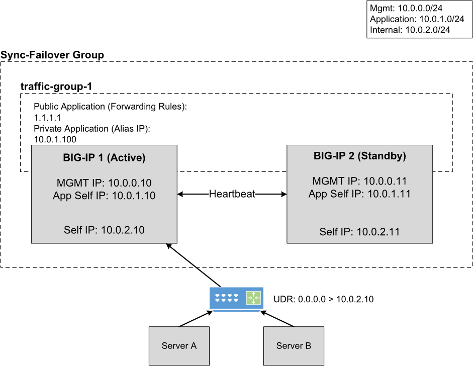
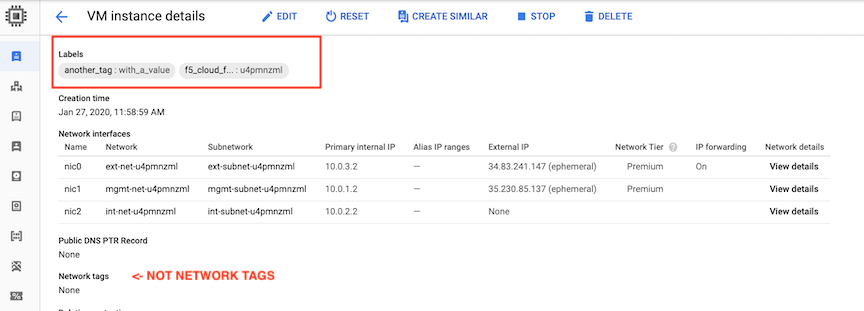

.. _gcp:

Google Cloud
============

In this section, you can see the complete steps for implementing Cloud Failover Extension in Google Cloud. You can also go straight to the :ref:`gcp-example`.

.. _gcp-prereqs:

Google CFE Prerequisites
------------------------
These are the basic prerequisites for setting up CFE in Google Cloud Platform:

- **2 BIG-IP systems in Active/Standby configuration**. You can find an example GDM Template |gdmtemplate|. Any configuration tool can be used to provision the resources.
- **Virtual addresses** or **Self IPs** created in a floating traffic group on the instances serving application traffic which will match either an Alias IP  or Forwarding Rule.
- **Target Instance Pair** created where each target instance is pointing at a BIG-IP instance.  Note that this is only required if failover of any forwarding rules is desired.

|

Complete these tasks to deploy Cloud Failover Extension in GCP. Before getting started, we recommend you review the `Known Issues <https://github.com/F5Networks/f5-cloud-failover-extension/issues>`_ and :ref:`faq`. 

.. include:: /_static/reuse/initial-config.rst

.. table:: Task Summary

   =======  ===================================================================
   Step     Task
   =======  ===================================================================
   1.       :ref:`download-rpm`

            - :ref:`verify-rpm`

   2.       :ref:`upload-install`

            - :ref:`installgui-ref` (or)
            - :ref:`installcurl-ref`

   3.       :ref:`gcp-iam`
   4.       :ref:`gcp-tag-objects`

            - :ref:`gcp-tag-storage`
            - :ref:`gcp-tag-addresses`
            - :ref:`gcp-tag-routes`

   5.       Modify and POST the :ref:`gcp-example`
   6.       :ref:`update-revert`
   =======  ===================================================================


Failover Event Diagram
----------------------

This diagram shows a failover event with Cloud Failover implemented in Google Cloud. In the event of a failover, alias IPs are updated to point to the network interface of the active BIG-IP device. The forwarding rule targets matching a self IP address of the active BIG-IP device are associated with the network interface of the active BIG-IP device.



|

.. _gcp-example:

Example GCP Declaration
-----------------------
This example declaration shows the minimum information needed to update the cloud resources in Google Cloud.  See the :ref:`quickstart` section for steps on how to post this declaration.

.. literalinclude:: ../../examples/declarations/gcp.json
   :language: json
   :tab-width: 4

:fonticon:`fa fa-download` :download:`gcp.json <../../examples/declarations/gcp.json>`

  

|


.. _gcp-iam:

Create and assign an IAM Role
-----------------------------
In order to successfully implement CFE in GCP, you need to have a GCP Identity and Access Management (IAM) service account with sufficient access. To create and assign an IAM role you must have a user role of `Editor`.

#. In GCP, go to **IAM > Roles**.
  
#. Select :guilabel:`Create Role` and fill in the required fields.
   
#. Ensure that Role launch stage is set to :guilabel:`General Availability`.

#. Select :guilabel:`Add Permissions` and select the required permissions.

   - compute.forwardingRules.get
   - compute.forwardingRules.list
   - compute.forwardingRules.setTarget
   - compute.instances.create
   - compute.instances.get
   - compute.instances.list
   - compute.instances.updateNetworkInterface
   - compute.networks.updatePolicy
   - compute.routes.create
   - compute.routes.delete
   - compute.routes.get
   - compute.routes.list
   - compute.targetInstances.get
   - compute.targetInstances.list
   - compute.targetInstances.use
   - storage.buckets.create
   - storage.buckets.delete
   - storage.buckets.get
   - storage.buckets.list
   - storage.buckets.update
   - storage.objects.create
   - storage.objects.delete
   - storage.objects.get
   - storage.objects.list
   - storage.objects.update

   |

#. Select :guilabel:`Create` to finish creating the custom role.

   .. NOTE:: These permissions are also included in by default in GCP primitives roles (Editor/Owner) and pre-defined roles (Compute Admin and Storage Admin). As long as the service account has a role bind to it with all the necessary permissions then it should be sufficient.

   .. image:: ../images/gcp/GCPIAMRoleSummary.png
    :width: 800


#. Bind the custom role in the step above to a service account by navigating to **IAM & admin > IAM**.

#. Select the edit icon next to the service account for binding.

#. Select :guilabel:`Add Another Role` and choose the custom role to add.

#. Select :guilabel:`Save` to update the service account.
  
#. Assign an IAM member to each instance by navigating to **Compute Engine > VM Instances > Instance**, select :guilabel:`Edit`, and then update the Service Account.

   For example:

   .. image:: ../images/gcp/GCPIamRoleAssignedToInstance.png
     :width: 800

|

.. _gcp-tag-objects:

Label your Google Cloud Network Infrastructure Objects
------------------------------------------------------

Label your infrastructure with the the keys and values that you will send in your CFE declaration. Note that GCP uses the term `labels` rather than the term `tags`, which is used by other cloud providers.

.. IMPORTANT:: You must label the following resources. Even if you only have routes to update during failover (for example, there are no NIC IP configuration objects to re-map) you still have to tag the NICs on the Virtual Machines associated with the IPs in your CFE declaration.

.. _gcp-tag-storage:

Label the storage account in GCP
````````````````````````````````
You need to add a label to the storage bucket for Cloud Failover Extension cluster-wide file(s) and then specify a key and value for the label. This key/value will correspond to the key/value you use in the `externalStorage.scopingTags` section of the CFE configuration.

.. WARNING:: Ensure the required storage accounts do not have public access.

#. Open the Cloud Storage browser in the Google Cloud Console.

#. In the bucket list, find the bucket you want to apply a label to, and click its :guilabel:`Bucket overflow menu (...)`.

#. Click :guilabel:`Edit labels`.

#. In the side panel that appears, click the :guilabel:`+ Add label` button.

#. Specify a ``key`` and ``value`` for your label.

#. Click :guilabel:`Save`.


.. _gcp-tag-addresses:

Label the Network Interfaces in GCP
```````````````````````````````````
Now you need to label the virtual machine instances with a key and value. This key/value will correspond to the key/value you use in the `failoverAddresses.scopingTags` section of the CFE configuration.

#. Go to the VM instances page.

#. Select an instance.

#. On the `VM instance details` page, click :guilabel:`Edit`.

#. In the :guilabel:`Labels` section, specify a name and a value.

#. Click :guilabel:`Save`.




|

.. _gcp-tag-routes:

Label the User-Defined routes in GCP
````````````````````````````````````
.. include:: /_static/reuse/discovery-type-note.rst

If you are using the ``routeTag`` option for ``discoveryType`` within the CFE declaration, you need to label the route(s) with a key-value pair that will correspond to the key-value pair in the `failoverRoutes.scopingTags` section of the CFE declaration.

#. Go to the Routes page in the Google Cloud Console.

#. Click :guilabel:`Create route`.

#. Specify a :guilabel:`Name` and a :guilabel:`Description` for the route.

#. Select an existing :guilabel:`Network` where the route will apply.

#. Specify a :guilabel:`Destination IP range` to define the destination of the route.

#. Select a :guilabel:`Priority` for the route. 

#. Go to the :guilabel:`Instance tags` field to create a tag. For example ``f5_cloud_failover_labels={"f5_cloud_failover_label":"mydeployment"}``.

#. Select a :guilabel:`Next hop` for the route and :guilabel:`Specify a forwarding rule of internal TCP/UDP load balancer` to specify the BIG-IP as a next hop.

   .. TIP:: Make sure the route targets a ``next-hop-address`` instead of a ``next-hop-instance``.

#. Click :guilabel:`Create`.

#. In your CFE declaration, enter the key/value in the `failoverRoutes.scopingTags` section that matches the tag that you attached to the routing table in GCP. Then update the list of destination routes in the `failoverRoutes.scopingAddressRanges` section.

|

.. code-block:: python
   :caption: Example of a gcloud compute command to create a route

    gcloud compute routes create example-route --destination-range=192.168.1.0/24 --network=example-network --next-hop-address=192.0.2.10 --description='f5_cloud_failover_labels={"f5_cloud_failover_label":"mydeployment"}'


|


.. code-block:: json
   :caption: What the route section of the declaration should look like

   {
    "failoverRoutes": {
        "scopingTags": {
            "f5_cloud_failover_label": "mydeployment"
        },
        "scopingAddressRanges": [
            {
                "range": "192.168.1.0/24"
            }
        ],
        "defaultNextHopAddresses": {
            "discoveryType": "static",
            "items": [
                "192.0.2.10",
                "192.0.2.11"
            ]
        }
   }


|

.. _gcp-shared-vpc:

Shared VPC Configuration
------------------------

A `Shared VPC <https://cloud.google.com/vpc/docs/shared-vpc>`_ allows an organization to connect resources from multuple projects to a common VPC, CFE works with Shared VPC in the following topologies.

- BIG-IP cluster deployed in the Shard VPC Host project.  In this scenario all objects such as Alias IPs, Forwarding Rules and Routes in the host project will continue to failover per normal conditions.
- BIG-IP cluster deployed in a Shared VPC Service project where NIC 0 is attached to a Shared VPC in the Host project.  In this scenario all objects such as Alias IPs, Forwarding Rules and Routes in the service project will continue to failover per normal conditions.  However any objects in the Shared VPC Host project will not be discovered/updated during a failover event.

|

.. include:: /_static/reuse/feedback.rst


.. |github| raw:: html

   <a href="https://github.com/F5networks/f5-google-gdm-templates/tree/master/supported/failover/same-net/via-api/3nic/existing-stack/payg" target="_blank">F5 Cloud Failover Extension site on GitHub</a>

.. |gdmtemplate| raw:: html

   <a href="https://github.com/F5networks/f5-google-gdm-templates/tree/master/supported/failover/same-net/via-api/3nic/existing-stack/payg" target="_blank">here</a>


.. |gcp-route-considerations| raw:: html

   <a href="https://cloud.google.com/vpc/docs/routes#instance_next_hops" target="_blank">Google documentation</a>
