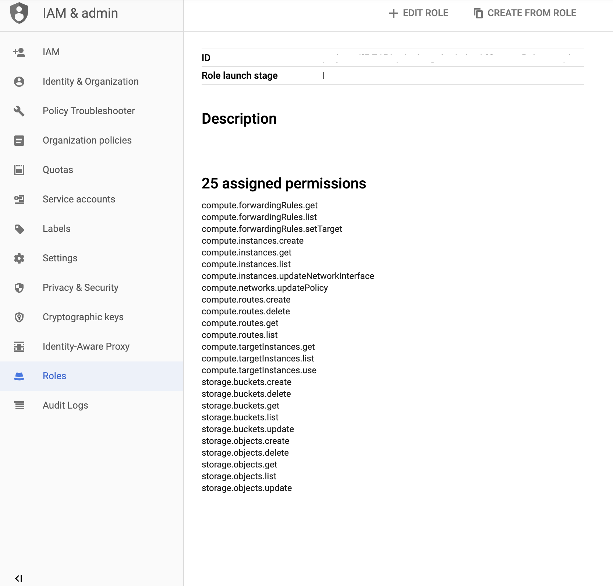

.. _gcp:

Google Cloud
============


Failover Event Diagram
----------------------

This diagram shows a failover event with Cloud Failover implemented in Google Cloud. In the event of a failover, alias IPs are updated to point to the network interface of the active BIG-IP device. The forwarding rule targets matching a self IP address of the active BIG-IP device are associated with the network interface of the active BIG-IP device.

.. image:: ../images/gcp/GCPFailoverExtensionHighLevel.gif
  :width: 800


Prerequisites
-------------
These are the minimum requirements for setting up Cloud Failover in Google Cloud Platform:

- **2 BIG-IP systems in Active/Standby configuration**. You can find an example GDM Template |gdmtemplate|. Any configuration tool can be used to provision the resources.
- **A GCP Identity and Access Management (IAM) service account with sufficient access**. See the instructions below for creating and assigning an IAM role.
- **A storage bucket for Cloud Failover extension cluster-wide file(s)** that is tagged with a key/value pair corresponding to the key/value(s) provided in the `externalStorage.scopingTags` section of the Cloud Failover extension configuration.

  .. IMPORTANT:: Ensure the required storage accounts do not have public access.

- **Instances tagged with a key/value corresponding to the key/value(s) provided in the `failoverAddresses.scopingTags` section of the Cloud Failover extension configuration**.
- **Virtual addresses created in a floating traffic group and matching Alias IP addresses on the instance serving application traffic**.
- **Forwarding rules(s) configured with targets that match a virtual address or floating self IP on the instance serving application traffic**. 
- **Route(s) in a route table tagged with**:

  - a key/value corresponding to the key/value(s) provided in the `failoverRoutes.scopingTags` section of the Cloud Failover extension configuration
  - a special key called `f5_self_ips` containing a comma-separated list of addresses mapping to a self IP address on each instance in the cluster that the routes should be pointed at. Example: `10.0.0.10,10.0.0.11`

  Note: Since GCP routes don't support GCP labels a JSON blob MUST be added to the description, here is an example: f5_cloud_failover_labels={"f5_cloud_failover_label":"mydeployment","f5_self_ips":"10.0.0.10,10.0.0.11"}
  Note: The failover extension configuration `failoverRoutes.scopingAddressRanges` contains a list of destination routes to update.


Creating and assigning an IAM Role
``````````````````````````````````
To create and assign an IAM role you must have a user role of `Editor`.

1. In GCP, go to **IAM > Roles** and create the member with the following scopes:

- compute-rw
- storage-rw
- cloud-platform

For example:




2. Assign an IAM member to each instance by navigating to **Compute Engine > VM Instances > Instance**, select Edit, and then update the Service Account.

For example:

.. image:: ../images/gcp/GCPIAMRoleAssignedToInstance.png
  :width: 800


.. _gcp-example:

Example Declaration
-------------------
This example declaration shows the minimum information needed to update the cloud resources in Google Cloud.  See the :ref:`quickstart` section for steps on how to post this declaration.

.. code-block:: json
    :linenos:


    {
        "class": "Cloud_Failover",
        "environment": "gcp",
        "externalStorage": {
            "scopingTags": {
              "f5_cloud_failover_label": "mydeployment"
            }
        },
        "failoverAddresses": {
            "scopingTags": {
              "f5_cloud_failover_label": "mydeployment"
            }
        },
        "failoverRoutes": {
          "scopingTags": {
            "f5_cloud_failover_label": "mydeployment"
          },
          "scopingAddressRanges": [
            "192.168.1.0/24"
          ]
        }
    }


.. |github| raw:: html

   <a href="https://github.com/F5Networks/f5-google-gdm-templates/tree/master/supported/failover/same-net/via-api/3nic/existing-stack/payg" target="_blank">F5 Cloud Failover site on GitHub</a>

.. |gdmtemplate| raw:: html

   <a href="https://github.com/F5Networks/f5-google-gdm-templates/tree/master/supported/failover/same-net/via-api/3nic/existing-stack/payg" target="_blank">here</a>