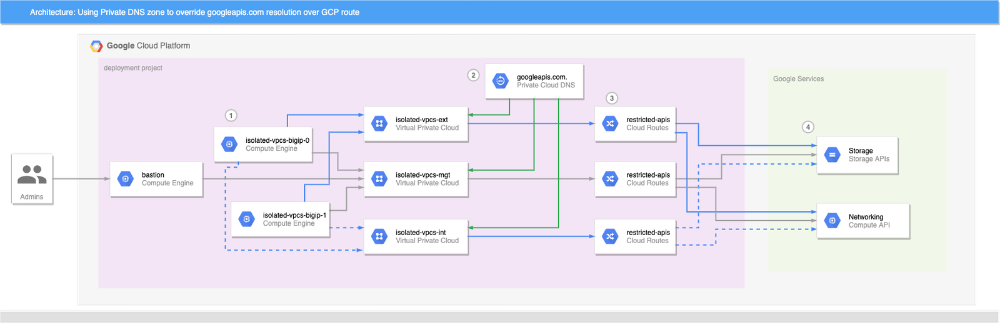

.. _isolated-env:

CFE in Isolated Environments
============================

Running BIG-IP in isolated Virtual Private Clouds (VPCs) is a security best practice, but requires upfront foundational setup. This section shows how to support CFE on GCP when BIG-IP instances have no route to public internet.


How to use CFE on GCP when BIG-IP instances have no route to public internet
----------------------------------------------------------------------------

Overview
````````

- Enable restricted (aka private) API access on subnets
- Override DNS entries for `*.googleapis.com` with `restricted.googleapis.com`, with A records for CIDR 199.36.153.4/30
- Create custom routes on networks (if needed) for 199.36.153.4/30 via internet next-hop

BIG-IP instances launched in GCP by almost any method will need to retrieve Cloud Libraries, DO declarations, and other run-time assets pulled from public URLs during boot sequence. This allows decoupling of BIG-IP releases from the libraries and add-ons that enhance cloud deployments, and is generally a good thing. When BIG-IP is deployed into VPCs without a public IP address, or where there isn't a NAT gateway, or the default internet routes have been removed, then an alternative means to install the libraries is required.

Many enterprises will deploy an artefact repository (such as Artifactory or Nexus) in GCP that can be leveraged to provide a convenient and secured way for VMs to access components for downloading and installing. Alternatively, a VM can be established to provide simple HTTP(s) or FTP downloads of binaries from within the VPCs. Assuming the repository endpoints are accessible to the VMs, you can modify the boot scripts to pull from the new location instead of F5's CDN.

Alternatively, you can choose to build custom BIG-IP images to add the library binaries to the BIG-IP base image for configuration at run-time; this too is a good solution if you have a repave strategy for maintenance and updates, and can use BYOL.

As long as the endpoint resolves to an address in one of the VPC network CIDRs attached to BIG-IP, installing the libraries at boot will be successful, even if the user has to modify the installation scripts. Note that GCS is not an option for binary distribution in this example because Storage API endpoints are implemented on public IP addresses.


Example Scenario
````````````````

CFE will not function correctly out of the box when the BIG-IP instances are not able to reach the public internet directly or via a NAT. CFE must have access to Storage APIs for state management, and to compute APIs for network updates. This section shows you how to make CFE work in an isolated VPC using a scenario.

In the following scenario, a user is looking to use BIG-IP in an active-standby configuration on GCP, and rightly does not want to incur the additional cost of putting a GCP LB in front of BIG-IP. As BIG-IP will need to update GCP routing and addressing on a failover event, the user will need to use CFE to manage HA state and make GCP API calls as necessary. The user also has a requirement that VMs, including BIG-IP, must operate in an environment without internet access:

- VMs do not have a public IP address
- NAT is not provided
- Default VPC network routes to the internet are removed and only the default subnet and any custom routes exist

.. image:: ../images/gcp/gcp-private-endpoints.png

|

This scenario causes problems for CFE:

- CFE tries to initialize shared instance state in a dedicated bucket, or update a route via API.
- Bucket access is via `storage.googleapis.com` endpoint and networking API is via `compute.googleapis.com`, both of which resolve to public IP addresses.
- Default internet routes have been removed from the network, and NAT gateway or instance with custom routes is not in place: Access to the APIs fails.

**Solution: Private Google Access**

Enabling Private Google Access on each VPC subnet that may need to access Google Cloud APIs makes a change to the underlying SDN such that the CIDR for `restricted.googleapis.com` (199.36.153.4/30) will be routed without going through the internet. When combined with a private DNS zone which resolves all `googleapis.com` lookups to `restricted.googleapis.com` [#ie1]_ API endpoint addresses, the VPC networks effectively have private endpoint access for all GCP APIs.

1. Enable Private Google Access on each VPC subnet as necessary.

2. Create a Cloud DNS private zone [#ie2]_ for `googleapis.com`.

   a. Add a CNAME for `*.googleapis.com` that aliases to `restricted.googleapis.com`.

   b. Add an A record for `restricted.googleapis.com` that resolves to 199.36.153.4/30.


With this configuration in place, any VMs that are attached to the VPC networks that are associated with this private DNS zone will automatically try to use 199.36.153.4/30 endpoints for all GCP API calls. If the user did not remove the default-internet routes, this is all you need to do to make the APIs functional again and CFE will work correctly.

|

In this scenario, the default route to internet was removed, and the user insists that it cannot be re-added. In this case, a custom route [#ie3]_ must be added to each VPC network that will use GCP APIs.

1. Define a custom route​​​​​​​ on each network [#ie4]_ for 199.36.153.4/30 with next-hop set for ``internet gateway``.

Once the custom routes are in place, GCP will route traffic for the /30 CIDR to an internet gateway, which will effectively route via a private VPC network to an internal GCP endpoint; the traffic will never go to the internet even though the target IP is a public address.



|

Now CFE can access the GCP APIs and function correctly:

- BIG-IP (and bastion) instances attempt to connect to GCP APIs.
- Cloud DNS private zone for `googleapis.com` has been injected into each VPC network; DNS returns a CNAME alias of `restricted.googleapis.com` for all `googleapis.com` lookups, which in turn resolves to an IP address in 199.36.153.4/30.
- Custom routes provides a way to reach Google API endpoints from VMs to GCP services that does not traverse the public internet.
- API endpoints in Google's private VPC respond.

|

**Boot-time scripts, cloud libs, and GCS**

The approach described here applies at VPC network and subnet resources, which means that any VM that is instantiated on those networks after these changes will be able to use GCP APIs, including Cloud Storage. This makes GCS a viable option for storing Cloud Libs, RPMs, etc. needed by the BIG-IP boot-time initialization scripts.

See a fully functional example below. [#ie5]_ When executed, Terraform will create three network VPCs that lack the default-internet egress route, but have a custom route to allow traffic to restricted.googleapis.com CIDR. It will also create a Cloud DNS private zone to override googleapis.com and resolve to restricted.googleapis.com, and associate the private zone with all three networks. A pair of BIG-IPs are spun up with CFE  enabled and using a dedicated CFE bucket for state management. An IAP bastion host with tinyproxy allows for SSH and GUI access to the BIG-IPs (See the repo README for details). If you force the active instance to standby, you will see CFE state being created or updated in the GCS bucket.


.. rubric:: **Footnotes**
.. [#ie1] **Private versus restricted access:** GCP supports two protected API endpoint options: `private` and `restricted access`. Both allow access to GCP API endpoints without traversing the public internet, but `restricted access` is integrated with `VPC Service Controls <https://cloud.google.com/vpc-service-controls/docs>`_ albeit with a reduced set of API endpoints, whereas private access cannot be used with VPC Service Controls but supports all of the GCP API endpoints. Both options are valid for BIG-IP deployments and supporting libraries, but F5 recommends `restricted access` as it has better observability and access controls. If you require use of private access, the same steps can be used by shadowing `*.googleapis.com` to resolve to `private.googleapis.com`, and adding A records for 199.36.153.8/30, and a corresponding custom route declaration.

.. [#ie2] **DNS resolution:** Cloud DNS is used in this example because bastion host needs the same `restricted` access to APIs. An alternative DNS implementation will work fine, including BIG-IP declarations, as long as it can resolve `*.googleapis.com` to either the `restricted` or `private access` endpoints.

.. [#ie3] **Custom route only needed if a route through internet gateway is undefined:** In this post a custom route is required because the default-internet route has been explicitly removed from the VPC networks. If the user has not removed this route, or if another route exists that contains the 199.36.153.4/30 CIDR with a next-hop to internet gateway, then those will provide the same private GCP routing as the custom route. I.e. the default-internet routes have a target CIDR of 0.0.0.0/0 with next-hop of internet gateway.

.. [#ie4] **Do I really need to add DNS and route to all VPC networks used by BIG-IP or other instances?:** No, you don't. Most VMs will resolve DNS and make API calls through nic0 as GCP sets a default route through the first network attached to each instance. For BIG-IP it will depend on the default route set via TMSH or DO. However, to make things simple and to have a minimal working example I inject the custom DNS zone and routes to all networks so that BIG-IP and bastion can make use of GCS for boot-time libraries.

.. [#ie5] **Custom BIG-IP onboarding vs supported GDM templates:** The example repo uses a Terraform module to define and bootstrap BIG-IP instances because the module has built in support for overriding the location of library files. The same techniques described here will work with the F5 published GDM templates if you or your user will edit the Python file associated with deployment target to use the updated URLs.

|

Steps
-----

1. Create or prepare a GCS bucket, or other HTTP host on the private network that can supply Cloud Libraries and supporting files as needed by BIG-IP and bastion host.

2. Prepare Terraform config and variables setting files; you can make a copy of ``env/emes`` folder and modify the ``base.config`` and ``base.tfvars`` files to match your environment.

   - This example assumes you have setup and enabled IAM impersonation for a Terraform service account; set ``tf_sa_email`` variable to empty string ("") to use your own credentials or a service account via application-default credentials.
   - If you are using a GCS bucket to host RPMs, etc, use the scheme for encoding HTTP download requests as described at `Encoding URI path parts <https://cloud.google.com/storage/docs/request-endpoints#encoding>`_ and set ``cloud_libs_bucket`` variable to the name of the GCS bucket. Terraform will ensure the BIG-IP and bastion service accounts have read-only access to the bucket.

   ::

      install_cloud_libs = [
         "https://storage.googleapis.com/storage/v1/b/automation-factory-f5-gcs-4138-sales-cloud-sales/o/misc%2Ff5-cloud-libs.tar.gz?alt=media",
         "https://storage.googleapis.com/storage/v1/b/automation-factory-f5-gcs-4138-sales-cloud-sales/o/misc%2Ff5-cloud-libs-gce.tar.gz?alt=media",
         "https://storage.googleapis.com/storage/v1/b/automation-factory-f5-gcs-4138-sales-cloud-sales/o/misc%2Ff5-appsvcs-3.22.1-1.noarch.rpm?alt=media",
         "https://storage.googleapis.com/storage/v1/b/automation-factory-f5-gcs-4138-sales-cloud-sales/o/misc%2Ff5-declarative-onboarding-1.15.0-3.noarch.rpm?alt=media",
         "https://storage.googleapis.com/storage/v1/b/automation-factory-f5-gcs-4138-sales-cloud-sales/o/misc%2Ff5-cloud-failover-1.5.0-0.noarch.rpm?alt=media"
      ]
      install_tinyproxy_url = "https://storage.googleapis.com/storage/v1/b/automation-factory-f5-gcs-4138-sales-cloud-sales/o/misc%2Ftinyproxy-1.8.3-2.el7.x86_64.rpm?alt=media"
      cloud_libs_bucket = "automation-factory-f5-gcs-4138-sales-cloud-sales"

3. Initialize and execute Terraform. Using ``emes`` configuration as an example.

   ::

      terraform init -backend-config env/emes/base.config
      terraform apply -var-file env/emes/base.tfvars -auto-approve

   ::

      Apply complete! Resources: 52 added, 0 changed, 0 destroyed.

      Outputs:

      admin_password_key = projects/f5-gcs-4138-sales-cloud-sales/secrets/isolated-vpcs-bigip-admin-passwd-key
      bastion_name = isolated-vpcs-bastion
      bigip_addresses = {
        "isolated-vpcs-bigip-0" = {
          "external" = [
            "172.16.0.3",
            "172.16.0.4/32",
          ]
          "internal" = [
            "172.18.0.2",
          ]
          "management" = [
            "172.17.0.2",
          ]
          "vips" = [
            "172.16.0.4/32",
          ]
        }
        "isolated-vpcs-bigip-1" = {
          "external" = [
            "172.16.0.2",
          ]
          "internal" = [
            "172.18.0.3",
          ]
          "management" = [
            "172.17.0.3",
          ]
          "vips" = []
        }
      }
      cfe_label_value = isolated-vpcs

4. Wait for BIG-IPs to complete initialization. You can check initialization status by viewing the serial console output of instances and verifying that the CFE declaration has been applied, as this is the final step in initialization.

   ::

     gcloud compute instances get-serial-port-output --project f5-gcs-4138-sales-cloud-sales --zone us-central1-c isolated-vpcs-bigip-1 2>/dev/null | grep '/config/cloud/gce'

   ::

     2020-09-17T15:54:25.447-0700: /config/cloud/gce/initialSetup.sh: Info: Initialisation starting
     2020-09-17T15:54:25.451-0700: /config/cloud/gce/initialSetup.sh: Info: Generating /config/cloud/gce/network.config
     2020-09-17T15:54:25.610-0700: /config/cloud/gce/initialSetup.sh: Info: Waiting for mcpd to be ready
     2020-09-17T15:55:14.543-0700: /config/cloud/gce/multiNicMgmtSwap.sh: Rebooting for multi-nic management interface swap
     2020-09-17T15:56:00.021-0700: /config/cloud/gce/initialSetup.sh: Info: Initialisation starting
     2020-09-17T15:56:00.025-0700: /config/cloud/gce/initialSetup.sh: Info: Generating /config/cloud/gce/network.config
     2020-09-17T15:56:00.037-0700: /config/cloud/gce/initialSetup.sh: Info: Waiting for mcpd to be ready
     2020-09-17T15:56:27.580-0700: /config/cloud/gce/multiNicMgmtSwap.sh: Nothing to do
     2020-09-17T15:56:27.587-0700: /config/cloud/gce/initialNetworking.sh: Info: Waiting for mcpd to be ready
     2020-09-17T15:56:27.841-0700: /config/cloud/gce/initialNetworking.sh: Info: Resetting management settings
     ...
     2020-09-17T22:59:08.234+0000: /config/cloud/gce/customConfig.sh: Info: waiting for mcpd to be ready
     2020-09-17T22:59:08.959+0000: /config/cloud/gce/customConfig.sh: Info: Applying CFE payload
     2020-09-17T22:59:26.609+0000: /config/cloud/gce/customConfig.sh: Info: CFE declaration is applied
     2020-09-17T22:59:26.614+0000: /config/cloud/gce/initialSetup.sh: Info: Initialisation complete
     2020-09-17T22:59:26.620+0000: /config/cloud/gce/resetManagementRoute.sh: waiting for mcpd to be ready
     2020-09-17T22:59:27.051+0000: /config/cloud/gce/resetManagementRoute.sh: complete


5. Login and configure BIG-IP as needed. In this example, accessing the BIG-IP requires the use of the bastion host. Create an SSH tunnel through the bastion host and use tinyproxy to access instances.

   i. Create an IAP session for SSH to the bastion and tunnel between port 8888 on local computer and bastion. Tinyproxy has been configured to be active on port 8888 too. This command will ensure that your key is forwarded to the bastion so you can SSH to a BIG-IP instance on it's management IP address.

      :: 
     
         gcloud compute ssh --project f5-gcs-4138-sales-cloud-sales --zone us-central1-f isolated-vpcs-bastion --tunnel-through-iap -- -A -L8888:127.0.0.1:8888


   ii. Set your browser to proxy HTTP and HTTPS traffic through localhost:8888

       .. image:: ../images/gcp/gcp-private-endpoints3.png
         :scale: 50%


   iii. Retrieve the random admin password from Secret Manager.

       .. image:: ../images/gcp/gcp-private-endpoints4.png
         :scale: 50%


   iv. Login to a BIG-IP instance using the ``admin`` account and password from step 3.

       .. image:: ../images/gcp/gcp-private-endpoints5.png


Inputs
``````

+----------------------------+--------------+-----------+---------------------------------+-------------------------------------------------+
| Name                       | Type         | Required  | Default                         | Description                                     |
+============================+==============+===========+=================================+=================================================+
| bastion_zone               | string       | Optional  | ``"us-central1-f"``             | The GCE zone to deploy the bastion host.        |
|                            |              |           |                                 | Default is 'us-central1-f'.                     |
|                            |              |           |                                 |                                                 |
+----------------------------+--------------+-----------+---------------------------------+-------------------------------------------------+
| bigip_zones                | list(string) | Optional  | ``[``                           | The GCE zones to deploy the BIG-IP              |
|                            |              |           |   ``"us-central1-f",``          | instances. Default is 'us-central1-f' and       |
|                            |              |           |   ``"us-central1-c"``           | 'us-central1-c'.                                |
|                            |              |           | ``]``                           |                                                 |
+----------------------------+--------------+-----------+---------------------------------+-------------------------------------------------+
| cfe_label_key              | string       | Optional  | "f5_cloud_failover_label"       | The CFE label key to assign to resources        |
|                            |              |           |                                 | that are going to be managed by CFE.            |
|                            |              |           |                                 | Default value is 'f5_cloud_failover_label'.     |
+----------------------------+--------------+-----------+---------------------------------+-------------------------------------------------+
| cfe_label_value            | string       | Optional  | ``""``                          | The CFE label value to assign to resources      |
|                            |              |           |                                 | that are going to be managed by this BIG-IP     |
|                            |              |           |                                 | deployment. If left empty, a value will be      |
|                            |              |           |                                 | generated for this deployment.                  |
|                            |              |           |                                 |                                                 |
|                            |              |           |                                 |                                                 |
|                            |              |           |                                 |                                                 |
|                            |              |           |                                 |                                                 |
|                            |              |           |                                 |                                                 |
|                            |              |           |                                 |                                                 |
+----------------------------+--------------+-----------+---------------------------------+-------------------------------------------------+
| cloud_libs_bucket          | string       | Optional  | ``""``                          | An optional GCS bucket name to which the        |
|                            |              |           |                                 | BIG-IP service account will be granted          |
|                            |              |           |                                 | read-only access. Default is empty string.      |
|                            |              |           |                                 | See install_cloud_libs.                         |
|                            |              |           |                                 |                                                 |
|                            |              |           |                                 |                                                 |
+----------------------------+--------------+-----------+---------------------------------+-------------------------------------------------+
| image                      | string       | Optional  | ``"projects/f5-7626-networks-`` | The GCE image to use as the base for BIG-IP     |
|                            |              |           | ``public/global/images/f5-``    | instances; default is latest BIG-IP v15         |
|                            |              |           | ``bigip-15-1-0-4-0-0-6-payg-``  | payg good 25mbs. BIG-IP iControl REST           |
|                            |              |           | ``good-25mbps-200618231522"``   | password                                        |
|                            |              |           |                                 |                                                 |
|                            |              |           |                                 |                                                 |
+----------------------------+--------------+-----------+---------------------------------+-------------------------------------------------+
| install_cloud_libs         | list(string) | Required  | N/A                             | Contains the URLs for F5's Cloud Libs           |
|                            |              |           |                                 | required for BIG-IP w/CFE on-boarding,          |
|                            |              |           |                                 | overriding the default download patch from      |
|                            |              |           |                                 | cdn.f5.com and github.com.                      |
+----------------------------+--------------+-----------+---------------------------------+-------------------------------------------------+
| install_tinyproxy_url      | string       | Required  | N/A                             | Contains the URL for tinyproxy RPM to           |
|                            |              |           |                                 | install on bastion host.                        |
|                            |              |           |                                 |                                                 |
|                            |              |           |                                 |                                                 |
+----------------------------+--------------+-----------+---------------------------------+-------------------------------------------------+
| labels                     | map(string)  | Optional  | ``{}``                          | An optional map of label key-values to          |
|                            |              |           |                                 | apply to all resources. Default is an           |
|                            |              |           |                                 | empty map.                                      |
|                            |              |           |                                 |                                                 |
+----------------------------+--------------+-----------+---------------------------------+-------------------------------------------------+
| prefix                     | string       | Optional  | ``"isolated-vpcs"``             | An optional prefix to use when naming           |
|                            |              |           |                                 | resources; default is 'isolated-vpcs'.          |
|                            |              |           |                                 | Override this value if you are deploying        |
|                            |              |           |                                 | in a shared environment.                        |
+----------------------------+--------------+-----------+---------------------------------+-------------------------------------------------+
| project_id                 | string       | Required  | N/A                             | The existing project id that will host the      |
|                            |              |           |                                 | BIG-IP resources.                               |
|                            |              |           |                                 |                                                 |
|                            |              |           |                                 |                                                 |
+----------------------------+--------------+-----------+---------------------------------+-------------------------------------------------+
| tf_sa_email                | string       | Optional  | ``null``                        | The fully-qualified email address of the        |
|                            |              |           |                                 | Terraform service account to use for            |
|                            |              |           |                                 | resource creation. E.g. tf_sa_email =           |
|                            |              |           |                                 | "terraform@PROJECT_ID.iam.gserviceaccount.com"  |
+----------------------------+--------------+-----------+---------------------------------+-------------------------------------------------+
| tf_sa_token_lifetime_secs  | number       | Optional  | ``1200``                        | The expiration duration for the service account |
|                            |              |           |                                 | token, in seconds. This value should be high    |
|                            |              |           |                                 | enough to prevent token timeout issues during   |
|                            |              |           |                                 | resource creation, but short enough that the    |
|                            |              |           |                                 | token is useless replayed later. Default value  |
|                            |              |           |                                 | is 1200.                                        |
+----------------------------+--------------+-----------+---------------------------------+-------------------------------------------------+


.. include:: /_static/reuse/feedback.rst