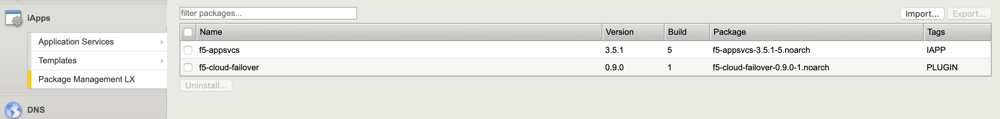

.. _quickstart:

Quickstart 
==========

If you are familiar with the BIG-IP system, and generally familiar with REST and
using APIs, this section contains the minimum amount of information to get you
up and running with Cloud Failover.

.. sidebar:: :fonticon:`fa fa-info-circle fa-lg` Version Notice:

   Cloud Failover extension supports BIG-IP version 14.1.X and later.

1. Download the latest RPM package from |github| in the releases section.

2. Upload and install the RPM package on the using the BIG-IP GUI:

- :guilabel:`Main tab > iApps > Package Management LX > Import`

- Select the downloaded file and click :guilabel:`Upload`
- For complete instructions see :ref:`installgui-ref` or :ref:`installcurl-ref`
    

3. Be sure to see the |known-issues| to review any known issues and other important information before you attempt to use Cloud Failover.

4. Provide authorization (basic auth) to the BIG-IP system:  

   - If using a RESTful API client like Postman, in the :guilabel:`Authorization` tab, type the user name and password for a BIG-IP user account with Administrator permissions.
   - If using cURL, see :ref:`installcurl-ref`.

5. Using a RESTful API client like Postman, send a GET request to the URI
   ``https://{{host}}/mgmt/shared/cloud-failover/info`` to ensure Cloud Failover is running
   properly. You should receive an expect response of Success after you have posted this declaration. For example:

   .. code-block:: shell

    {
        "message": "success"
    }

6. Copy one of the example declarations which best matches the configuration you want to use. There are example declarations in the sections for :ref:`azure`, :ref:`aws`, and :ref:`gcp`.

7. Paste the declaration into your API client, and modify names and IP addresses as applicable. The key and value pair can be arbitrary but they must match the tags that you assign to the infrastructure within the cloud provider. You can craft your declaration with any key and value pair as long as it matches what is in the configuration. For example:

.. code-block:: shell

  "failoverAddresses": {
          "scopingTags": {
            "i_am_an_arbitrary_key": "i_am_an_arbitrary_value"
          }

8. POST to the URI ``https://<BIG-IP>/mgmt/shared/cloud-failover/declare``

9. To stream the output of restnoded, use the tail command: ``tail –f /var/log/restnoded/restnoded.log``

Quick Start Example
-------------------

Here is an example declaration for Microsoft Azure.

.. code-block:: json

    {
        "class": "Cloud_Failover",
        "environment": "azure",
          "externalStorage": {
            "scopingTags": {
              "f5_cloud_failover_label": "mydeployment"
            }
        },
          "failoverAddresses": {
            "scopingTags": {
              "f5_cloud_failover_label": "mydeployment"
            }
        },
        "failoverRoutes": {
          "scopingTags": {
            "f5_cloud_failover_label": "mydeployment"
          },
          "scopingAddressRanges": [
            "0.0.0.0/0"
          ]
        }
    }

You will receive a response from Postman that looks like this example:

.. code-block:: json

    {"message":"success","declaration":{"class":"Cloud_Failover","environment":"azure","externalStorage":{"scopingTags":{"f5_cloud_failover_label":"mydeployment"}},"failoverAddresses":{"scopingTags":{"f5_cloud_failover_label":"mydeployment"}},"failoverRoutes":{"scopingTags":{"f5_cloud_failover_label":"mydeployment"},"scopingAddressRanges":["0.0.0.0/0"]},"schemaVersion":"0.9.0"}}

.. |github| raw:: html

   <a href="https://github.com/F5Devcentral/f5-cloud-failover-extension" target="_blank">F5 Cloud Failover site on GitHub</a>

   
.. |known-issues| raw:: html

   <a href="https://github.com/F5Devcentral/f5-cloud-failover-extension/issues" target="_blank">Known Issues on GitHub</a>

